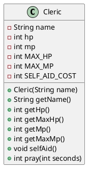

# 인스턴스, 클래스, 캡슐화 복습

이 문서는 Java 코드를 거의 처음 작성하는 학습자가
`Cleric` 클래스를 만들고, 과제를 작은 단계로 나누어 해결하며,
JUnit 테스트까지 작성할 수 있도록 돕는 실습 자료입니다.

## 이 문서의 목표

이 과제를 끝낸 뒤 다음을 할 수 있으면 됩니다.

- Java 파일과 클래스를 만들 수 있습니다.
- 클래스와 인스턴스의 차이를 설명할 수 있습니다.
- 필드와 메서드를 구분할 수 있습니다.
- 생성자로 인스턴스의 초기 상태를 만들 수 있습니다.
- `this`, `new`, `if`, `return`의 역할을 이해할 수 있습니다.
- 요구사항을 작은 테스트 시나리오로 바꿀 수 있습니다.
- JUnit 테스트를 작성하고 실행 결과를 확인할 수 있습니다.
- 작성한 클래스의 구조를 PlantUML 다이어그램으로 표현할 수 있습니다.
- 생성자 오버로드와 `this()`로 중복 코드를 줄일 수 있습니다.
- `static`과 인스턴스 필드의 차이를 설명할 수 있습니다.
- `private`, getter, setter, 예외를 사용해 잘못된 상태를 막을 수 있습니다.

## 이 문서를 읽는 순서

이 문서는 한 번에 모두 외우는 책이 아닙니다. 아래 순서로 필요한 부분을 따라갑니다.

```text
1~6장  : Cleric의 기본 필드와 메서드 만들기
7장    : 생성자, 오버로드, static으로 Cleric 확장하기
8장    : private, getter, setter, 입력값 검증으로 캡슐화하기
9장 이후: 최종 코드, 테스트, PlantUML, 제출 점검
```

앞 단계의 코드가 완성되지 않았다면 다음 단계로 급하게 넘어가지 않습니다.
먼저 테스트가 통과하는 가장 작은 상태를 만든 뒤 다음 개념을 추가합니다.

> 이 문서는 `Java 입문 기초 8장 인스턴스와 클래스` 자료의 개념과 연습문제를 바탕으로 작성했습니다. 문서의 예시는 현재 저장소의 패키지 구조에 맞췄습니다.

## 0. 시작하기 전에

### 준비물

- IntelliJ IDEA
- Java 프로젝트
- Gradle
- 터미널을 실행할 수 있는 환경
- 이 저장소의 `src/main/java`와 `src/test/java` 폴더

이 저장소의 패키지는 다음과 같습니다.

```text
src/main/java/com/survivalcoding/day01_class_instance
src/test/java/com/survivalcoding/day01_class_instance
```

Java 파일의 첫 줄에 있는 `package`는 파일이 어느 폴더에 속하는지 알려주는 문장입니다.

```java
package com.survivalcoding.day01_class_instance;
```

`Cleric.java`와 `ClericTest.java`는 같은 패키지에 두는 것이 좋습니다.

### 과제를 읽을 때 먼저 할 일

문제를 읽자마자 코드를 작성하지 않습니다. 다음 단어를 먼저 표시합니다.

| 문제의 표현 | 코드로 바꿀 것 |
| --- | --- |
| 가지고 있다, 속성 | 필드(field) |
| 할 수 있다, 행동한다 | 메서드(method) |
| 이름, HP, MP | 변수와 자료형 |
| 최대 HP까지 회복 | 조건과 계산 |
| 반환한다 | 메서드의 반환 타입과 `return` |
| 인수, 매개변수 | 메서드 괄호 안의 입력값 |
| 초기값 | 필드 또는 생성자에서 처음 정할 값 |

이 과제의 요구사항을 먼저 분해하면 다음과 같습니다.

1. `Cleric`이라는 클래스를 만듭니다.
2. 이름, HP, 최대 HP, MP, 최대 MP를 저장합니다.
3. 처음 HP와 최대 HP는 50입니다.
4. 처음 MP와 최대 MP는 10입니다.
5. `selfAid()`는 MP 5를 사용해 HP를 최대 HP로 만듭니다.
6. `pray(seconds)`는 기도 시간과 0~2의 랜덤 보정값만큼 MP를 회복합니다.
7. MP는 최대 MP보다 커지면 안 됩니다.
8. `pray(seconds)`는 실제로 회복된 MP 양을 반환합니다.
9. 클래스 구조를 다이어그램으로 만들고 과제 제출물에 첨부합니다.

## 1. 오브젝트, 클래스, 인스턴스

### 오브젝트란 무엇인가요?

현실 세계에서 구분할 수 있는 대상을 오브젝트라고 생각할 수 있습니다.

- 사람
- 자동차
- 몬스터
- 성직자

오브젝트는 보통 다음 두 가지를 가지고 있습니다.

- 상태: 이름, HP, MP, 레벨
- 행동: 공격하기, 달리기, 회복하기, 기도하기

### 클래스란 무엇인가요?

클래스는 오브젝트를 Java 코드로 표현하기 위한 설계도입니다.

```java
public class Cleric {
}
```

이 코드는 `Cleric`이라는 설계도를 만든 것입니다.

클래스는 아직 실제 성직자가 아닙니다. 성직자가 어떤 상태와 행동을 가질 수 있는지 정의한 틀입니다.

### 인스턴스란 무엇인가요?

클래스로부터 실제로 만들어진 대상을 인스턴스라고 합니다.

```java
Cleric cleric = new Cleric("홍길동");
```

위 코드를 왼쪽부터 읽으면 다음과 같습니다.

1. `Cleric`: `cleric` 변수가 `Cleric` 타입이라는 뜻입니다.
2. `cleric`: 실제 성직자를 가리킬 변수 이름입니다.
3. `=`: 오른쪽 결과를 왼쪽 변수에 넣습니다.
4. `new Cleric("홍길동")`: `Cleric` 클래스의 새 인스턴스를 만듭니다.
5. `;`: Java 문장 하나가 끝났다는 뜻입니다.

비유하면 다음과 같습니다.

```text
클래스       = 붕어빵 틀
인스턴스     = 틀로 만든 실제 붕어빵
변수 cleric  = 붕어빵을 가리키는 이름표
```

## 2. 필드와 메서드 구분하기

### 필드: 상태를 저장합니다

```java
private String name;
private int hp;
private int mp;
```

- `String`: 글자를 저장하는 자료형입니다.
- `int`: 정수를 저장하는 자료형입니다.
- `name`: 이름을 저장할 공간입니다.
- `hp`: 현재 체력을 저장할 공간입니다.
- `mp`: 현재 마나를 저장할 공간입니다.

### 메서드: 행동을 정의합니다

```java
public void selfAid() {
    // 회복 행동을 작성합니다.
}
```

메서드는 다음처럼 읽습니다.

```text
public       외부에서 사용할 수 있는가
void         반환하는 값이 없는가
selfAid      메서드 이름
()           입력값이 없는가
{ ... }      실행할 코드
```

`pray`처럼 결과를 돌려주는 메서드는 반환 타입을 적습니다.

```java
public int pray(int seconds) {
    return 0;
}
```

- `int`: 정수 하나를 반환한다는 뜻입니다.
- `seconds`: 기도 시간을 입력받는 매개변수입니다.
- `return`: 계산한 결과를 호출한 곳으로 돌려보냅니다.

## 3. Java에서 자주 사용하는 문법

### 변수 만들기

```java
int seconds = 3;
int recovery = seconds + 2;
```

`int seconds = 3;`은 다음 뜻입니다.

1. 정수를 담을 공간을 만듭니다.
2. 그 공간의 이름을 `seconds`라고 합니다.
3. 처음 값으로 `3`을 넣습니다.

### 조건문

```java
if (mp < 5) {
    return;
}
```

뜻은 “현재 MP가 5보다 작으면 여기서 메서드를 끝낸다”입니다.

비교 연산자를 구분합니다.

| 연산자 | 의미 | 예시 |
| --- | --- | --- |
| `==` | 같은가 | `hp == 0` |
| `!=` | 다른가 | `name != null` |
| `<` | 작은가 | `mp < 5` |
| `<=` | 작거나 같은가 | `mp <= maxMp` |
| `>` | 큰가 | `recovery > 0` |
| `>=` | 크거나 같은가 | `hp >= maxHp` |

`=`는 비교가 아니라 대입입니다.

```java
hp = maxHp;     // hp에 maxHp 값을 넣습니다.
hp == maxHp     // 두 값이 같은지 비교합니다.
```

### 덧셈과 뺄셈

```java
mp -= 5;
hp = maxHp;
```

`mp -= 5`는 다음과 같습니다.

```java
mp = mp - 5;
```

### `this`

생성자의 매개변수 이름과 필드 이름이 같을 때 `this`를 사용합니다.

```java
private String name;

public Cleric(String name) {
    this.name = name;
}
```

- `this.name`: 현재 인스턴스의 필드
- `name`: 생성자가 받은 입력값

### `final`

한 번 정한 뒤 바꾸지 않을 값은 상수로 만들 수 있습니다.

```java
private static final int MAX_HP = 50;
private static final int MAX_MP = 10;
private static final int SELF_AID_COST = 5;
```

상수 이름은 보통 대문자와 밑줄을 사용합니다.

## 4. 과제 1: `Cleric` 클래스 만들기

### 4-1. 파일 위치 확인

다음 위치에 파일을 만듭니다.

```text
src/main/java/com/survivalcoding/day01_class_instance/Cleric.java
```

파일 이름과 public 클래스 이름은 같아야 합니다.

```text
파일 이름: Cleric.java
클래스 이름: Cleric
```

### 4-2. 가장 작은 클래스부터 시작하기

처음부터 모든 기능을 작성하지 말고, 빈 클래스가 컴파일되는지 확인합니다.

```java
package com.survivalcoding.day01_class_instance;

public class Cleric {
}
```

저장한 뒤 테스트를 실행합니다.

```bash
./gradlew test
```

아직 테스트가 없어도 컴파일 오류가 없는지 확인하는 습관이 중요합니다.

### 4-3. 상수와 필드 추가하기

```java
public class Cleric {
    private static final int MAX_HP = 50;
    private static final int MAX_MP = 10;
    private static final int SELF_AID_COST = 5;

    private String name;
    private int hp = MAX_HP;
    private int mp = MAX_MP;
}
```

현재 상태와 최대 상태를 구분합니다.

```text
hp     현재 HP
MAX_HP 최대 HP
mp     현재 MP
MAX_MP 최대 MP
```

`hp`와 `mp`는 인스턴스마다 달라지는 값입니다.
`MAX_HP`, `MAX_MP`는 모든 성직자에게 공통인 기준값입니다.

### 4-4. 생성자 작성하기

```java
public Cleric(String name) {
    this.name = name;
}
```

이제 다음처럼 인스턴스를 만들 수 있습니다.

```java
Cleric cleric = new Cleric("홍길동");
```

생성자에서 HP와 MP를 따로 설정하지 않았지만, 필드 선언에서 이미 초기값을 지정했습니다.

```java
private int hp = MAX_HP;
private int mp = MAX_MP;
```

### 4-5. 조회 메서드 추가하기

필드를 `private`으로 만들면 클래스 외부에서 직접 읽을 수 없습니다.
테스트에서 상태를 확인할 수 있도록 조회 메서드를 추가합니다.

```java
public String getName() {
    return name;
}

public int getHp() {
    return hp;
}

public int getMaxHp() {
    return MAX_HP;
}

public int getMp() {
    return mp;
}

public int getMaxMp() {
    return MAX_MP;
}
```

조회 메서드는 값을 바꾸지 않고 읽기만 합니다.

## 5. 과제 2: `selfAid()` 만들기

### 5-1. 문제를 순서도로 바꾸기

`selfAid()`의 요구사항을 문장으로 다시 씁니다.

1. MP가 5보다 적으면 아무것도 하지 않습니다.
2. MP가 5 이상이면 MP를 5 줄입니다.
3. HP를 최대 HP로 바꿉니다.
4. 반환값은 없습니다.

이를 의사 코드로 작성하면 다음과 같습니다.

```text
selfAid 시작
    MP가 5보다 작은가?
        예: 종료
        아니오: MP에서 5 차감
              HP를 최대 HP로 변경
selfAid 종료
```

### 5-2. 메서드 작성하기

```java
public void selfAid() {
    if (mp < SELF_AID_COST) {
        return;
    }

    mp -= SELF_AID_COST;
    hp = MAX_HP;
}
```

처음부터 코드를 외우지 말고 각 줄을 요구사항과 연결합니다.

```java
if (mp < SELF_AID_COST) {
    return;
}
```

“MP가 부족하면 아무것도 하지 않는다”를 표현합니다.

```java
mp -= SELF_AID_COST;
```

“MP 5를 소비한다”를 표현합니다.

```java
hp = MAX_HP;
```

“HP를 최대 HP까지 회복한다”를 표현합니다.

## 6. 과제 3: `pray(int seconds)` 만들기

### 6-1. 요구사항을 나누기

기도 메서드는 한 번에 작성하지 말고 다음 질문에 답합니다.

1. 입력값이 있는가? → 기도 시간 `seconds`
2. 반환값이 있는가? → 실제 회복량 `int`
3. 기본 회복량은 무엇인가? → 기도 시간
4. 랜덤 보정 범위는? → 0, 1, 2 중 하나
5. MP 최대치를 넘을 수 있는가? → 넘을 수 없음
6. 현재 MP에 실제로 더한 양은? → 실제 회복량

### 6-2. 랜덤 값 만들기

```java
Random random = new Random();
int bonus = random.nextInt(3);
```

`nextInt(3)`의 결과는 다음 중 하나입니다.

```text
0 또는 1 또는 2
```

3이 포함되지 않는다는 점을 주의합니다.

```text
nextInt(3) → 0, 1, 2
nextInt(10) → 0부터 9
```

파일 위쪽에 import가 필요합니다.

```java
import java.util.Random;
```

### 6-3. 최대 MP를 넘지 않게 계산하기

예를 들어 현재 MP가 9이고 최대 MP가 10이면, 5를 회복하려고 해도 실제로는 1만 회복할 수 있습니다.

```text
현재 MP       9
최대 MP      10
회복 가능량   1
계산된 회복량 5
실제 회복량    1
```

두 값 중 작은 값을 고르면 됩니다.

```java
int maxRecovery = MAX_MP - mp;
int actualRecovery = Math.min(recovery, maxRecovery);
```

### 6-4. 메서드 완성하기

```java
public int pray(int seconds) {
    if (seconds < 0) {
        throw new IllegalArgumentException("기도 시간은 음수일 수 없습니다.");
    }

    int bonus = new Random().nextInt(3);
    int recovery = seconds + bonus;
    int maxRecovery = MAX_MP - mp;
    int actualRecovery = Math.min(recovery, maxRecovery);

    mp += actualRecovery;
    return actualRecovery;
}
```

실행 순서는 다음과 같습니다.

```text
기도 시간 확인
→ 랜덤 보정값 생성
→ 회복하려는 양 계산
→ 현재 MP 기준으로 최대 회복량 계산
→ 둘 중 작은 값을 실제 회복량으로 결정
→ MP에 실제 회복량 반영
→ 실제 회복량 반환
```

### 6-5. 랜덤 메서드에서 가장 흔한 실수

다음 코드는 최대 MP를 넘길 수 있으므로 충분하지 않습니다.

```java
mp += seconds + bonus;
```

반드시 최대 회복량을 제한해야 합니다.

```java
int actualRecovery = Math.min(recovery, MAX_MP - mp);
mp += actualRecovery;
```

## 7. 다음 단계: 클래스, 생성자, `static`

앞에서 만든 `Cleric`은 이제 동작합니다. 다음 단계에서는 같은 클래스를 더 편하게 만들고, 모든 성직자가 공유해야 하는 값을 올바르게 관리합니다.

### 7-1. 참조형 변수 이해하기

`int` 같은 기본형 변수는 값을 직접 저장합니다.

```java
int hp = 50;
```

`Cleric` 같은 클래스형 변수는 인스턴스 자체가 아니라 인스턴스를 찾아갈 수 있는 참조를 저장합니다.

```java
Cleric first = new Cleric("아서스");
Cleric second = first;
```

이후에는 `first`와 `second`가 같은 인스턴스를 가리킵니다.

```text
first  ─┐
        ├─> Cleric 인스턴스
second ─┘
```

따라서 클래스형 변수를 다른 변수에 대입했다고 해서 인스턴스가 복사되는 것은 아닙니다.

```java
second.selfAid();
```

`second`를 통해 행동했지만, 실제로는 `first`가 가리키는 같은 성직자의 상태가 바뀝니다.

### 7-2. 생성자란 무엇인가요?

생성자는 `new`로 인스턴스를 만들 때 자동으로 실행되는 특별한 메서드입니다.

생성자의 특징은 다음과 같습니다.

- 이름이 클래스 이름과 같습니다.
- 반환 타입을 쓰지 않습니다.
- 인스턴스가 만들어질 때 필요한 초기값을 받습니다.
- 같은 클래스에 여러 생성자를 만들 수 있습니다.

```java
public class Cleric {
    private final String name;

    public Cleric(String name) {
        this.name = name;
    }
}
```

다음 코드를 실행하면 `Cleric(String name)` 생성자가 실행됩니다.

```java
Cleric cleric = new Cleric("아서스");
```

### 7-3. 기본 생성자 주의하기

생성자를 하나도 작성하지 않으면 Java가 매개변수 없는 기본 생성자를 자동으로 제공합니다.

```java
public class Cleric {
}

Cleric cleric = new Cleric();
```

하지만 생성자를 하나라도 직접 작성하면 Java가 기본 생성자를 자동으로 만들어 주지 않습니다.

```java
public class Cleric {
    public Cleric(String name) {
    }
}

// 컴파일 오류
Cleric cleric = new Cleric();
```

이 과제에서는 이름 없는 성직자를 허용하지 않으므로 `new Cleric()`이 실패하는 것이 맞습니다.

### 7-4. 생성자 오버로드

같은 이름의 생성자를 매개변수 개수나 자료형을 다르게 여러 개 정의할 수 있습니다.
이를 생성자 오버로드라고 합니다.

과제의 생성자 요구사항은 다음과 같습니다.

| 호출 방법 | 초기화할 값 |
| --- | --- |
| `new Cleric("아서스", 40, 5)` | 이름, HP, MP를 모두 전달 |
| `new Cleric("아서스", 35)` | 이름과 HP를 전달, MP는 최대 MP |
| `new Cleric("아서스")` | 이름만 전달, HP와 MP는 최대값 |
| `new Cleric()` | 이름이 없으므로 허용하지 않음 |

처음에는 각각 따로 작성할 수 있지만, 같은 코드가 반복됩니다.

```java
public Cleric(String name, int hp, int mp) {
    this.name = name;
    this.hp = hp;
    this.mp = mp;
}

public Cleric(String name, int hp) {
    this.name = name;
    this.hp = hp;
    this.mp = MAX_MP;
}

public Cleric(String name) {
    this.name = name;
    this.hp = MAX_HP;
    this.mp = MAX_MP;
}
```

### 7-5. `this()`로 생성자 연결하기

다른 생성자를 다시 호출하면 중복 코드를 줄일 수 있습니다.

```java
public Cleric(String name, int hp, int mp) {
    this.name = name;
    this.hp = hp;
    this.mp = mp;
}

public Cleric(String name, int hp) {
    this(name, hp, MAX_MP);
}

public Cleric(String name) {
    this(name, MAX_HP, MAX_MP);
}
```

`this(...)`는 반드시 생성자의 첫 번째 문장이어야 합니다.

```java
public Cleric(String name) {
    System.out.println("시작");
    this(name, MAX_HP, MAX_MP); // 컴파일 오류
}
```

올바른 순서는 다음과 같습니다.

```java
public Cleric(String name) {
    this(name, MAX_HP, MAX_MP);
}
```

### 7-6. 생성자 단계별 구현

한 번에 세 개의 생성자를 만들지 말고 다음 순서로 확인합니다.

#### 1단계: 모든 값을 받는 생성자

```java
public Cleric(String name, int hp, int mp) {
    this.name = name;
    this.hp = hp;
    this.mp = mp;
}
```

#### 2단계: 이름과 HP만 받는 생성자

```java
public Cleric(String name, int hp) {
    this(name, hp, MAX_MP);
}
```

#### 3단계: 이름만 받는 생성자

```java
public Cleric(String name) {
    this(name, MAX_HP, MAX_MP);
}
```

각 단계를 추가할 때마다 다음 테스트를 실행합니다.

```bash
./gradlew test
```

### 7-7. `static`이 필요한 이유

모든 성직자의 최대 HP가 50이고 최대 MP가 10이라면, 성직자 인스턴스마다 같은 숫자를 따로 저장할 필요가 없습니다.

```java
private int maxHp = 50;
private int maxMp = 10;
```

위 방식은 인스턴스마다 최대값을 하나씩 가집니다.

```java
private static final int MAX_HP = 50;
private static final int MAX_MP = 10;
```

`static`은 인스턴스가 아니라 클래스가 값을 공유한다는 뜻입니다.
`final`은 한 번 정한 값을 바꾸지 않는다는 뜻입니다.

```text
static  : 모든 Cleric이 공유
final   : 값을 변경할 수 없음
static final : 모두가 공유하고 변경도 불가능한 상수
```

상수는 클래스 이름을 통해 사용하는 것이 자연스럽습니다.

```java
Cleric.MAX_HP
```

다만 외부에서 직접 변경하지 못하게 `private`으로 두었다면 클래스 내부에서만 사용할 수 있습니다.

### 7-8. `static`과 인스턴스 필드 비교

```java
Cleric first = new Cleric("아서스");
Cleric second = new Cleric("제이나");
```

각 성직자마다 다른 값:

```text
name
hp
mp
```

모든 성직자가 같은 기준으로 사용하는 값:

```text
MAX_HP
MAX_MP
SELF_AID_COST
```

`name`, `hp`, `mp`에 `static`을 붙이면 모든 성직자가 같은 이름과 HP를 공유하게 되므로 잘못된 설계가 됩니다.

### 7-9. 생성자 테스트

생성자도 테스트 대상입니다.

```java
@Test
@DisplayName("이름, HP, MP를 전달하면 전달한 값으로 초기화한다")
void constructor_withNameHpMp() {
    // Given & When
    Cleric cleric = new Cleric("아서스", 40, 5);

    // Then
    assertEquals("아서스", cleric.getName());
    assertEquals(40, cleric.getHp());
    assertEquals(5, cleric.getMp());
}

@Test
@DisplayName("이름과 HP만 전달하면 MP는 최대 MP가 된다")
void constructor_withNameAndHp() {
    // Given & When
    Cleric cleric = new Cleric("아서스", 35);

    // Then
    assertEquals("아서스", cleric.getName());
    assertEquals(35, cleric.getHp());
    assertEquals(10, cleric.getMp());
}

@Test
@DisplayName("이름만 전달하면 HP와 MP는 최대값이 된다")
void constructor_withNameOnly() {
    // Given & When
    Cleric cleric = new Cleric("아서스");

    // Then
    assertEquals(50, cleric.getHp());
    assertEquals(10, cleric.getMp());
}

// new Cleric()이 컴파일되지 않는 것은 코드로 실행해 확인하는 테스트가 아닙니다.
// 이름 없는 성직자를 허용하지 않는 설계인지 코드 리뷰에서 확인합니다.
```

## 8. 다음 단계: 캡슐화와 입력값 검증

### 8-1. 캡슐화가 필요한 이유

필드를 누구나 직접 바꿀 수 있으면 현실적으로 말이 안 되는 상태가 만들어질 수 있습니다.

```java
Cleric cleric = new Cleric("아서스");
cleric.hp = -100;
cleric.mp = 9999;
```

HP가 음수가 되거나 MP가 최대치를 넘는 것을 클래스 밖의 코드가 마음대로 만들 수 있다면, `Cleric` 클래스가 자신의 상태를 안전하게 관리한다고 보기 어렵습니다.

캡슐화는 내부 데이터를 직접 만지지 못하게 하고, 정해진 메서드를 통해서만 안전하게 조작하게 하는 방법입니다.

### 8-2. 접근 지정자

| 지정자 | 접근 가능한 범위 | 초보자용 기억법 |
| --- | --- | --- |
| `private` | 자기 클래스 안 | 가장 닫혀 있음 |
| 아무것도 쓰지 않음 | 같은 패키지 안 | package-private |
| `protected` | 같은 패키지 또는 자식 클래스 | 상속과 연결 |
| `public` | 모든 클래스 | 외부에 공개 |

클래스와 멤버의 기본 원칙은 다음과 같습니다.

```text
클래스  : 특별한 이유가 없으면 public
필드    : private
메서드  : 필요한 기능만 public
```

### 8-3. 캡슐화 전과 후

캡슐화 전에는 필드를 직접 변경합니다.

```java
public class Hero {
    String name;
}

Hero hero = new Hero();
hero.name = "아무 값";
```

캡슐화 후에는 필드를 숨기고 메서드를 통과합니다.

```java
public class Hero {
    private String name;

    public String getName() {
        return name;
    }

    public void setName(String name) {
        this.name = name;
    }
}
```

이제 외부 코드는 다음처럼 사용합니다.

```java
Hero hero = new Hero();
hero.setName("아서스");
String name = hero.getName();
```

### 8-4. getter와 setter

getter는 값을 읽는 메서드입니다.

```java
public int getHp() {
    return hp;
}
```

setter는 값을 설정하는 메서드입니다.

```java
public void setHp(int hp) {
    this.hp = hp;
}
```

하지만 모든 필드에 setter를 반드시 만드는 것은 아닙니다.

```text
읽기만 허용     → getter만 제공
읽기와 쓰기 허용 → getter와 setter 제공
외부 변경 금지   → setter를 제공하지 않음
```

예를 들어 `Cleric`의 최대 HP는 프로그램 전체의 기준값이므로 외부에서 바꾸면 안 됩니다.
`getMaxHp()`는 제공할 수 있지만 `setMaxHp()`는 만들지 않습니다.

### 8-5. `Cleric` 필드 캡슐화

```java
public class Cleric {
    private static final int MAX_HP = 50;
    private static final int MAX_MP = 10;

    private final String name;
    private int hp = MAX_HP;
    private int mp = MAX_MP;

    public int getHp() {
        return hp;
    }

    public int getMp() {
        return mp;
    }

    public int getMaxHp() {
        return MAX_HP;
    }

    public int getMaxMp() {
        return MAX_MP;
    }
}
```

테스트에서 `cleric.hp`나 `cleric.mp`에 직접 접근하지 않고 getter를 사용합니다.

```java
assertEquals(50, cleric.getHp());
assertEquals(10, cleric.getMp());
```

### 8-6. setter에서 유효성 검사하기

외부에서 MP를 설정할 수 있도록 해야 한다면 그냥 대입하지 않고 검사합니다.

```java
public void setMp(int mp) {
    if (mp < 0) {
        throw new IllegalArgumentException("MP는 음수일 수 없습니다.");
    }

    if (mp > MAX_MP) {
        throw new IllegalArgumentException("MP는 최대 MP를 넘을 수 없습니다.");
    }

    this.mp = mp;
}
```

실행 순서는 다음과 같습니다.

```text
setMp 호출
→ 음수인지 확인
→ 최대 MP 초과인지 확인
→ 문제가 없으면 필드에 저장
→ 문제가 있으면 예외 발생
```

예외는 “잘못된 값을 그대로 저장하지 않고 호출한 쪽에 문제가 있음을 알리는 방법”입니다.

### 8-7. setter를 테스트하기

정상적인 값은 저장되는지 확인합니다.

```java
@Test
@DisplayName("유효한 MP는 저장된다")
void setMp_withValidValue() {
    // Given
    Cleric cleric = new Cleric("아서스");

    // When
    cleric.setMp(5);

    // Then
    assertEquals(5, cleric.getMp());
}
```

잘못된 값은 예외가 발생하는지 확인합니다.

```java
@Test
@DisplayName("음수 MP를 설정하면 예외가 발생한다")
void setMp_withNegativeValue() {
    // Given
    Cleric cleric = new Cleric("아서스");

    // When & Then
    assertThrows(
            IllegalArgumentException.class,
            () -> cleric.setMp(-1)
    );
}
```

최대 MP를 넘는 경우도 별도로 확인합니다.

```java
@Test
@DisplayName("최대 MP보다 큰 값을 설정하면 예외가 발생한다")
void setMp_overMaxValue() {
    // Given
    Cleric cleric = new Cleric("아서스");

    // When & Then
    assertThrows(
            IllegalArgumentException.class,
            () -> cleric.setMp(11)
    );
}
```

### 8-8. 입력값 검증 규칙을 문장으로 먼저 쓰기

코드를 작성하기 전에 규칙을 한국어로 적습니다.

```text
이름은 null이면 안 된다.
이름은 3글자 이상이어야 한다.
MP는 0 이상이어야 한다.
MP는 최대 MP보다 클 수 없다.
HP가 음수가 되면 0으로 보정한다.
```

그 다음 각각을 코드와 테스트로 바꿉니다.

| 규칙 | 구현 | 테스트 |
| --- | --- | --- |
| MP가 음수면 안 됨 | `if (mp < 0)` | 음수 입력 시 예외 |
| MP가 최대값을 넘으면 안 됨 | `if (mp > MAX_MP)` | 11 입력 시 예외 |
| 이름이 null이면 안 됨 | `if (name == null)` | null 입력 시 예외 |
| HP가 음수면 0 | `Math.max(hp, 0)` | -1 입력 후 0 확인 |

### 8-9. 캡슐화 리팩터링 순서

이미 작성한 코드에 캡슐화를 적용할 때는 다음 순서를 지킵니다.

1. 필드에 직접 접근하는 코드를 찾습니다.
2. 필드에 `private`을 붙입니다.
3. 컴파일 오류가 발생한 위치를 확인합니다.
4. 외부에서 읽어야 하는 값에 getter를 추가합니다.
5. 외부에서 설정해야 하는 값에만 setter를 추가합니다.
6. setter에 잘못된 값 검사를 추가합니다.
7. 정상 입력과 잘못된 입력을 모두 테스트합니다.
8. 직접 필드에 접근하는 코드를 모두 메서드 호출로 바꿉니다.

캡슐화는 한 번에 코드를 새로 쓰는 작업이 아니라, 기존 코드의 접근 경계를 조금씩 정리하는 작업입니다.

### 8-10. `Person`으로 캡슐화 연습하기

`Person`은 이름과 태어난 해를 한 번 정하면 바꿀 수 없는 객체입니다.

요구사항을 먼저 나눕니다.

1. 생성자에서 `name`, `birthYear`를 받습니다.
2. 두 값은 수정할 수 없어야 합니다.
3. `getAge()`로 나이를 읽을 수 있어야 합니다.
4. 나이는 올해 연도에서 태어난 연도를 뺍니다.

핵심 필드는 `final`로 만들 수 있습니다.

```java
import java.time.Year;

public class Person {
    private final String name;
    private final int birthYear;

    public Person(String name, int birthYear) {
        this.name = name;
        this.birthYear = birthYear;
    }

    public String getName() {
        return name;
    }

    public int getAge() {
        return Year.now().getValue() - birthYear;
    }
}
```

이 클래스에는 `setName()`과 `setBirthYear()`가 없습니다.
수정 기능을 제공하지 않는 것도 캡슐화 설계입니다.

### 8-11. 페어 과제와 AI 테스트 작성 순서

클래스와 캡슐화 과제는 다음 순서로 진행합니다.

1. 페어로 요구사항을 읽고 테스트 시나리오를 먼저 정합니다.
2. 각자 독립된 환경에서 코드를 작성합니다.
3. 서로의 코드를 읽고 차이와 이유를 설명합니다.
4. 작성한 코드와 테스트 시나리오를 기준으로 AI에게 테스트 작성을 요청합니다.
5. AI가 제안한 추가 시나리오가 실제로 필요한지 사람이 판단합니다.
6. 테스트를 실행하고 실패한 원인을 직접 설명합니다.

AI에게 테스트를 요청할 때는 다음 정보를 함께 제공합니다.

```text
다음 Cleric 코드와 테스트 시나리오를 기준으로 JUnit 테스트를 작성해 줘.

테스트 시나리오:
1. 이름만 전달한 생성자는 HP 50, MP 10으로 초기화해야 한다.
2. 이름과 HP만 전달한 생성자는 MP를 10으로 초기화해야 한다.
3. MP가 5 이상이면 selfAid는 HP를 50으로 만들고 MP를 5 줄여야 한다.
4. MP가 음수이면 예외가 발생해야 한다.

우리가 생각하지 못한 테스트가 있다면 테스트 코드와 분리해서 목록으로 알려 줘.
테스트가 통과했다고 해서 요구사항이 맞다고 단정하지 말고,
각 테스트가 어떤 요구사항을 확인하는지도 설명해 줘.
```

AI가 만든 테스트를 그대로 제출하지 않습니다.

- 테스트가 요구사항을 실제로 확인하는지 읽습니다.
- private 필드에 직접 접근하는지 확인합니다.
- 랜덤 결과를 하나의 숫자로 고정하지 않았는지 확인합니다.
- 예외 테스트의 대상과 예외 타입이 맞는지 확인합니다.
- 테스트가 통과해도 구현이 요구사항을 놓치지 않았는지 직접 검토합니다.

## 9. 한 번에 확인할 수 있는 예시 코드

아래 코드는 과제 요구사항을 한 파일에 연결한 예시입니다.
먼저 직접 작성해 본 뒤 비교하는 것을 권장합니다.

```java
package com.survivalcoding.day01_class_instance;

import java.util.Random;

public class Cleric {
    private static final int MAX_HP = 50;
    private static final int MAX_MP = 10;
    private static final int SELF_AID_COST = 5;

    private final String name;
    private int hp = MAX_HP;
    private int mp = MAX_MP;

    public Cleric(String name, int hp, int mp) {
        this.name = name;
        this.hp = hp;
        setMp(mp);
    }

    public Cleric(String name, int hp) {
        this(name, hp, MAX_MP);
    }

    public Cleric(String name) {
        this(name, MAX_HP, MAX_MP);
    }

    public String getName() {
        return name;
    }

    public int getHp() {
        return hp;
    }

    public int getMaxHp() {
        return MAX_HP;
    }

    public int getMp() {
        return mp;
    }

    public int getMaxMp() {
        return MAX_MP;
    }

    public void setMp(int mp) {
        if (mp < 0 || mp > MAX_MP) {
            throw new IllegalArgumentException("MP는 0 이상 최대 MP 이하이어야 합니다.");
        }

        this.mp = mp;
    }

    public void selfAid() {
        if (mp < SELF_AID_COST) {
            return;
        }

        mp -= SELF_AID_COST;
        hp = MAX_HP;
    }

    public int pray(int seconds) {
        if (seconds < 0) {
            throw new IllegalArgumentException("기도 시간은 음수일 수 없습니다.");
        }

        int bonus = new Random().nextInt(3);
        int recovery = seconds + bonus;
        int maxRecovery = MAX_MP - mp;
        int actualRecovery = Math.min(recovery, maxRecovery);

        mp += actualRecovery;
        return actualRecovery;
    }
}
```

### 예시 코드를 그대로 복사하기 전에 확인할 것

- 과제에서 생성자 추가를 허용하는지 확인합니다.
- 필드 이름과 메서드 이름이 과제 요구사항과 같은지 확인합니다.
- `private` 필드에 테스트가 직접 접근하고 있지 않은지 확인합니다.
- `pray()`의 음수 입력 처리 방식을 팀 규칙과 맞춥니다.
- 선생님이 제공한 기본 코드가 있다면 그 구조를 우선합니다.

## 10. 테스트를 왜 작성하나요?

테스트는 코드를 대신 작성해 주는 것이 아닙니다.
내가 생각한 규칙대로 코드가 동작하는지 자동으로 확인하는 프로그램입니다.

예를 들어 다음 요구사항이 있습니다.

```text
selfAid()를 사용하면 MP가 5 줄고 HP가 최대 HP가 된다.
```

사람이 눈으로 확인하는 대신 테스트 코드로 약속을 적습니다.

```java
assertEquals(0, cleric.getMp());
assertEquals(50, cleric.getHp());
```

테스트는 보통 다음 순서로 작성합니다.

```text
Given   테스트에 필요한 상태 준비
When    테스트할 메서드 실행
Then    결과 확인
```

## 11. JUnit 테스트 파일 만들기

파일 위치는 다음과 같습니다.

```text
src/test/java/com/survivalcoding/day01_class_instance/ClericTest.java
```

기본 형태는 다음과 같습니다.

```java
package com.survivalcoding.day01_class_instance;

import org.junit.jupiter.api.DisplayName;
import org.junit.jupiter.api.Test;

import static org.junit.jupiter.api.Assertions.assertEquals;

class ClericTest {
    @Test
    @DisplayName("테스트 설명")
    void testName() {
        // Given: 준비
        // When: 실행
        // Then: 검증
    }
}
```

### 주요 JUnit 문법

| 문법 | 의미 |
| --- | --- |
| `@Test` | 테스트 메서드라는 표시 |
| `@DisplayName` | 테스트 결과에 표시할 설명 |
| `assertEquals(expected, actual)` | 기대값과 실제값이 같은지 확인 |
| `assertTrue(condition)` | 조건이 참인지 확인 |
| `assertThrows(...)` | 특정 예외가 발생하는지 확인 |

`assertEquals`의 순서는 기대값을 먼저 적습니다.

```java
assertEquals(50, cleric.getHp());
```

이 코드는 “실제값이 50이어야 한다”는 뜻입니다.

## 12. 단계별 테스트 작성

### 테스트 1: 기본 상태

성직자를 만들었을 때 이름, HP, MP가 초기값인지 확인합니다.

```java
@Test
@DisplayName("성직자는 이름과 기본 HP, MP를 가진다")
void cleric_hasDefaultState() {
    // Given
    Cleric cleric = new Cleric("홍길동");

    // When
    String name = cleric.getName();
    int hp = cleric.getHp();
    int mp = cleric.getMp();

    // Then
    assertEquals("홍길동", name);
    assertEquals(50, hp);
    assertEquals(10, mp);
}
```

### 테스트 2: `selfAid()` 성공

HP가 10이고 MP가 5인 상태에서 `selfAid()`를 사용합니다.

기대 결과는 다음과 같습니다.

```text
HP: 10 → 50
MP: 5  → 0
```

```java
@Test
@DisplayName("MP가 충분하면 selfAid는 HP를 최대치로 회복하고 MP 5를 사용한다")
void selfAid_whenMpIsEnough() {
    // Given
    Cleric cleric = new Cleric("홍길동", 10, 5);

    // When
    cleric.selfAid();

    // Then
    assertEquals(50, cleric.getHp());
    assertEquals(0, cleric.getMp());
}
```

### 테스트 3: `selfAid()` 실패

MP가 4이면 MP 5를 사용할 수 없습니다.
이 경우 HP와 MP가 변하지 않아야 합니다.

```java
@Test
@DisplayName("MP가 부족하면 selfAid는 아무것도 바꾸지 않는다")
void selfAid_whenMpIsNotEnough() {
    // Given
    Cleric cleric = new Cleric("홍길동", 10, 4);

    // When
    cleric.selfAid();

    // Then
    assertEquals(10, cleric.getHp());
    assertEquals(4, cleric.getMp());
}
```

성공하는 경우만 테스트하면 안 됩니다. 실패하거나 제한에 걸리는 경우도 테스트해야 합니다.

### 테스트 4: `pray(3)`의 회복량 범위

3초 기도하면 회복량은 다음 범위입니다.

```text
3초 + 랜덤 보정 0~2 = 3~5
```

```java
import static org.junit.jupiter.api.Assertions.assertTrue;

@Test
@DisplayName("3초 기도하면 MP를 3에서 5 사이 회복한다")
void pray_threeSeconds_returnsBetweenThreeAndFive() {
    // Given
    Cleric cleric = new Cleric("홍길동", 50, 0);

    // When
    int actualRecovery = cleric.pray(3);

    // Then
    assertTrue(actualRecovery >= 3);
    assertTrue(actualRecovery <= 5);
    assertEquals(actualRecovery, cleric.getMp());
}
```

랜덤 값은 매번 달라질 수 있으므로 정확히 3이 나온다고 테스트하면 안 됩니다.

나쁜 테스트:

```java
assertEquals(3, cleric.pray(3));
```

좋은 테스트:

```java
assertTrue(actualRecovery >= 3);
assertTrue(actualRecovery <= 5);
```

### 테스트 5: 최대 MP 제한

현재 MP가 9이고 최대 MP가 10이면, 기도 결과가 3~5여도 실제로는 1만 회복해야 합니다.

```java
@Test
@DisplayName("기도해도 MP는 최대 MP를 넘지 않는다")
void pray_doesNotExceedMaxMp() {
    // Given
    Cleric cleric = new Cleric("홍길동", 50, 9);

    // When
    int actualRecovery = cleric.pray(3);

    // Then
    assertEquals(1, actualRecovery);
    assertEquals(10, cleric.getMp());
    assertEquals(cleric.getMaxMp(), cleric.getMp());
}
```

여기서는 랜덤값을 확인하지 않습니다. 현재 MP가 9이므로 최대 MP까지 남은 공간이 1이라는 사실만 확인합니다.

### 테스트 6: 음수 기도 시간

음수 초는 정상적인 입력이 아닙니다.
예외를 발생시키기로 정했다면 다음처럼 테스트할 수 있습니다.

```java
import static org.junit.jupiter.api.Assertions.assertThrows;

@Test
@DisplayName("기도 시간에 음수를 넣으면 예외가 발생한다")
void pray_negativeSeconds_throwsException() {
    // Given
    Cleric cleric = new Cleric("홍길동");

    // When & Then
    assertThrows(
            IllegalArgumentException.class,
            () -> cleric.pray(-1)
    );
}
```

과제에서 음수 입력을 어떻게 처리할지 정하지 않았다면, 이 테스트를 추가하기 전에 수업 기준을 확인합니다.

## 13. 완성된 테스트 예시

```java
package com.survivalcoding.day01_class_instance;

import org.junit.jupiter.api.DisplayName;
import org.junit.jupiter.api.Test;

import static org.junit.jupiter.api.Assertions.assertEquals;
import static org.junit.jupiter.api.Assertions.assertThrows;
import static org.junit.jupiter.api.Assertions.assertTrue;

class ClericTest {

    @Test
    @DisplayName("성직자는 이름과 기본 HP, MP를 가진다")
    void cleric_hasDefaultState() {
        // Given
        Cleric cleric = new Cleric("홍길동");

        // When
        String name = cleric.getName();
        int hp = cleric.getHp();
        int mp = cleric.getMp();

        // Then
        assertEquals("홍길동", name);
        assertEquals(50, hp);
        assertEquals(10, mp);
    }

    @Test
    @DisplayName("MP가 충분하면 selfAid는 HP를 최대치로 회복하고 MP 5를 사용한다")
    void selfAid_whenMpIsEnough() {
        // Given
        Cleric cleric = new Cleric("홍길동", 10, 5);

        // When
        cleric.selfAid();

        // Then
        assertEquals(50, cleric.getHp());
        assertEquals(0, cleric.getMp());
    }

    @Test
    @DisplayName("MP가 부족하면 selfAid는 아무것도 바꾸지 않는다")
    void selfAid_whenMpIsNotEnough() {
        // Given
        Cleric cleric = new Cleric("홍길동", 10, 4);

        // When
        cleric.selfAid();

        // Then
        assertEquals(10, cleric.getHp());
        assertEquals(4, cleric.getMp());
    }

    @Test
    @DisplayName("3초 기도하면 MP를 3에서 5 사이 회복한다")
    void pray_threeSeconds_returnsBetweenThreeAndFive() {
        // Given
        Cleric cleric = new Cleric("홍길동", 50, 0);

        // When
        int actualRecovery = cleric.pray(3);

        // Then
        assertTrue(actualRecovery >= 3);
        assertTrue(actualRecovery <= 5);
        assertEquals(actualRecovery, cleric.getMp());
    }

    @Test
    @DisplayName("기도해도 MP는 최대 MP를 넘지 않는다")
    void pray_doesNotExceedMaxMp() {
        // Given
        Cleric cleric = new Cleric("홍길동", 50, 9);

        // When
        int actualRecovery = cleric.pray(3);

        // Then
        assertEquals(1, actualRecovery);
        assertEquals(10, cleric.getMp());
    }

    @Test
    @DisplayName("기도 시간에 음수를 넣으면 예외가 발생한다")
    void pray_negativeSeconds_throwsException() {
        // Given
        Cleric cleric = new Cleric("홍길동");

        // When & Then
        assertThrows(
                IllegalArgumentException.class,
                () -> cleric.pray(-1)
        );
    }
}
```

## 14. 테스트 실행 방법

### 전체 테스트 실행

프로젝트 루트에서 실행합니다.

```bash
./gradlew test
```

성공하면 보통 다음과 같은 결과를 볼 수 있습니다.

```text
BUILD SUCCESSFUL
```

`BUILD SUCCESSFUL`은 명령이 성공했다는 뜻입니다.
실제로 내가 작성한 테스트가 실행되었는지도 테스트 결과에서 확인합니다.

### 특정 테스트 클래스만 실행

```bash
./gradlew test --tests "com.survivalcoding.day01_class_instance.ClericTest"
```

### 테스트가 실패했을 때 읽는 순서

1. 실패한 테스트 메서드 이름을 읽습니다.
2. `expected`와 `actual` 값을 비교합니다.
3. 어느 줄에서 실패했는지 확인합니다.
4. 테스트의 Given 상태가 올바른지 확인합니다.
5. 실제 메서드가 요구사항대로 계산하는지 한 줄씩 확인합니다.

예를 들어 다음 오류가 나왔다고 가정합니다.

```text
expected: <50> but was: <10>
```

뜻은 “50을 기대했지만 실제 결과는 10이었다”입니다.
`selfAid()`가 HP를 최대치로 바꾸지 않았거나, 테스트 준비 단계에서 HP 상태를 잘못 만들었을 가능성이 있습니다.

## 15. 과제 풀이 순서

처음부터 완성 코드를 만들려고 하지 말고 다음 순서를 그대로 따라 합니다.

### 1단계: 파일 만들기

`Cleric.java` 파일을 만들고 패키지 문장을 확인합니다.

### 2단계: 빈 클래스 컴파일

```java
public class Cleric {
}
```

```bash
./gradlew test
```

### 3단계: 필드와 기본값 추가

이름, HP, MP를 추가하고 조회 메서드를 만듭니다.

### 4단계: 기본 상태 테스트

성직자를 만들었을 때 이름과 초기 HP·MP가 맞는지 확인합니다.

### 5단계: `selfAid()` 구현

MP가 충분한 경우와 부족한 경우를 각각 구현하고 테스트합니다.

### 6단계: `pray()`의 계산만 먼저 작성

랜덤을 생각하기 전에 다음 계산을 이해합니다.

```java
int recovery = seconds + bonus;
int maxRecovery = MAX_MP - mp;
int actualRecovery = Math.min(recovery, maxRecovery);
```

### 7단계: `pray()`의 정상 범위 테스트

3초 기도의 회복량이 3~5인지 확인합니다.

### 8단계: 최대 MP 제한 테스트

현재 MP가 최대치에 가까운 경우를 테스트합니다.

### 9단계: PlantUML 작성

클래스 이름, 필드, 메서드를 다이어그램으로 표현합니다.

### 10단계: PR 제출

- 테스트 실행 결과를 확인합니다.
- 클래스 다이어그램 스크린샷을 준비합니다.
- PR 본문에 과제 내용과 테스트 결과를 작성합니다.
- 자신의 학생 브랜치를 대상으로 PR을 생성합니다.

## 16. PlantUML 클래스 다이어그램

현재 클래스의 구조를 다음처럼 표현할 수 있습니다.



### 기호 읽기

| 기호 | 의미 |
| --- | --- |
| `+` | public |
| `-` | private |
| `#` | protected |
| `String name` | 자료형과 필드 이름 |
| `void selfAid()` | 반환값이 없는 메서드 |
| `int pray(int seconds)` | 정수를 반환하고 정수 입력을 받는 메서드 |

이번 클래스 다이어그램에서는 비즈니스 로직을 새로 설계할 필요가 없습니다.
현재 작성한 클래스의 필드와 메서드 구조를 읽어 그림으로 옮기면 됩니다.

## 17. 자주 발생하는 오류

### 오류 1: public 클래스 이름과 파일 이름이 다름

```text
class Cleric is public, should be declared in a file named Cleric.java
```

해결:

- 파일 이름을 `Cleric.java`로 변경합니다.
- 클래스 이름도 `Cleric`인지 확인합니다.

### 오류 2: package가 다름

```text
cannot find symbol
```

해결:

- `Cleric.java`와 `ClericTest.java`의 package 문장을 비교합니다.
- 폴더 구조와 package 이름이 같은지 확인합니다.

### 오류 3: private 필드에 직접 접근함

```java
cleric.hp = 10;
```

`hp`가 `private`이면 클래스 밖에서 직접 접근할 수 없습니다.
조회는 `getHp()` 같은 메서드를 사용합니다.

```java
assertEquals(50, cleric.getHp());
```

### 오류 4: 생성자에 반환 타입을 적음

잘못된 예:

```java
public void Cleric(String name) {
}
```

생성자는 반환 타입을 적지 않습니다.

```java
public Cleric(String name) {
    this.name = name;
}
```

### 오류 5: `this`를 빠뜨림

```java
public Cleric(String name) {
    name = name;
}
```

위 코드는 매개변수에 매개변수를 대입하는 코드라 필드가 바뀌지 않습니다.

```java
public Cleric(String name) {
    this.name = name;
}
```

### 오류 6: 랜덤 결과를 정확한 하나의 숫자로 테스트함

`pray(3)`은 항상 같은 값이 나오지 않습니다.
3, 4, 5 중 어느 값이 나와도 정상입니다.
따라서 범위를 테스트해야 합니다.

### 오류 7: 최대 MP 제한을 빠뜨림

```java
mp += recovery;
```

다음처럼 실제 회복 가능량을 계산해야 합니다.

```java
int actualRecovery = Math.min(recovery, MAX_MP - mp);
mp += actualRecovery;
```

### 오류 8: 테스트를 주석 처리함

실패하는 테스트를 주석 처리하면 문제가 해결된 것이 아닙니다.

1. 실패 메시지를 읽습니다.
2. 요구사항과 테스트 중 무엇이 잘못되었는지 확인합니다.
3. 코드를 수정합니다.
4. 테스트를 다시 실행합니다.

## 18. 과제를 풀 때 스스로에게 할 질문

코드를 작성하기 전에 다음 질문에 답해 봅니다.

- 이 문장은 필드인가, 메서드인가?
- 이 값은 모든 인스턴스가 공유하는가, 각자 다른가?
- `selfAid()`는 입력값이 필요한가?
- `pray()`는 무엇을 입력받는가?
- `pray()`는 무엇을 반환해야 하는가?
- MP가 부족하면 어떤 일이 일어나는가?
- 이미 최대 MP라면 기도할 때 어떻게 되는가?
- 랜덤값의 최소값과 최대값은 무엇인가?
- 테스트를 위해 어떤 시작 상태가 필요한가?
- 테스트 결과가 실패하면 expected와 actual 중 무엇이 잘못되었는가?

## 19. 제출 전 체크리스트

### 코드

- [ ] 파일 위치와 package 이름이 맞습니다.
- [ ] `Cleric` 클래스가 컴파일됩니다.
- [ ] 이름, HP, 최대 HP, MP, 최대 MP가 있습니다.
- [ ] HP와 최대 HP의 초기값은 50입니다.
- [ ] MP와 최대 MP의 초기값은 10입니다.
- [ ] `selfAid()`는 MP 5를 사용합니다.
- [ ] MP가 부족하면 `selfAid()`가 상태를 바꾸지 않습니다.
- [ ] `selfAid()` 후 HP가 최대 HP가 됩니다.
- [ ] `pray()`는 기도 시간과 랜덤 보정을 사용합니다.
- [ ] MP가 최대 MP를 넘지 않습니다.
- [ ] `pray()`가 실제 회복량을 반환합니다.

### 테스트

- [ ] 기본 상태 테스트를 작성했습니다.
- [ ] `selfAid()` 성공 테스트를 작성했습니다.
- [ ] `selfAid()` 실패 테스트를 작성했습니다.
- [ ] `pray()` 회복량 범위 테스트를 작성했습니다.
- [ ] 최대 MP 제한 테스트를 작성했습니다.
- [ ] 필요하면 잘못된 입력 테스트를 작성했습니다.
- [ ] `./gradlew test`가 성공합니다.

### 제출

- [ ] PlantUML 클래스 다이어그램을 만들었습니다.
- [ ] 클래스 다이어그램 스크린샷을 PR에 첨부했습니다.
- [ ] PR 대상 브랜치가 `master`가 아니라 자신의 학생 브랜치입니다.
- [ ] PR 본문에 과제 내용, 테스트 결과, 회고를 작성했습니다.
- [ ] 어려웠던 점과 해결 과정을 TIL에 기록했습니다.

## 20. 마지막으로 기억할 것

코딩은 한 번에 완성 코드를 떠올리는 일이 아닙니다.

```text
문제 읽기
→ 필요한 상태와 행동 찾기
→ 작은 코드 작성
→ 컴파일하기
→ 테스트 하나 작성
→ 실행하기
→ 실패 원인 읽기
→ 코드 수정하기
→ 다시 테스트하기
```

처음에는 이 순서가 느리게 느껴져도 괜찮습니다.
문제를 작게 나누고, 실행 결과를 읽고, 한 번에 한 가지씩 고치면 됩니다.
