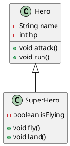
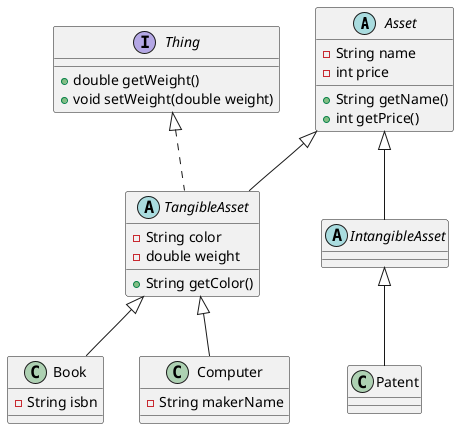

# 상속, 추상 클래스, 인터페이스, 다형성 복습

이 문서는 `Hero`, `Slime`, `Wizard` 같은 게임 캐릭터와 자산관리 프로그램 과제를 풀면서
상속, 추상 클래스, 인터페이스, 다형성을 다시 익히는 복습 자료입니다.

## 이 문서의 목표

이 문서를 끝낸 뒤 다음을 할 수 있으면 됩니다.

- `extends`로 기존 클래스를 확장한 새 클래스를 만들 수 있습니다.
- 오버라이드와 `super`로 부모의 동작을 재사용하면서 바꿀 수 있습니다.
- 상속과 생성자의 호출 순서를 설명할 수 있습니다.
- is-a 원칙으로 올바른 상속과 잘못된 상속을 구분할 수 있습니다.
- 추상 클래스와 추상 메서드로 "상속의 재료"를 안전하게 만들 수 있습니다.
- 인터페이스를 정의하고 `implements`로 구현할 수 있습니다.
- 부모 타입 변수에 자식 인스턴스를 담고, 그 결과를 예측할 수 있습니다.
- 캐스트와 `instanceof`를 올바르게 사용할 수 있습니다.
- `List`, `Set`, `Map` 중 상황에 맞는 컬렉션을 고를 수 있습니다.

## 이 문서를 읽는 순서

```text
1장 : 상속 (11장)            → PoisonSlime, Wizard, GreatWizard 과제
      └ 덤: List로 파티 전원 회복하기
2장 : 추상 클래스와 인터페이스 (12장) → 자산관리 프로그램 과제
      └ 덤: List, Set, Map으로 자산 관리하기
3장 : 다형성 (13장)           → 13-1, 13-2, 13-3 과제
      └ 덤: 배열 대신 List, Iterator, 컬렉션 안의 컬렉션
4장 : 컬렉션 한눈에 정리       → 컬렉션 연습문제 1~3
5장 : 자주 하는 실수, 체크리스트
```

> 이 문서는 `Java 입문 기초 11장 상속`, `12장 추상클래스와 인터페이스`, `13장 다형성`,
> `Java 입문 응용 2장 컬렉션` 자료를 바탕으로 작성했습니다.
> 13장의 최종 과제인 "별들의 전쟁"은 이 문서에서 다루지 않습니다.

### 패키지

이 문서의 과제 코드는 다음 패키지에 작성한다고 가정합니다.

```text
src/main/java/com/survivalcoding/day02_inheritance
src/test/java/com/survivalcoding/day02_inheritance
```

```java
package com.survivalcoding.day02_inheritance;
```

`day01_class_instance` 패키지에 이미 `Hero`, `Slime`이 있으므로
새 패키지에 만들면 이름이 겹쳐도 서로 영향을 주지 않습니다.

---

## 1. 상속 (11장)

### 1-1. 왜 상속이 필요한가요?

`Hero`는 싸우기(`attack`)와 도망치기(`run`)만 할 수 있습니다.

```java
public class Hero {
    private String name;
    private int hp;

    public void attack() {
        System.out.println(name + "의 공격!");
    }

    public void run() {
        System.out.println(name + "은 도망쳤다!");
    }
}
```

이번에는 날기(`fly`)와 착륙(`land`)까지 가능한 `SuperHero`가 필요합니다.
가장 쉬운 방법은 `Hero.java`를 복사해서 `SuperHero.java`를 만들고 메서드 두 개를 추가하는 것입니다.

하지만 복사 붙여넣기에는 문제가 있습니다.

- `Hero`의 `run()`을 고치면 `SuperHero`의 `run()`도 똑같이 고쳐야 합니다.
- 같은 코드가 여러 파일에 흩어져서 어디가 원본인지 파악하기 어려워집니다.

해결책이 **상속(inheritance)** 입니다.

### 1-2. `extends`로 상속하기

```java
public class SuperHero extends Hero {
    private boolean isFlying;

    public void fly() {
        isFlying = true;
        System.out.println("날아올랐다!");
    }

    public void land() {
        isFlying = false;
        System.out.println("착지했다!");
    }
}
```

`SuperHero extends Hero`는 "`SuperHero`는 `Hero`의 모든 것을 토대로 확장한다"는 뜻입니다.

```java
SuperHero superHero = new SuperHero();
superHero.run();   // SuperHero에 run()이 없어도 Hero의 run()이 실행됩니다.
superHero.fly();
```

용어를 정리합니다.

| 부르는 이름 | `Hero` | `SuperHero` |
| --- | --- | --- |
| 부모 / 자식 | 부모 클래스 | 자식 클래스 |
| 슈퍼 / 서브 | 슈퍼 클래스 | 서브 클래스 |
| 기반 / 파생 | 기반 클래스 | 파생 클래스 |

자식 클래스에는 **부모와 다른 부분(추가된 부분)만** 작성하면 됩니다.

### 1-3. 상속 관계를 그림으로 표현하기

클래스 다이어그램에서는 자식에서 부모 쪽으로 속이 빈 삼각형 화살표를 그립니다.



화살표는 "자식이 부모를 알고 있다"는 방향입니다. 부모는 자식이 누구인지 모릅니다.

### 1-4. 다중 상속은 금지

Java에서는 부모 클래스를 하나만 가질 수 있습니다.

```java
// 컴파일 오류
public class SuperHero extends Hero, Flyer {
}
```

두 부모에 같은 이름의 메서드가 있으면 어느 것을 실행해야 할지 모호해지기 때문입니다.
여러 개를 물려받고 싶은 경우는 2장의 인터페이스로 해결합니다.

### 1-5. 오버라이드 (override)

부모의 메서드를 자식이 **다시 작성하는 것**을 오버라이드라고 합니다.

`SuperHero`는 날고 있는 동안 도망칠 수 없다고 가정합니다.

```java
public class SuperHero extends Hero {
    private boolean isFlying;

    @Override
    public void run() {
        System.out.println("퇴각했다!");
    }
}
```

```java
Hero hero = new Hero();
hero.run();          // Hero의 run()

SuperHero superHero = new SuperHero();
superHero.run();     // SuperHero의 run() → "퇴각했다!"
```

`@Override`는 "이 메서드는 부모 메서드를 재정의한 것"이라고 컴파일러에게 알려주는 표시입니다.
붙이지 않아도 동작하지만 **반드시 붙이는 습관**을 들입니다.

```java
@Override
public void rnu() {   // 오타! 부모에 rnu()가 없으므로 컴파일 오류로 알려줍니다.
}
```

`@Override`가 없으면 오타 난 `rnu()`는 그냥 새 메서드로 추가되고, 실수를 발견하기 어려워집니다.

> 오버로드(overload)와 헷갈리지 않습니다.
> 오버로드는 **같은 클래스 안에서** 이름은 같고 매개변수가 다른 메서드를 여러 개 만드는 것입니다.
> 오버라이드는 **부모의 메서드를** 자식이 같은 모양으로 다시 쓰는 것입니다.

### 1-6. 상속을 금지하는 `final`

```java
public final class Hero {       // 이 클래스는 상속할 수 없습니다.
}

public class Hero {
    public final void run() {    // 이 메서드는 오버라이드할 수 없습니다.
    }
}
```

대표적인 예가 `String`입니다. `String`은 `final` 클래스라서 상속할 수 없습니다.

| `final`을 붙인 곳 | 의미 |
| --- | --- |
| 변수 | 값을 바꿀 수 없음 (상수) |
| 메서드 | 오버라이드할 수 없음 |
| 클래스 | 상속할 수 없음 |

### 1-7. 인스턴스의 다중 구조와 `super`

자식 인스턴스는 안쪽에 부모 인스턴스를 품고 있는 구조라고 생각하면 이해하기 쉽습니다.

```text
┌───────── SuperHero 인스턴스 ─────────┐
│  isFlying, fly(), land(), run()      │
│  ┌──────── Hero 부분 ────────┐       │
│  │ name, hp, attack(), run() │       │
│  └───────────────────────────┘       │
└──────────────────────────────────────┘
```

메서드를 호출하면 **바깥쪽(자식)부터** 찾습니다.
그래서 `superHero.run()`은 `SuperHero`의 `run()`이 먼저 실행됩니다.

바깥쪽에서 안쪽(부모) 부분을 부르고 싶을 때 `super`를 사용합니다.

새로운 요구사항이 생겼다고 가정합니다.

```text
SuperHero가 날고 있을 때 공격하면, 일반 공격을 한 뒤 한 번 더 공격한다.
```

`Hero`의 공격 코드를 복사하지 않고 `super.attack()`으로 재사용합니다.

```java
@Override
public void attack() {
    super.attack();          // Hero의 attack() 실행
    if (isFlying) {
        super.attack();      // 날고 있으면 한 번 더
    }
}
```

`super.attack()` 대신 `attack()`을 쓰면 자기 자신을 다시 호출하므로 무한 반복에 빠집니다.

| 표현 | 뜻 |
| --- | --- |
| `this.name` | 나의 필드 |
| `this.attack()` | 나의 메서드 (오버라이드했다면 자식 것) |
| `super.attack()` | 부모의 메서드 |
| `this(...)` | 같은 클래스의 다른 생성자 호출 |
| `super(...)` | 부모 클래스의 생성자 호출 |

### 1-8. 상속과 생성자

다음 코드의 출력 순서를 예측해 봅니다.

```java
public class Hero {
    public Hero() {
        System.out.println("Hero 생성자");
    }
}

public class SuperHero extends Hero {
    public SuperHero() {
        System.out.println("SuperHero 생성자");
    }
}

new SuperHero();
```

결과:

```text
Hero 생성자
SuperHero 생성자
```

`SuperHero` 생성자에 아무것도 적지 않았지만 Java가 첫 줄에 `super();`를 자동으로 넣어줍니다.

```java
public SuperHero() {
    super();   // 적지 않아도 자동으로 추가됨
    System.out.println("SuperHero 생성자");
}
```

안쪽(부모) 부분이 먼저 만들어져야 바깥쪽(자식) 부분을 만들 수 있기 때문입니다.

#### 부모 생성자를 호출하지 않으면 에러가 나는 이유

부모에 매개변수 없는 생성자가 없으면 자동으로 넣어준 `super();`가 실패합니다.

```java
public class Hero {
    private String name;

    public Hero(String name) {    // 기본 생성자가 없음
        this.name = name;
    }
}

public class SuperHero extends Hero {
    public SuperHero(String name) {
        // super(); 가 자동으로 들어가지만 Hero()가 없으므로 컴파일 오류
    }
}
```

해결 방법은 부모 생성자를 **직접 첫 줄에서** 호출하는 것입니다.

```java
public SuperHero(String name) {
    super(name);
}
```

`this(...)`와 마찬가지로 `super(...)`도 반드시 생성자의 첫 번째 문장이어야 합니다.

### 1-9. 올바른 상속: is-a 원칙

올바른 상속은 다음 문장이 자연스러운 경우입니다.

```text
자식 클래스 is a 부모 클래스
SuperHero is a Hero   (SuperHero는 Hero의 한 종류이다)  → O
```

코드가 비슷하다는 이유만으로 상속하면 **잘못된 상속**입니다.

```java
// 포션에도 이름과 가격이 있으니 Sword를 상속하자?
public class Potion extends Sword {
}
```

"포션은 칼의 한 종류이다"는 말이 되지 않습니다.
잘못된 상속을 하면 다음 문제가 생깁니다.

- 클래스를 확장할 때 현실 세계와 모순이 생깁니다. (`Sword`에 `sharpen()`을 추가하면 포션도 갈 수 있게 됩니다.)
- 3장에서 배울 **다형성**을 제대로 활용할 수 없습니다.

상속 관계는 **구체화와 일반화**의 관계이기도 합니다.

```text
Character      ← 더 추상적 (일반화)
   ↑
  Hero
   ↑
SuperHero      ← 더 구체적 (구체화)
```

자식으로 내려갈수록 구체적이 되고, 부모로 올라갈수록 추상적이 됩니다.

### 1-10. 연습문제 1: 잘못된 상속 찾기

| 번호 | 부모 | 자식 | "자식 is a 부모"? | 판정 |
| --- | --- | --- | --- | --- |
| 1 | `Person` | `Student` | 학생은 사람이다 | 올바름 |
| 2 | `Car` | `Engine` | 엔진은 자동차이다? | **잘못됨** |
| 3 | `Father` | `Child` | 아이는 아버지이다? | **잘못됨** |
| 4 | `Food` | `Sushi` | 초밥은 음식이다 | 올바름 |
| 5 | `SuperMan` | `Man` | 남자는 슈퍼맨이다? | **잘못됨** |

- 2번: 엔진은 자동차의 **부품**입니다. "자동차가 엔진을 가진다(has-a)"이므로 상속이 아니라 필드로 표현합니다.
- 3번: 현실의 "부모와 자식"과 상속의 "부모와 자식"은 다른 개념입니다.
- 5번: 방향이 거꾸로입니다. `Man`이 부모, `SuperMan`이 자식이어야 합니다.

```java
// 2번의 올바른 표현: has-a
public class Car {
    private Engine engine;
}
```

### 1-11. 연습문제 2: 부모와 자식 떠올리기

정답은 하나가 아닙니다. "자식 is a 부모"가 자연스러운지만 확인합니다.

| 기준 | 부모 클래스 예 | 자식 클래스 예 |
| --- | --- | --- |
| `Hero` (예시) | `Character` | `SuperHero` |
| `Phone` | `Device` | `SmartPhone` |
| `Car` | `Vehicle` | `SportsCar` |
| `Dictionary` | `Book` | `EnglishDictionary` |

### 1-12. 과제 준비: 이 장에서 사용할 `Hero`

연습문제 3~5에서는 공격을 받고 회복하는 `Hero`가 필요합니다.
HP는 0보다 작아지거나 최대 HP를 넘으면 안 되므로 `setHp()`에서 범위를 보정합니다.

```java
package com.survivalcoding.day02_inheritance;

public class Hero {
    public static final int MAX_HP = 100;

    private final String name;
    private int hp;

    public Hero(String name, int hp) {
        this.name = name;
        setHp(hp);
    }

    public Hero(String name) {
        this(name, MAX_HP);
    }

    public String getName() {
        return name;
    }

    public int getHp() {
        return hp;
    }

    public int getMaxHp() {
        return MAX_HP;
    }

    public void setHp(int hp) {
        this.hp = Math.max(0, Math.min(hp, MAX_HP));
    }
}
```

`Math.max(0, Math.min(hp, MAX_HP))`는 안쪽부터 읽습니다.

```text
Math.min(hp, MAX_HP)  → 최대 HP를 넘지 않게 자르기
Math.max(0, ...)      → 0보다 작아지지 않게 자르기
```

### 1-13. 연습문제 3: `PoisonSlime`

#### 주어진 `Slime`

```java
package com.survivalcoding.day02_inheritance;

public class Slime {
    private final String suffix;
    private int hp = 50;

    public Slime(String suffix) {
        this.suffix = suffix;
    }

    public String getSuffix() {
        return suffix;
    }

    public int getHp() {
        return hp;
    }

    public void setHp(int hp) {
        this.hp = hp;
    }

    public void attack(Hero hero) {
        System.out.println("슬라임 " + suffix + "이/가 공격했다");
        System.out.println("10의 데미지");
        hero.setHp(hero.getHp() - 10);
    }
}
```

#### 요구사항 분해

| 문제의 표현 | 코드로 바꿀 것 |
| --- | --- |
| 슬라임 중에서도 특히 독 공격이 되는 것 | `PoisonSlime extends Slime` |
| `new PoisonSlime("A")`로 만든다 | `PoisonSlime(String suffix)` 생성자 |
| 독 공격 가능 횟수 `poisonCount`, 초기값 5 | `private int poisonCount = 5;` |
| 아무나 수정 금지 | `private` + setter 없음 |
| 우선 보통 슬라임과 같은 공격 | `super.attack(hero)` |
| `poisonCount`가 0이 아니면 추가 공격 | `if (poisonCount > 0)` |
| 독 데미지는 용사 HP / 5, 소수점 버림 | `int poisonDamage = hero.getHp() / 5;` |
| `poisonCount`를 1 감소 | `poisonCount--;` |

`int / int`는 결과도 `int`이므로 소수점 이하가 자동으로 버려집니다.

```text
72 / 5 = 14   (14.4 → 14)
```

#### 1단계: 클래스와 생성자

```java
public class PoisonSlime extends Slime {
    public PoisonSlime(String suffix) {
        super(suffix);
    }
}
```

`Slime`에는 `Slime(String suffix)` 생성자만 있으므로 `super(suffix)`를 직접 호출해야 합니다.
이 줄을 지우면 1-8에서 본 컴파일 오류가 발생합니다.

#### 2단계: 필드 추가

```java
public class PoisonSlime extends Slime {
    private static final int INITIAL_POISON_COUNT = 5;

    private int poisonCount = INITIAL_POISON_COUNT;

    public PoisonSlime(String suffix) {
        super(suffix);
    }

    public int getPoisonCount() {
        return poisonCount;
    }
}
```

getter는 제공하지만 setter는 만들지 않습니다. "아무나 수정 금지"를 이렇게 표현합니다.

#### 3단계: `attack()` 오버라이드

```java
@Override
public void attack(Hero hero) {
    super.attack(hero);

    if (poisonCount <= 0) {
        return;
    }

    System.out.println("추가로, 독 포자를 살포했다!");
    int poisonDamage = hero.getHp() / 5;
    hero.setHp(hero.getHp() - poisonDamage);
    System.out.println(poisonDamage + "포인트 데미지");
    poisonCount--;
}
```

"보통 슬라임과 같은 공격"을 복사하지 않고 `super.attack(hero)`로 재사용한 점이 핵심입니다.
나중에 `Slime`의 공격 메시지가 바뀌어도 `PoisonSlime`은 고칠 필요가 없습니다.

#### 테스트

```java
package com.survivalcoding.day02_inheritance;

import org.junit.jupiter.api.DisplayName;
import org.junit.jupiter.api.Test;

import static org.junit.jupiter.api.Assertions.assertEquals;

class PoisonSlimeTest {

    @Test
    @DisplayName("독 슬라임은 일반 공격 후 남은 HP의 1/5만큼 독 데미지를 준다")
    void attack_withPoison() {
        // Given
        Hero hero = new Hero("홍길동", 100);
        PoisonSlime poisonSlime = new PoisonSlime("A");

        // When
        poisonSlime.attack(hero);

        // Then
        // 100 - 10 = 90, 90 / 5 = 18, 90 - 18 = 72
        assertEquals(72, hero.getHp());
        assertEquals(4, poisonSlime.getPoisonCount());
    }

    @Test
    @DisplayName("독 공격 횟수를 모두 쓰면 일반 공격만 한다")
    void attack_withoutPoison() {
        // Given
        Hero hero = new Hero("홍길동", 100);
        PoisonSlime poisonSlime = new PoisonSlime("A");
        for (int i = 0; i < 5; i++) {
            poisonSlime.attack(hero);
        }
        hero.setHp(100);

        // When
        poisonSlime.attack(hero);

        // Then
        assertEquals(90, hero.getHp());
        assertEquals(0, poisonSlime.getPoisonCount());
    }
}
```

두 번째 테스트는 "Given에서 독을 모두 소진시킨 상태"를 먼저 만든 뒤 한 번 더 공격합니다.
기대값을 쉽게 계산하려고 공격 전에 HP를 100으로 다시 맞췄습니다.

### 1-14. 연습문제 4: `Wizard` 수정

#### 요구사항

- 필드: `int mp` (초기값 100)
- `void heal(Hero hero)`: HP를 20 회복시키고 자신의 MP를 10 소모
- MP가 부족하면 `"마나가 부족합니다"` 출력
- 힐에 성공하면 `"힐을 시전했습니다. 대상 HP: XX"` 출력

다음 연습문제 5에서 `GreatWizard`가 `Wizard`를 상속받아 MP 초기값을 150으로 바꿔야 합니다.
이를 미리 생각해서 **MP를 지정할 수 있는 생성자**를 `protected`로 하나 더 만들어 둡니다.

```java
package com.survivalcoding.day02_inheritance;

public class Wizard {
    private static final int INITIAL_MP = 100;
    private static final int HEAL_AMOUNT = 20;
    private static final int HEAL_COST = 10;

    private final String name;
    private int mp;

    public Wizard(String name) {
        this(name, INITIAL_MP);
    }

    protected Wizard(String name, int mp) {
        this.name = name;
        setMp(mp);
    }

    public String getName() {
        return name;
    }

    public int getMp() {
        return mp;
    }

    protected void setMp(int mp) {
        if (mp < 0) {
            throw new IllegalArgumentException("MP는 음수일 수 없습니다.");
        }
        this.mp = mp;
    }

    public void heal(Hero hero) {
        if (mp < HEAL_COST) {
            System.out.println("마나가 부족합니다");
            return;
        }

        hero.setHp(hero.getHp() + HEAL_AMOUNT);
        mp -= HEAL_COST;
        System.out.println("힐을 시전했습니다. 대상 HP: " + hero.getHp());
    }
}
```

#### `protected`는 왜 썼나요?

| 지정자 | 접근 가능한 범위 |
| --- | --- |
| `private` | 자기 클래스 안 |
| (없음) | 같은 패키지 안 |
| `protected` | 같은 패키지 + **다른 패키지의 자식 클래스** |
| `public` | 모든 곳 |

`setMp()`를 `public`으로 열면 외부 코드가 마법사의 MP를 마음대로 바꿀 수 있습니다.
`private`으로 닫으면 자식인 `GreatWizard`도 MP를 줄일 수 없습니다.
`protected`는 "자식에게만 열어준다"는 중간 단계입니다.

> 필드 `mp` 자체를 `protected`로 열 수도 있지만, 그러면 자식이 음수 검사를 건너뛸 수 있습니다.
> 필드는 `private`으로 두고 검사가 들어간 메서드를 `protected`로 여는 편이 안전합니다.

### 1-15. 연습문제 5: `GreatWizard`

#### 요구사항

- `Wizard`를 상속
- MP 초기값 150
- `heal(Hero)` 재정의: HP 25 회복, MP 5 소모
- `superHeal(Hero)`: HP를 최대로 회복, MP 50 소모
- MP가 부족하면 `"마나가 부족합니다"` 출력
- 슈퍼 힐에 성공하면 `"슈퍼 힐을 시전했습니다. 대상 HP: XX"` 출력

```java
package com.survivalcoding.day02_inheritance;

public class GreatWizard extends Wizard {
    private static final int INITIAL_MP = 150;
    private static final int GREAT_HEAL_AMOUNT = 25;
    private static final int GREAT_HEAL_COST = 5;
    private static final int SUPER_HEAL_COST = 50;

    public GreatWizard(String name) {
        super(name, INITIAL_MP);
    }

    @Override
    public void heal(Hero hero) {
        if (getMp() < GREAT_HEAL_COST) {
            System.out.println("마나가 부족합니다");
            return;
        }

        hero.setHp(hero.getHp() + GREAT_HEAL_AMOUNT);
        setMp(getMp() - GREAT_HEAL_COST);
        System.out.println("힐을 시전했습니다. 대상 HP: " + hero.getHp());
    }

    public void superHeal(Hero hero) {
        if (getMp() < SUPER_HEAL_COST) {
            System.out.println("마나가 부족합니다");
            return;
        }

        hero.setHp(hero.getMaxHp());
        setMp(getMp() - SUPER_HEAL_COST);
        System.out.println("슈퍼 힐을 시전했습니다. 대상 HP: " + hero.getHp());
    }
}
```

코드를 줄 단위로 요구사항과 연결합니다.

| 코드 | 요구사항 |
| --- | --- |
| `extends Wizard` | Wizard를 상속 |
| `super(name, INITIAL_MP)` | MP 초기값 150 |
| `@Override heal` | heal 재정의 |
| `getMp()`, `setMp()` | 부모의 `private mp`는 직접 못 만지므로 메서드로 접근 |
| `hero.getMaxHp()` | HP를 최대로 회복 |

#### `heal()`에서 `super.heal()`을 쓰지 않은 이유

`PoisonSlime`은 "보통 공격 + 추가 공격"이라 `super.attack()`을 재사용했습니다.
`GreatWizard.heal()`은 회복량과 소모량이 **완전히 다른 동작**이므로 부모의 `heal()`을 부르면 안 됩니다.

```java
@Override
public void heal(Hero hero) {
    super.heal(hero);   // HP 20 회복 + MP 10 소모가 먼저 일어나 버림
    ...
}
```

`super`는 "부모 동작에 무언가를 덧붙일 때" 사용합니다.

> 심화: 부모의 `heal()`이 회복량과 소모량을 `protected int getHealAmount()` 같은 메서드로 얻도록 만들면
> 자식은 그 두 메서드만 오버라이드하면 됩니다. 이렇게 "흐름은 부모가, 세부 값은 자식이" 정하는 방식은
> 2장의 추상 메서드와도 잘 어울립니다.

#### 테스트

```java
package com.survivalcoding.day02_inheritance;

import org.junit.jupiter.api.DisplayName;
import org.junit.jupiter.api.Test;

import static org.junit.jupiter.api.Assertions.assertEquals;

class WizardTest {

    @Test
    @DisplayName("마법사의 힐은 HP 20을 회복하고 MP 10을 소모한다")
    void wizard_heal() {
        // Given
        Wizard wizard = new Wizard("간달프");
        Hero hero = new Hero("홍길동", 50);

        // When
        wizard.heal(hero);

        // Then
        assertEquals(70, hero.getHp());
        assertEquals(90, wizard.getMp());
    }

    @Test
    @DisplayName("대마법사는 MP 150으로 시작한다")
    void greatWizard_initialMp() {
        GreatWizard greatWizard = new GreatWizard("멀린");

        assertEquals(150, greatWizard.getMp());
    }

    @Test
    @DisplayName("대마법사의 힐은 HP 25를 회복하고 MP 5를 소모한다")
    void greatWizard_heal() {
        // Given
        GreatWizard greatWizard = new GreatWizard("멀린");
        Hero hero = new Hero("홍길동", 50);

        // When
        greatWizard.heal(hero);

        // Then
        assertEquals(75, hero.getHp());
        assertEquals(145, greatWizard.getMp());
    }

    @Test
    @DisplayName("슈퍼 힐은 HP를 최대로 회복하고 MP 50을 소모한다")
    void greatWizard_superHeal() {
        // Given
        GreatWizard greatWizard = new GreatWizard("멀린");
        Hero hero = new Hero("홍길동", 1);

        // When
        greatWizard.superHeal(hero);

        // Then
        assertEquals(hero.getMaxHp(), hero.getHp());
        assertEquals(100, greatWizard.getMp());
    }

    @Test
    @DisplayName("MP가 부족하면 슈퍼 힐은 아무것도 바꾸지 않는다")
    void greatWizard_superHeal_notEnoughMp() {
        // Given
        GreatWizard greatWizard = new GreatWizard("멀린");
        Hero hero = new Hero("홍길동", 1);
        greatWizard.superHeal(hero);   // 150 → 100
        greatWizard.superHeal(hero);   // 100 → 50
        greatWizard.superHeal(hero);   // 50 → 0
        hero.setHp(1);

        // When
        greatWizard.superHeal(hero);

        // Then
        assertEquals(1, hero.getHp());
        assertEquals(0, greatWizard.getMp());
    }
}
```

### 1-16. 덤: `List`로 파티 전원 회복하기

대마법사가 파티원 여러 명에게 힐을 해야 한다면, 용사들을 한곳에 모아둘 곳이 필요합니다.
지금까지는 배열을 사용했습니다.

```java
Hero[] party = new Hero[3];
party[0] = new Hero("홍길동", 30);
party[1] = new Hero("한석봉", 50);
party[2] = new Hero("이순신", 80);
```

배열은 **처음에 크기를 정해야** 하고, 파티원이 4명이 되면 새 배열을 만들어 옮겨야 합니다.
이런 불편함을 해결하는 도구가 **컬렉션**이고, 그중 가장 많이 쓰는 것이 `List`입니다.

```java
import java.util.ArrayList;
import java.util.List;

List<Hero> party = new ArrayList<>();
party.add(new Hero("홍길동", 30));
party.add(new Hero("한석봉", 50));
party.add(new Hero("이순신", 80));
party.add(new Hero("강감찬", 10));   // 크기 걱정 없이 계속 추가
```

코드를 왼쪽부터 읽습니다.

| 코드 | 뜻 |
| --- | --- |
| `List<Hero>` | `Hero`만 담는 리스트 타입 (`<Hero>`를 제네릭이라고 부릅니다) |
| `new ArrayList<>()` | 실제로는 `ArrayList`를 만듭니다. `<>` 안은 왼쪽을 보고 추론합니다 |
| `add(...)` | 맨 뒤에 추가 |

배열과 `ArrayList`를 비교합니다.

| 하고 싶은 일 | 배열 | `ArrayList` |
| --- | --- | --- |
| 만들기 | `new Hero[3]` | `new ArrayList<>()` |
| 추가 | `party[0] = hero` | `party.add(hero)` |
| 꺼내기 | `party[0]` | `party.get(0)` |
| 개수 | `party.length` | `party.size()` |
| 크기 | 고정 | 추가할 때마다 커짐 |

이제 파티 전원을 슈퍼 힐합니다.

```java
GreatWizard greatWizard = new GreatWizard("멀린");

for (Hero hero : party) {
    greatWizard.superHeal(hero);
}
```

`for (Hero hero : party)`는 "party에서 하나씩 꺼내 hero라고 부르며 반복한다"는 뜻입니다(for-each).
MP 150으로 슈퍼 힐은 3번만 가능하므로, 4번째 강감찬에게는 `"마나가 부족합니다"`가 출력됩니다.

#### 컬렉션에는 기본형을 담을 수 없습니다

```java
List<int> scores = new ArrayList<>();       // 컴파일 오류
List<Integer> scores = new ArrayList<>();   // O
scores.add(100);                             // int → Integer 자동 변환
int first = scores.get(0);                   // Integer → int 자동 변환
```

| 기본형 | 컬렉션에 쓸 타입 (래퍼 클래스) |
| --- | --- |
| `int` | `Integer` |
| `double` | `Double` |
| `boolean` | `Boolean` |
| `char` | `Character` |

#### 리스트에는 인스턴스가 아니라 "참조"가 들어갑니다

다음 코드의 출력을 예측해 봅니다.

```java
Hero hero = new Hero("홍길동", 100);

List<Hero> party = new ArrayList<>();
party.add(hero);

hero.setHp(1);

System.out.println(party.get(0).getHp());   // ?
```

정답은 `1`입니다. `add(hero)`는 용사를 **복사해서** 넣는 것이 아니라,
`hero` 변수가 가리키는 **같은 인스턴스의 참조**를 넣습니다.

```text
hero ────────┐
             ├──> Hero 인스턴스 (hp: 1)
party[0] ────┘
```

01 문서의 "참조형 변수" 내용과 같은 원리입니다.

---

## 2. 추상 클래스와 인터페이스 (12장)

### 2-1. 상속의 재료를 만드는 개발자

지금까지는 "이미 있는 클래스를 상속해서 쓰는" 입장이었습니다.
이번에는 **다른 개발자가 상속해서 쓸 부모 클래스를 만드는** 입장이 되어 봅니다.

`Hero`와 `Wizard`의 공통점을 모아 `Character`를 만들고 싶습니다.

```java
public class Character {
    protected String name;
    protected int hp;

    public void run() {
        System.out.println(name + "은 도망쳤다");
    }

    public void attack(Monster monster) {
        // ??? 용사는 칼로, 마법사는 지팡이로 공격한다. 여기에 무엇을 써야 할까?
    }
}
```

`run()`은 모두 같지만 `attack()`은 캐릭터마다 다르므로 **지금은 내용을 정할 수 없습니다.**

#### 대책 1: 내용을 비워두기

```java
public void attack(Monster monster) {
}
```

이렇게 하면 미래의 걱정이 생깁니다.

1. 자식 클래스 개발자가 `attack()`을 오버라이드하는 것을 **잊어버릴 수 있습니다.** 그러면 공격해도 아무 일도 일어나지 않습니다.
2. "반드시 오버라이드하세요"라고 주석을 남겨도 **철자가 틀린** `atack()`을 만들면 여전히 빈 `attack()`이 실행됩니다.
3. 누군가 `new Character()`로 **정체 모를 캐릭터를 만들어 버릴 수 있습니다.**

필요한 것은 두 가지입니다.

```text
① 이 메서드는 반드시 오버라이드하라고 "강제"하기
② 이 클래스는 new 하지 못하게 "금지"하기
```

### 2-2. 추상 메서드와 추상 클래스

```java
public abstract class Character {
    protected String name;
    protected int hp;

    public void run() {
        System.out.println(name + "은 도망쳤다");
    }

    public abstract void attack(Monster monster);
}
```

- `abstract void attack(...)` : **추상 메서드**. 몸통 `{ }` 없이 세미콜론으로 끝납니다. "상세 내용은 미정"이라는 뜻입니다.
- `abstract class Character` : **추상 클래스**. 추상 메서드를 하나라도 가지면 클래스에도 반드시 `abstract`를 붙여야 합니다.

추상 클래스에는 두 가지 제약이 생기고, 이 제약이 곧 위의 걱정을 해결합니다.

#### 제약 ①: 추상 메서드 오버라이드 강제

```java
public class Hero extends Character {
    // attack()을 오버라이드하지 않으면 컴파일 오류
}
```

```java
public class Hero extends Character {
    @Override
    public void attack(Monster monster) {
        System.out.println(name + "의 공격!");
    }
}
```

오버라이드를 잊거나 철자를 틀리면 **컴파일 단계에서** 바로 알 수 있습니다.

#### 제약 ②: 인스턴스화 금지

```java
Character character = new Character();   // 컴파일 오류
Character character = new Hero();        // O (3장에서 자세히 다룹니다)
```

#### 다계층 추상 상속

추상 클래스를 상속한 자식이 모든 추상 메서드를 구현하지 않으면, 자식도 추상 클래스여야 합니다.

```java
public abstract class Character {
    public abstract void attack(Monster monster);
    public abstract void run();
}

public abstract class Wizard extends Character {   // attack만 구현했으므로 아직 추상
    @Override
    public void attack(Monster monster) { ... }
}

public class GreatWizard extends Wizard {          // 남은 run까지 구현해야 일반 클래스
    @Override
    public void run() { ... }
}
```

### 2-3. 인터페이스

추상 클래스 중에서도 다음 조건을 만족하는 것을 특별히 **인터페이스**로 취급합니다.

1. 모든 메서드가 추상 메서드이다.
2. 필드를 가지지 않는다.

```java
// 추상 메서드만 가진 추상 클래스
public abstract class Creature {
    public abstract void run();
}

// 같은 뜻의 인터페이스
public interface Creature {
    void run();
}
```

인터페이스 안의 메서드는 자동으로 `public abstract`가 붙습니다. 그래서 생략해서 씁니다.

#### 인터페이스의 "필드"는 상수입니다

```java
public interface Creature {
    double PI = 3.14;      // 자동으로 public static final
}
```

인터페이스에 선언한 변수는 필드가 아니라 **상수**입니다. 값을 바꿀 수 없고 `Creature.PI`처럼 사용합니다.

> 참고: Java 8부터는 인터페이스에 몸통이 있는 `default` 메서드도 만들 수 있습니다.
> 이 과정에서는 "인터페이스 = 추상 메서드의 모음"이라는 기본 개념을 먼저 익힙니다.

#### 구현하기: `implements`

```java
public interface Healable {
    void heal(Hero hero);
}

public class Wizard implements Healable {
    @Override
    public void heal(Hero hero) {
        ...
    }
}
```

클래스가 인터페이스를 부모로 가질 때는 `extends`가 아니라 `implements`(구현)를 씁니다.

### 2-4. 인터페이스의 효과

1. 같은 인터페이스를 구현한 클래스들은 공통 메서드를 **반드시** 구현합니다.
2. 어떤 클래스가 `Healable`을 구현했다면, 적어도 `heal()`을 가지고 있다는 것이 **보증**됩니다.
3. **can-do 원칙**: 인터페이스는 "~할 수 있다"는 능력을 나타냅니다. 그래서 이름을 형용사형(`-able`)으로 짓는 경우가 많습니다.
4. 일종의 **역할, 분류**를 표현합니다.

| 원칙 | 관계 | 예 |
| --- | --- | --- |
| is-a | 상속 (`extends`) | `Wizard is a Character` |
| can-do | 구현 (`implements`) | `Wizard can heal` → `Healable` |

### 2-5. 인터페이스는 여러 개 구현할 수 있습니다

클래스는 부모를 하나만 가질 수 있지만, 인터페이스는 여러 개를 구현할 수 있습니다.

```java
public interface Human {
    void talk();
}

public interface Hero {
    void fight();
}

// 스파이더맨은 영웅이면서 시민이다
public class SpiderMan implements Human, Hero {
    @Override
    public void talk() { ... }

    @Override
    public void fight() { ... }
}
```

클래스의 다중 상속을 금지한 이유는 "같은 이름의 메서드가 서로 다른 내용을 가질 때의 모호함" 때문이었습니다.
인터페이스의 메서드는 내용이 없으므로 이름이 겹쳐도 구현은 하나뿐이라 모호하지 않습니다.

#### 인터페이스끼리의 상속

```java
public interface Creature {
    void run();
}

public interface Human extends Creature {
    void talk();
}
```

`Human`을 구현하는 클래스는 `run()`과 `talk()`를 모두 구현해야 합니다.

#### `extends`와 `implements` 정리

| 부모 | 자식 | 키워드 | 여러 개 가능? |
| --- | --- | --- | --- |
| class | class | `extends` | X |
| interface | class | `implements` | O |
| interface | interface | `extends` | O |

### 2-6. 상속과 구현을 동시에

```java
public interface Attackable {
    void attack(Monster monster);
}

public interface Healable {
    void heal(Hero hero);
}

public class Wizard extends Character implements Attackable, Healable {
    public Wizard(String name, int hp) {
        super(name, hp);
    }

    @Override
    public void attack(Monster monster) { ... }

    @Override
    public void heal(Hero hero) { ... }
}
```

순서는 항상 `extends` 먼저, `implements` 나중입니다.
"일반 전투(Attackable)와 마법(Healable)이 모두 가능한 캐릭터"를 인터페이스의 조합으로 표현했습니다.

### 2-7. 연습문제 1: 유형자산 `TangibleAsset`

#### 주어진 클래스

```java
public class Book {
    String name;
    int price;
    String color;
    String isbn;
}

public class Computer {
    String name;
    int price;
    String color;
    String makerName;
}
```

#### 공통점과 차이점 찾기

| 필드 | `Book` | `Computer` | 어디로? |
| --- | --- | --- | --- |
| `name` | O | O | 부모 |
| `price` | O | O | 부모 |
| `color` | O | O | 부모 |
| `isbn` | O | | `Book` |
| `makerName` | | O | `Computer` |

공통 필드를 부모인 `TangibleAsset`으로 올립니다.
"유형자산"이라는 정체 모를 물건을 `new`로 만들면 안 되므로 **추상 클래스**로 만듭니다.

```java
public abstract class TangibleAsset {
    private final String name;
    private final int price;
    private final String color;

    protected TangibleAsset(String name, int price, String color) {
        this.name = name;
        this.price = price;
        this.color = color;
    }

    public String getName() {
        return name;
    }

    public int getPrice() {
        return price;
    }

    public String getColor() {
        return color;
    }
}
```

```java
public class Book extends TangibleAsset {
    private final String isbn;

    public Book(String name, int price, String color, String isbn) {
        super(name, price, color);
        this.isbn = isbn;
    }

    public String getIsbn() {
        return isbn;
    }
}

public class Computer extends TangibleAsset {
    private final String makerName;

    public Computer(String name, int price, String color, String makerName) {
        super(name, price, color);
        this.makerName = makerName;
    }

    public String getMakerName() {
        return makerName;
    }
}
```

- 추상 메서드가 하나도 없어도 `abstract class`로 만들 수 있습니다. 목적은 **인스턴스화 금지**입니다.
- 추상 클래스의 생성자는 자식만 부르면 되므로 `protected`로 둡니다.

### 2-8. 연습문제 2: 자산 `Asset`과 무형자산

```text
무형자산(IntangibleAsset)에는 특허권(Patent) 등이 있다.
무형자산도 유형자산도 자산(Asset)의 일종이다.
```

상속도의 빈칸은 다음과 같습니다.

| 칸 | 클래스 |
| --- | --- |
| (가) | `Asset` |
| (나) | `IntangibleAsset` |
| (다) | `Patent` |

유형자산과 무형자산의 공통점은 무엇일까요?
`color`는 형태가 있어야 가질 수 있으므로 무형자산에는 맞지 않습니다.
`name`, `price`만 `Asset`으로 한 단계 더 올립니다.

```java
public abstract class Asset {
    private final String name;
    private final int price;

    protected Asset(String name, int price) {
        this.name = name;
        this.price = price;
    }

    public String getName() {
        return name;
    }

    public int getPrice() {
        return price;
    }
}
```

```java
public abstract class TangibleAsset extends Asset {
    private final String color;

    protected TangibleAsset(String name, int price, String color) {
        super(name, price);
        this.color = color;
    }

    public String getColor() {
        return color;
    }
}
```

```java
public abstract class IntangibleAsset extends Asset {
    protected IntangibleAsset(String name, int price) {
        super(name, price);
    }
}

public class Patent extends IntangibleAsset {
    public Patent(String name, int price) {
        super(name, price);
    }
}
```

`Book`과 `Computer`는 고칠 필요가 없습니다. 여전히 `super(name, price, color)`로 `TangibleAsset`을 부르고,
`TangibleAsset`이 다시 `super(name, price)`로 `Asset`을 부릅니다.

```text
new Book(...)
→ Book 생성자
→ super(name, price, color)  : TangibleAsset 생성자
→ super(name, price)         : Asset 생성자
```

### 2-9. 연습문제 3: 인터페이스 `Thing`

```text
자산인지 아닌지 따지지 말고, 형태가 있는 것(Thing)이면 무게가 있다.
```

```java
public interface Thing {
    double getWeight();

    void setWeight(double weight);
}
```

인터페이스는 필드를 가질 수 없으므로 `weight` 필드는 없고, getter와 setter의 **약속**만 정의합니다.
실제 `weight` 필드는 구현하는 클래스가 가집니다.

### 2-10. 연습문제 4: `TangibleAsset`은 `Asset`이면서 `Thing`

```text
유형자산은 자산의 일종이며(is-a), 형태가 있는 것의 일종이기도 하다.
```

```java
public abstract class TangibleAsset extends Asset implements Thing {
    private final String color;
    private double weight;

    protected TangibleAsset(String name, int price, String color, double weight) {
        super(name, price);
        this.color = color;
        setWeight(weight);
    }

    public String getColor() {
        return color;
    }

    @Override
    public double getWeight() {
        return weight;
    }

    @Override
    public void setWeight(double weight) {
        if (weight < 0) {
            throw new IllegalArgumentException("무게는 음수일 수 없습니다.");
        }
        this.weight = weight;
    }
}
```

생성자에 `weight`가 추가되었으므로 자식 생성자도 함께 수정합니다.

```java
public class Book extends TangibleAsset {
    private final String isbn;

    public Book(String name, int price, String color, double weight, String isbn) {
        super(name, price, color, weight);
        this.isbn = isbn;
    }

    public String getIsbn() {
        return isbn;
    }
}
```

`Computer`도 같은 방식으로 `weight`를 받아 `super(...)`에 넘깁니다.

#### 클래스 다이어그램



| 화살표 | 뜻 |
| --- | --- |
| `<\|--` (실선) | 상속 (`extends`) |
| `<\|..` (점선) | 구현 (`implements`) |

#### 테스트

```java
package com.survivalcoding.day02_inheritance;

import org.junit.jupiter.api.DisplayName;
import org.junit.jupiter.api.Test;

import static org.junit.jupiter.api.Assertions.assertEquals;
import static org.junit.jupiter.api.Assertions.assertThrows;

class AssetTest {

    @Test
    @DisplayName("책은 자산 정보와 무게, ISBN을 가진다")
    void book_hasAllInfo() {
        Book book = new Book("자바 입문", 30000, "파랑", 0.8, "978-89-000");

        assertEquals("자바 입문", book.getName());
        assertEquals(30000, book.getPrice());
        assertEquals("파랑", book.getColor());
        assertEquals(0.8, book.getWeight());
        assertEquals("978-89-000", book.getIsbn());
    }

    @Test
    @DisplayName("무게를 음수로 설정하면 예외가 발생한다")
    void setWeight_negative() {
        Computer computer = new Computer("맥북", 2000000, "은색", 1.4, "애플");

        assertThrows(IllegalArgumentException.class, () -> computer.setWeight(-1));
    }
}
```

`new Asset(...)`, `new TangibleAsset(...)`이 컴파일되지 않는 것은 테스트 코드로 확인하는 내용이 아닙니다.
설계가 의도대로 되었는지 코드 리뷰에서 확인합니다.

### 2-11. 덤: `List`, `Set`, `Map`으로 자산 관리하기

자산관리 프로그램이라면 자산을 모아서 다루는 기능이 꼭 필요합니다.
여기서 세 가지 대표 컬렉션을 모두 만나 봅니다.

| 컬렉션 | 특징 | 비유 |
| --- | --- | --- |
| `List` | 순서대로 쌓임, 중복 허용 | 줄 서기 |
| `Set` | 순서 없음, 중복 불가 | 주머니 속 구슬 |
| `Map` | 키(key)와 값(value)의 쌍, 키 중복 불가 | 사전 |

#### `List<Asset>`: 모든 자산의 가격 합계

```java
List<Asset> assets = new ArrayList<>();
assets.add(new Book("자바 입문", 30000, "파랑", 0.8, "978-89-000"));
assets.add(new Computer("맥북", 2000000, "은색", 1.4, "애플"));
assets.add(new Patent("게임 특허", 5000000));

int total = 0;
for (Asset asset : assets) {
    total += asset.getPrice();
}
System.out.println("총 자산: " + total);
```

`List<Asset>`에 `Book`, `Computer`, `Patent`를 **모두** 담을 수 있다는 점을 눈여겨봅니다.
셋 다 `Asset`의 일종(is-a)이기 때문입니다. 이것이 3장의 **다형성**입니다.

#### `Set<String>`: 컴퓨터 제조사 목록 (중복 제거)

```java
Set<String> makers = new HashSet<>();
makers.add("애플");
makers.add("삼성");
makers.add("애플");   // 이미 있으므로 무시됨

System.out.println(makers.size());            // 2
System.out.println(makers.contains("삼성"));   // true
```

- `Set`은 순서가 없으므로 `get(0)` 같은 메서드가 **없습니다.** 하나씩 꺼낼 때는 for-each를 씁니다.
- `contains()`로 "들어 있는지" 확인하는 속도가 `List`보다 압도적으로 빠릅니다.

#### `Map<String, Book>`: ISBN으로 책 찾기

```java
Map<String, Book> booksByIsbn = new HashMap<>();
Book javaBook = new Book("자바 입문", 30000, "파랑", 0.8, "978-89-000");
booksByIsbn.put(javaBook.getIsbn(), javaBook);

Book found = booksByIsbn.get("978-89-000");
System.out.println(found.getName());   // 자바 입문
```

`List`에서 책을 찾으려면 처음부터 하나씩 비교해야 하지만, `Map`은 키로 바로 찾아갑니다.

`Map`의 내용을 하나씩 꺼낼 때는 `entrySet()`을 사용합니다.

```java
for (Map.Entry<String, Book> entry : booksByIsbn.entrySet()) {
    System.out.println(entry.getKey() + " : " + entry.getValue().getName());
}
```

> `HashMap`과 `HashSet`은 **순서를 보장하지 않습니다.** 넣은 순서대로 출력되지 않을 수 있습니다.
> 넣은 순서를 유지하고 싶다면 `LinkedHashMap`, `LinkedHashSet`을 사용합니다.

---

## 3. 다형성 (13장)

### 3-1. 다형성이란?

**다형성(polymorphism)** 은 "어떤 것을 이렇게도 부를 수 있고, 저렇게도 부를 수 있는 것"입니다.

```text
손흥민은 남자이고, 축구선수이다.
소나타는 자동차이면서, 기계이다.
```

코드에서도 마찬가지입니다. `SuperHero`는 `SuperHero`이면서 `Hero`이기도 합니다.

### 3-2. 공통 메서드를 하나로 묶기

집, 강아지, 자동차를 그리는 프로그램이 있습니다.

```java
house.draw();
dog.draw();
car.draw();
```

셋 다 "그릴 수 있다(can-do)"는 공통점이 있으므로 인터페이스로 묶습니다.

```java
public interface Drawable {
    void draw();
}

public class House implements Drawable {
    @Override
    public void draw() {
        System.out.println("집을 그립니다");
    }
}

public class Dog implements Drawable {
    @Override
    public void draw() {
        System.out.println("강아지를 그립니다");
    }
}
```

이제 변수의 타입을 인터페이스로 선언할 수 있습니다.

```java
Drawable drawable = new House();
drawable.draw();   // 집을 그립니다

drawable = new Dog();
drawable.draw();   // 강아지를 그립니다
```

같은 `drawable.draw()` 코드인데 **들어 있는 인스턴스에 따라** 다르게 동작합니다. 이것이 다형성입니다.

#### 다형성을 활용하는 방법

```text
선언은 상위 개념(추상적인 타입)으로,
인스턴스 생성은 하위 개념(구체적인 타입)으로.

Drawable drawable = new House();
   ↑ 추상적 선언         ↑ 구체적 생성
```

이미 2장의 덤에서 `List<Hero> party = new ArrayList<>();`로 같은 방식을 사용했습니다.
`List`는 인터페이스이고, `ArrayList`는 그것을 구현한 클래스입니다.

### 3-3. 상자의 타입과 내용의 타입

```java
Character character = new Wizard();
```

변수를 "상자", 인스턴스를 "내용물"로 생각합니다.

```text
상자의 타입  : Character   → 무엇을 호출할 수 있는지 결정
내용의 타입  : Wizard      → 호출했을 때 어떻게 동작하는지 결정
```

```java
public abstract class Character {
    public abstract void attack(Monster monster);
}

public class Wizard extends Character {
    @Override
    public void attack(Monster monster) {
        System.out.println("지팡이로 때렸다");
    }

    public void fireball(Monster monster) {
        System.out.println("파이어볼!");
    }
}
```

```java
Character character = new Wizard();
character.attack(slime);     // O  → "지팡이로 때렸다"
character.fireball(slime);   // X  컴파일 오류
```

- `attack()`이 가능한 이유: 상자 타입 `Character`에 `attack()`이 있으므로. 실제로는 내용물인 `Wizard`의 `attack()`이 실행됩니다.
- `fireball()`이 불가능한 이유: 상자 타입 `Character`에는 `fireball()`이 없으므로.
  모든 `Character`가 파이어볼을 쓸 수 있는 것은 아니기 때문에, 컴파일러는 상자의 타입만 보고 판단합니다.

### 3-4. 결과 예측 연습

```java
public abstract class Monster {
    public void run() {
        System.out.println("몬스터는 도망쳤다");      // ①
    }
}

public class Slime extends Monster {
    @Override
    public void run() {
        System.out.println("슬라임은 슬금슬금 도망쳤다");   // ②
    }
}

Slime slime = new Slime();
Monster monster = new Slime();
slime.run();
monster.run();
```

정답은 `②, ②`입니다.
상자의 타입이 `Monster`여도 내용물은 `Slime`이므로 `Slime`의 `run()`이 실행됩니다.

### 3-5. 타입 변경: 캐스트

상자의 타입을 좁혀서 `fireball()`을 쓰고 싶다면 캐스트 연산자를 사용합니다.

```java
Character character = new Wizard();
Wizard wizard = (Wizard) character;   // "내용물은 Wizard가 맞다"고 강제로 주장
wizard.fireball(slime);               // O
```

하지만 내용물이 실제로 다르면 **실행 중에** 예외가 발생합니다.

```java
Character character = new Hero();
Wizard wizard = (Wizard) character;   // 컴파일은 통과, 실행 시 ClassCastException
```

컴파일러는 "`Character`가 `Wizard`일 수도 있겠지"라고 믿어주지만, 실행해 보니 `Hero`였던 것입니다.

#### `instanceof`로 안전하게 확인하기

```java
if (character instanceof Wizard) {
    Wizard wizard = (Wizard) character;
    wizard.fireball(slime);
}
```

Java 16부터는 확인과 캐스트를 한 번에 쓸 수 있습니다.

```java
if (character instanceof Wizard wizard) {
    wizard.fireball(slime);
}
```

> 캐스트와 `instanceof`가 코드 곳곳에 등장한다면 설계를 다시 볼 신호입니다.
> 다형성을 잘 쓰면 "내용물이 무엇인지 확인하는 코드" 자체가 필요 없어집니다.

### 3-6. 다형성의 메리트 1: 같은 타입으로 모아 처리하기

파티원 모두가 쉬어서 HP를 50 회복하는 코드를 다형성 없이 작성하면 다음과 같습니다.

```java
Hero hero1 = new Hero();
Hero hero2 = new Hero();
Thief thief = new Thief();
Wizard wizard = new Wizard();

hero1.setHp(hero1.getHp() + 50);
hero2.setHp(hero2.getHp() + 50);
thief.setHp(thief.getHp() + 50);
wizard.setHp(wizard.getHp() + 50);
```

모두 `Character`로 볼 수 있으므로 하나의 목록에 담아 반복합니다.
원래 교재는 배열을 쓰지만, 1장의 덤에서 배운 `List`로 바꿔 봅니다.

```java
List<Character> party = new ArrayList<>();
party.add(new Hero());
party.add(new Hero());
party.add(new Thief());
party.add(new Wizard());

for (Character character : party) {
    character.setHp(character.getHp() + 50);
}
```

파티원이 늘어나도 반복문은 그대로입니다.

#### 덤: `Iterator`로 꺼내기

for-each는 내부적으로 `Iterator`라는 객체를 사용합니다. 직접 쓰면 다음과 같습니다.

```java
Iterator<Character> iterator = party.iterator();
while (iterator.hasNext()) {
    Character character = iterator.next();
    character.setHp(character.getHp() + 50);
}
```

| 메서드 | 뜻 |
| --- | --- |
| `hasNext()` | 다음 요소가 있는가? |
| `next()` | 다음 요소를 꺼내고 한 칸 이동 |
| `remove()` | 방금 꺼낸 요소를 삭제 |

평소에는 for-each로 충분합니다.
**반복하면서 요소를 삭제**해야 할 때는 `Iterator.remove()`를 사용합니다.
for-each 도중에 `party.remove(...)`를 호출하면 `ConcurrentModificationException`이 발생합니다.

```java
// HP가 0인 파티원을 목록에서 제거
Iterator<Character> iterator = party.iterator();
while (iterator.hasNext()) {
    if (iterator.next().getHp() == 0) {
        iterator.remove();
    }
}
```

### 3-7. 다형성의 메리트 2: 매개변수를 부모 타입으로 받기

몬스터 종류마다 공격 메서드를 따로 만들면 다음과 같습니다.

```java
public class Hero extends Character {
    public void attack(Slime slime) { ... }
    public void attack(Goblin goblin) { ... }
    public void attack(Dragon dragon) { ... }
    // 새 몬스터가 추가될 때마다 메서드도 추가해야 함
}
```

매개변수를 부모 타입 `Monster`로 받으면 하나로 충분합니다.

```java
public class Hero extends Character {
    @Override
    public void attack(Monster monster) {
        System.out.println(this.name + "의 공격!");
        System.out.println("적에게 10포인트의 데미지를 주었다!");
        monster.setHp(monster.getHp() - 10);
    }
}
```

`Slime`, `Goblin`, `Dragon` 모두 `Monster`의 일종이므로 전부 받을 수 있습니다.
나중에 `Golem`이 추가되어도 `Hero`는 고칠 필요가 없습니다.

#### 타입을 하나로 묶고, 각자 잘 동작하게 하기

```java
List<Monster> monsters = new ArrayList<>();
monsters.add(new Slime());
monsters.add(new Goblin());

for (Monster monster : monsters) {
    monster.run();   // 각자 자기 방식으로 도망침
}
```

- **묶을 때**는 `Monster`라는 하나의 타입으로 취급합니다.
- **동작할 때**는 각 인스턴스가 자기 클래스에 정의된 대로 움직입니다.

#### 덤: 컬렉션 안의 컬렉션

지역마다 출현하는 몬스터 목록을 저장하고 싶다면 `Map`의 값으로 `List`를 넣을 수 있습니다.

```java
Map<String, List<Monster>> monstersByArea = new HashMap<>();
monstersByArea.put("초원", new ArrayList<>());
monstersByArea.put("동굴", new ArrayList<>());

monstersByArea.get("초원").add(new Slime());
monstersByArea.get("동굴").add(new Goblin());
monstersByArea.get("동굴").add(new Dragon());

for (Monster monster : monstersByArea.get("동굴")) {
    monster.run();
}
```

`List<List<Hero>>`처럼 "파티들의 목록"도 같은 방식으로 만들 수 있습니다.
타입이 길어 보여도 바깥에서부터 한 겹씩 읽으면 됩니다.

```text
Map<String, List<Monster>>
= 지역 이름(String)을 키로, 몬스터 목록(List<Monster>)을 값으로 가지는 Map
```

### 3-8. 연습문제 13-1: 빈칸 채우기

| | (1) | (2) |
| --- | --- | --- |
| 코드 | `Item i = new Sword();` | `Monster a = new Slime();` |
| 내용물 | `Sword` 인스턴스 | `Slime` 인스턴스 |
| 해설 | `Sword`를 생성했지만 어쨌든 `Item`으로 보임 | `Slime`을 생성했지만 어쨌든 `Monster`로 보임 |

(2)는 `Slime`을 생성했으므로 오른쪽은 `new Slime()`이고,
왼쪽은 `Slime`을 퉁쳐서 부를 수 있는 부모 타입이면 됩니다.

### 3-9. 연습문제 13-2: 상자의 타입과 내용의 타입

```java
public interface X {
    void a();
}

public abstract class Y implements X {
    public abstract void a();
    public abstract void b();
}

public class A extends Y {
    @Override public void a() { System.out.println("Aa"); }
    @Override public void b() { System.out.println("Ab"); }
    public void c() { System.out.println("Ac"); }
}

public class B extends Y {
    @Override public void a() { System.out.println("Ba"); }
    @Override public void b() { System.out.println("Bb"); }
    public void c() { System.out.println("Bc"); }
}
```

```text
X ← Y ← A
      ← B
```

#### 1. `X obj = new A();`에서 호출할 수 있는 메서드

정답: `a()`만 호출할 수 있습니다.
상자의 타입 `X`에는 `a()`만 선언되어 있기 때문입니다. 내용물이 `A`라서 `b()`, `c()`를 가지고 있어도 상자가 모릅니다.

#### 2. 실행 결과

```java
Y y1 = new A();
Y y2 = new B();
y1.a();
y2.a();
```

```text
Aa
Ba
```

같은 `Y` 타입이지만 내용물이 다르므로 각자의 `a()`가 실행됩니다.

### 3-10. 연습문제 13-3: `A`, `B`를 하나의 목록에

```text
A와 B의 인스턴스를 하나씩 만들어 목록에 담고,
반복하면서 각 인스턴스의 b()를 호출한다.
```

#### 1. 목록의 타입으로 무엇을 써야 할까요?

| 후보 | 가능? | 이유 |
| --- | --- | --- |
| `A` | X | `B`를 담을 수 없음 |
| `X` | X | 담을 수는 있지만 `X`에는 `b()`가 없음 |
| `Y` | **O** | `A`, `B` 모두 담을 수 있고 `b()`도 있음 |

정답: `Y`. 조건을 만족하는 **가장 추상적인** 타입을 고릅니다.

#### 2. 코드

문제는 배열로 출제되었지만, 같은 코드를 배열과 `List`로 모두 작성해 봅니다.

```java
// 배열
Y[] array = new Y[2];
array[0] = new A();
array[1] = new B();

for (Y y : array) {
    y.b();
}
```

```java
// List
List<Y> list = new ArrayList<>();
list.add(new A());
list.add(new B());

for (Y y : list) {
    y.b();
}
```

```text
Ab
Bb
```

요소 수가 정해져 있고 바뀌지 않는다면 `List.of(...)`로 짧게 만들 수도 있습니다.

```java
List<Y> list = List.of(new A(), new B());
```

`List.of`로 만든 리스트는 **변경할 수 없습니다.** `add()`를 호출하면 `UnsupportedOperationException`이 발생합니다.

### 3-11. 13장 정리

```text
인스턴스를 애매하게 퉁치기
- is-a 관계가 성립하면 자식 인스턴스를 부모 타입 변수에 담을 수 있다.

상자의 타입과 내용의 타입
- 어떤 멤버를 호출할 수 있는가 → 상자의 타입이 결정
- 멤버가 어떻게 동작하는가     → 내용의 타입이 결정

취급 변경
- 캐스트로 상자의 타입을 바꿀 수 있다.
- 내용물이 맞지 않으면 ClassCastException이 발생한다.
- instanceof로 먼저 확인한다.

다형성
- 서로 다른 인스턴스를 부모 타입의 배열이나 List에 함께 담을 수 있다.
- 부모 타입을 매개변수나 반환값으로 쓰면 여러 클래스를 한 번에 처리할 수 있다.
- 한꺼번에 취급해도 각 인스턴스는 자기 클래스의 정의대로 동작한다.
```

---

## 4. 컬렉션 한눈에 정리

### 4-1. 이 문서에서 컬렉션을 사용한 곳

| 위치 | 컬렉션 | 배운 것 |
| --- | --- | --- |
| 1-16 파티 전원 회복 | `List<Hero>` | 배열과 비교, 제네릭, 래퍼 클래스, 참조 |
| 2-11 자산 관리 | `List<Asset>`, `Set<String>`, `Map<String, Book>` | 세 컬렉션의 차이, `entrySet()`, 순서 보장 |
| 3-6 파티 회복 | `List<Character>`, `Iterator` | 다형성과 List, 반복 중 삭제 |
| 3-7 지역별 몬스터 | `Map<String, List<Monster>>` | 컬렉션 안의 컬렉션 |
| 3-10 연습문제 13-3 | `List<Y>`, `List.of` | 알맞은 요소 타입 고르기 |

### 4-2. 컬렉션 선택 기준

| 상황 | 선택 |
| --- | --- |
| 키와 값의 쌍 | `Map` |
| 중복 허용 | `List` |
| 중복 불가 | `Set` |
| 순서가 중요 | `List` |
| 순서가 중요하지 않음 | `Set` |
| "들어 있는가" 검색 속도가 중요 | `Set` |

### 4-3. 연습문제 1: 어떤 컬렉션이 좋을까요?

| 저장할 정보 | 선택 | 이유 |
| --- | --- | --- |
| 대한민국의 도시 이름 모음 (순서 상관 없음) | `Set<String>` | 도시 이름은 중복되지 않고 순서도 필요 없음 |
| 10명 학생의 시험 점수 | `List<Integer>` | 점수는 같은 값이 여러 번 나올 수 있음 |
| 대한민국의 도시별 인구수 (순서 상관 없음) | `Map<String, Integer>` | 도시 이름(키)과 인구수(값)의 쌍 |

### 4-4. 연습문제 2: `Student`를 `List`에 담기

```java
public class Student {
    private final String name;

    public Student(String name) {
        this.name = name;
    }

    public String getName() {
        return name;
    }
}
```

"반드시 이름을 포함해야 한다"는 요구사항은 **이름을 받는 생성자 하나만** 만드는 것으로 표현합니다.
`new Student()`는 컴파일되지 않습니다.

```java
List<Student> students = new ArrayList<>();
students.add(new Student("홍길동"));
students.add(new Student("한석봉"));

for (Student student : students) {
    System.out.println(student.getName());
}
```

### 4-5. 연습문제 3: 이름과 나이를 쌍으로

이름과 나이는 "키와 값의 쌍"이므로 `Map`을 사용합니다.

```java
Student hong = new Student("홍길동");
Student han = new Student("한석봉");

Map<String, Integer> ages = new LinkedHashMap<>();
ages.put(hong.getName(), 20);
ages.put(han.getName(), 25);

for (Map.Entry<String, Integer> entry : ages.entrySet()) {
    System.out.println(entry.getKey() + "의 나이는 " + entry.getValue() + "살");
}
```

```text
홍길동의 나이는 20살
한석봉의 나이는 25살
```

- 나이는 `int`이지만 컬렉션에는 기본형을 담을 수 없으므로 `Integer`를 씁니다.
- 출력 순서를 넣은 순서대로 보장하려고 `HashMap` 대신 `LinkedHashMap`을 사용했습니다.
- 키에 `String` 대신 `Student`를 쓸 수도 있습니다(`Map<Student, Integer>`).
  이 경우 같은 이름의 학생을 같은 키로 보려면 `Student`에 `equals()`와 `hashCode()`를 재정의해야 합니다.
  이 내용은 다음 단원에서 다룹니다.

---

## 5. 자주 하는 실수

### 실수 1: 부모 생성자를 호출하지 않음

```text
constructor Slime in class Slime cannot be applied to given types
```

부모에 기본 생성자가 없다는 뜻입니다. 자식 생성자 첫 줄에 `super(...)`를 적습니다.

### 실수 2: `super.xxx()` 대신 `xxx()`를 호출함

```java
@Override
public void attack(Hero hero) {
    attack(hero);   // 자기 자신을 다시 호출 → StackOverflowError
}
```

### 실수 3: `@Override`를 붙이지 않음

철자가 틀려도 새 메서드로 추가되어 버립니다. 오버라이드할 때는 항상 `@Override`를 붙입니다.

### 실수 4: 부모의 `private` 필드에 직접 접근함

```java
public class GreatWizard extends Wizard {
    public void superHeal(Hero hero) {
        mp -= 50;   // 컴파일 오류: mp는 Wizard의 private
    }
}
```

부모가 제공하는 `getMp()`, `setMp()`를 사용합니다.

### 실수 5: 추상 클래스를 `new`로 생성함

```java
Asset asset = new Asset("자산", 100);   // 컴파일 오류
Asset asset = new Patent("특허", 100);  // O
```

### 실수 6: 상자의 타입에 없는 메서드를 호출함

```java
X obj = new A();
obj.b();   // 컴파일 오류: X에는 b()가 없음
```

### 실수 7: 무리한 캐스트

```java
Monster monster = new Slime();
Goblin goblin = (Goblin) monster;   // ClassCastException
```

`instanceof`로 먼저 확인하거나, 캐스트가 필요 없도록 다형성을 활용합니다.

### 실수 8: 컬렉션에 기본형을 넣음

```java
List<int> scores;       // X
List<Integer> scores;   // O
```

### 실수 9: `HashMap`의 출력 순서를 믿음

`HashMap`, `HashSet`은 순서를 보장하지 않습니다. 순서가 필요하면 `LinkedHashMap`, `LinkedHashSet` 또는 `List`를 사용합니다.

### 실수 10: for-each 도중에 요소를 삭제함

```java
for (Character character : party) {
    if (character.getHp() == 0) {
        party.remove(character);   // ConcurrentModificationException
    }
}
```

`Iterator.remove()`를 사용합니다.

## 6. 스스로에게 할 질문

- "자식 is a 부모" 문장이 자연스러운가?
- 코드가 비슷해서 상속하려는 것은 아닌가? has-a가 더 맞지 않은가?
- 부모 동작에 덧붙이는가(`super` 사용), 완전히 바꾸는가?
- 이 클래스를 `new`로 만들 일이 있는가? 없다면 추상 클래스로 만들었는가?
- 자식이 반드시 구현해야 하는 메서드를 추상 메서드로 강제했는가?
- 이 공통점은 "~이다(is-a)"인가, "~할 수 있다(can-do)"인가?
- 변수를 가장 추상적인 타입으로 선언했는가?
- 상자의 타입으로 필요한 메서드를 모두 호출할 수 있는가?
- 중복이 허용되는가? 순서가 중요한가? 키로 찾아야 하는가?

## 7. 제출 전 체크리스트

### 11장 상속

- [ ] 연습문제 1, 2의 답과 이유를 is-a 문장으로 설명할 수 있습니다.
- [ ] `PoisonSlime`이 `Slime`을 상속하고 `super(suffix)`를 호출합니다.
- [ ] `poisonCount`는 `private`이고 setter가 없습니다.
- [ ] `PoisonSlime.attack()`이 `super.attack()`을 재사용합니다.
- [ ] `Wizard.heal()`이 MP 부족을 처리합니다.
- [ ] `GreatWizard`의 MP 초기값이 150입니다.
- [ ] `GreatWizard.heal()`이 `@Override`로 재정의되었습니다.
- [ ] `superHeal()`이 HP를 최대로 회복합니다.

### 12장 추상 클래스와 인터페이스

- [ ] `Asset`, `TangibleAsset`, `IntangibleAsset`이 추상 클래스입니다.
- [ ] 공통 필드가 알맞은 부모로 올라갔습니다. (`color`는 `Asset`에 없습니다.)
- [ ] `Thing` 인터페이스에 필드가 없습니다.
- [ ] `TangibleAsset`이 `extends Asset implements Thing`입니다.
- [ ] PlantUML 다이어그램에 상속(실선)과 구현(점선)을 구분했습니다.

### 13장 다형성

- [ ] 13-1의 빈칸을 채우고 이유를 말할 수 있습니다.
- [ ] 13-2에서 "상자의 타입"과 "내용의 타입"으로 답을 설명할 수 있습니다.
- [ ] 13-3에서 `Y` 타입을 고른 이유를 설명할 수 있습니다.
- [ ] 13-3을 배열과 `List` 두 가지로 작성했습니다.

### 컬렉션

- [ ] 연습문제 1의 선택 이유를 "중복, 순서, 키" 기준으로 설명할 수 있습니다.
- [ ] `Student`는 이름 없이 생성할 수 없습니다.
- [ ] 연습문제 3을 `Map`으로 작성하고 출력 순서를 확인했습니다.

### 공통

- [ ] `./gradlew test`가 성공합니다.
- [ ] PR 대상 브랜치가 자신의 학생 브랜치입니다.
- [ ] 어려웠던 점과 해결 과정을 TIL에 기록했습니다.
