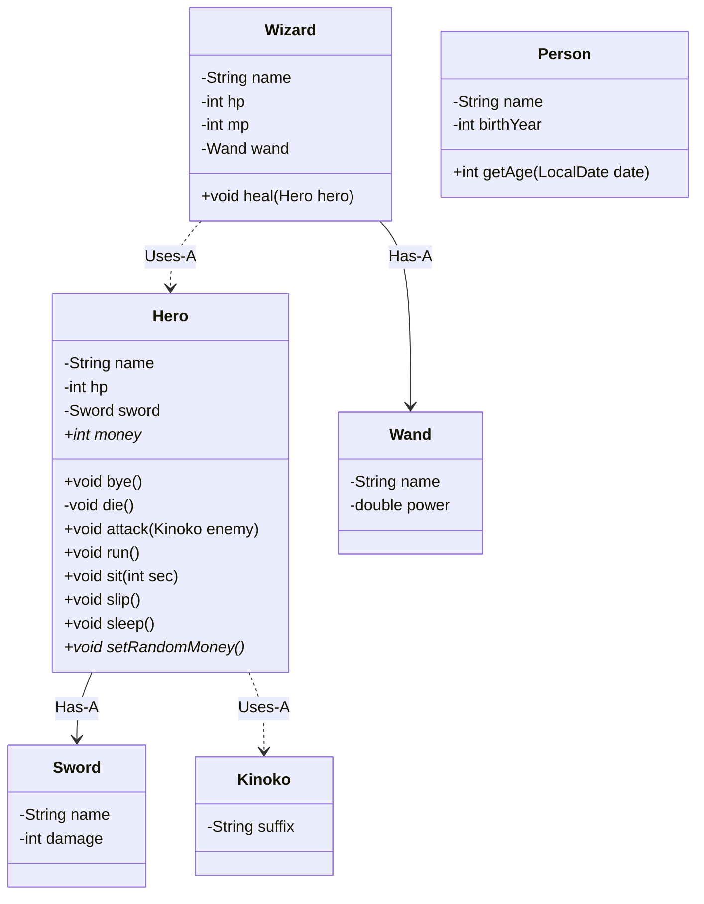

# 캡슐화

## 용어 정리

- `캡슐화`: 잘못된 접근(현실 세계와 동일한 프로그래밍)에 대한 제어 방법
- `접근 지정자`: 멤버(변수, 메서드)와 클래스의 접근 범위에 대한 제어 규칙 (e.g. private, package private, protected, public)
- `Getter`: 메소드를 경유한 필드 조작. 필드를 읽기 전용(Read-only)으로 구현할 때 사용
- `Setter`: 메소드를 경유한 필드 조작. 필드를 쓰기 전용(Write-only)으로 구현할 때 사용

## 클래스 다이어그램 코드



## 클래스 작성 테스트 코드

```java
@DisplayName("Wizard 클래스 테스트")
class WizardTest {

    Wizard wizard;

    @BeforeEach
    void setUp() {
        Wand wand = new Wand("나무", 10.0);
        wizard = new Wizard("위저드", 50, 10, wand);
    }

    @Test
    @DisplayName("heal을 하면 `power * point`만큼 hp를 회복해야 한다")
    void heal_shouldBeHp_powerTimesTen() {
        // given
        Hero hero = new Hero("히어로", 10);
        double power = wizard.getWand().getPower();
        int point = 10;
        int expected = (int) (power * point) + hero.getHp();

        // when
        wizard.heal(hero);

        // then
        assertEquals(expected, hero.getHp());
    }

    @Test
    @DisplayName("설정할 이름은 null이 아니어야 한다")
    void setName_shouldNotBeNull() {
        // given
        String name = null;
        String errorMessage = "name(이름)은 null이 아니어야 합니다";

        // when
        IllegalArgumentException error = assertThrows(IllegalArgumentException.class, () -> wizard.setName(name));

        // then
        assertEquals(errorMessage, error.getMessage());
    }

    @Test
    @DisplayName("설정할 이름은 최소 3글자 이상을 입력해야 한다")
    void setName_shouldBeLetters_atLeastThree() {
        // given
        String name = "위저";
        String errorMessage = "name(이름)은 3글자 이상이어야 합니다";

        // when
        IllegalArgumentException error = assertThrows(IllegalArgumentException.class, () -> wizard.setName(name));

        // then
        assertEquals(errorMessage, error.getMessage());
    }

    @Test
    @DisplayName("hp는 0 이상이어야 한다")
    void setHp_shouldBeHp_moreThanZero() {
        // given
        int hp = -1;
        String errorMessage = "hp(체력)는 0 이상이어야 합니다";

        // when
        IllegalArgumentException error = assertThrows(IllegalArgumentException.class, () -> wizard.setHp(hp));

        // then
        assertEquals(errorMessage, error.getMessage());
    }

    @Test
    @DisplayName("hp가 0이면 정상적으로 실행되어야 한다")
    void setHp_shouldBeExecutedSuccessfully() {
        // given
        int hp = 0;

        // when
        wizard.setHp(hp);

        // then
        assertEquals(hp, wizard.getHp());
    }

    @Test
    @DisplayName("mp는 0 이상이어야 한다")
    void setMp_shouldBeMp_moreThanZero() {
        // given
        int mp = -1;
        String errorMessage = "mp(마력)는 0 이상이어야 합니다";

        // when
        IllegalArgumentException error = assertThrows(IllegalArgumentException.class, () -> wizard.setMp(mp));

        // then
        assertEquals(errorMessage, error.getMessage());
    }

    @Test
    @DisplayName("mp가 0이면 정상적으로 실행되어야 한다")
    void setMp_shouldBeExecutedSuccessfully() {
        // given
        int mp = 0;

        // when
        wizard.setMp(mp);

        // then
        assertEquals(mp, wizard.getMp());
    }

    @Test
    @DisplayName("설정할 지팡이는 null이 아니어야 한다")
    void setWand_shouldNotBeNull() {
        // given
        Wand wand = null;
        String errorMessage = "wand(지팡이)는 null이 아니어야 합니다";

        // when
        IllegalArgumentException error = assertThrows(IllegalArgumentException.class, () -> wizard.setWand(wand));

        // then
        assertEquals(errorMessage, error.getMessage());
    }
}
```

```java
@DisplayName("Wand 클래스 테스트")
public class WandTest {

    Wand wand;

    @BeforeEach
    void setUp() {
        wand = new Wand("지팡이", 10.0);
    }

    @Test
    @DisplayName("설정할 이름은 null이 아니어야 한다")
    void setName_shouldNotBeNull() {
        // given
        String name = null;
        String errorMessage = "name(이름)은 null이 아니어야 합니다";

        // when
        IllegalArgumentException error = assertThrows(IllegalArgumentException.class, () -> wand.setName(name));

        // then
        assertEquals(errorMessage, error.getMessage());
    }

    @Test
    @DisplayName("설정할 이름은 최소 3글자 이상을 입력해야 한다")
    void setName_shouldBeLetters_atLeastThree() {
        // given
        String name = "나무";
        String errorMessage = "name(이름)은 3글자 이상이어야 합니다";

        // when
        IllegalArgumentException error = assertThrows(IllegalArgumentException.class, () -> wand.setName(name));

        // then
        assertEquals(errorMessage, error.getMessage());
    }

    @Test
    @DisplayName("power는 0.5 이상이어야 한다")
    void setPower_shouldBePower_moreThanPointFive() {
        // given
        double power = 0.4;
        String errorMessage = "wand(지팡이)의 power(지력)는 0.5 이상이어야 합니다";

        // when
        IllegalArgumentException error = assertThrows(IllegalArgumentException.class, () -> wand.setPower(power));

        // then
        assertEquals(errorMessage, error.getMessage());
    }

    @Test
    @DisplayName("power는 100을 초과하지 말아야 한다")
    void setPower_shouldBePower_lessThanHundred() {
        // given
        double power = 101;
        String errorMessage = "wand(지팡이)의 power(지력)는 100을 넘길 수 없습니다";

        // when
        IllegalArgumentException error = assertThrows(IllegalArgumentException.class, () -> wand.setPower(power));

        // then
        assertEquals(errorMessage, error.getMessage());
    }
}
```

```java
@DisplayName("Person 클래스 테스트")
public class PersonTest {

    @Test
    @DisplayName("특정 날짜가 주어지면 해당 연도 기준 나이를 계산한다")
    void getAge_withDate_returnAge() {
        // given
        Person person = new Person("김준기", 1996);
        LocalDate date = LocalDate.of(2026, 1, 1);
        int expectedAge = 30;

        // when
        int age = person.getAge(date);

        // then
        assertEquals(expectedAge, age);
    }
}
```

```java
@DisplayName("Hero 클래스 테스트")
class HeroTest {

    Hero hero;

    @BeforeEach
    void setUp() {
        hero = new Hero("히어로");
    }

    @Test
    @DisplayName("데미지를 입으면 hp가 감소해야 한다")
    void takeDamage_shouldReduceHp() {
        // given
        int damage = 30;
        int expected = 70;

        // when
        hero.takeDamage(damage);

        // then
        assertEquals(expected, hero.getHp());
    }

    @Test
    @DisplayName("남은 hp보다 큰 피해를 받으면 hp가 음수가 되지 않고 0이 되어야 한다")
    void takeDamage_hpShouldNotBeNegative() {
        // given
        int damage = 150;
        int expected = 0;

        // when
        hero.takeDamage(damage);

        // then
        assertEquals(expected, hero.getHp());
    }

    @Test
    @DisplayName("setHp에 음수를 입력하면 0으로 보정되어야 한다")
    void setHp_shouldClampToZero_whenNegativeValueGiven() {
        // given
        int hp = -10;
        int expected = 0;

        // when
        hero.setHp(hp);

        // then
        assertEquals(expected, hero.getHp());
    }
}
```

```java
@DisplayName("Kinoko 클래스 테스트")
class KinokoTest {

    Kinoko kinoko;

    @BeforeEach
    void setUp() {
        kinoko = new Kinoko("버섯", 50);
    }

    @Test
    @DisplayName("데미지를 입으면 hp가 감소해야 한다")
    void takeDamage_shouldReduceHp() {
        // given
        int damage = 10;
        int expected = 40;

        // when
        kinoko.takeDamage(damage);

        // then
        assertEquals(expected, kinoko.getHp());
    }

    @Test
    @DisplayName("남은 hp보다 큰 피해를 받으면 hp가 음수가 되지 않고 0이 되어야 한다")
    void takeDamage_hpShouldNotBeNegative() {
        // given
        int damage = 100;
        int expected = 0;

        // when
        kinoko.takeDamage(damage);

        // then
        assertEquals(expected, kinoko.getHp());
    }

    @Test
    @DisplayName("setHp에 음수를 입력하면 0으로 보정되어야 한다")
    void setHp_shouldClampToZero_whenNegativeValueGiven() {
        // given
        int hp = -5;
        int expected = 0;

        // when
        kinoko.setHp(hp);

        // then
        assertEquals(expected, kinoko.getHp());
    }
}
```

## 정리

- `캡슐화`
  - 멤버나 클래스로의 `접근을 제어`할 수 있다
  - 필드에 존재할 수 없는 값이 들어가지 않도록(휴먼 에러) 제어한다

- `멤버에 대한 접근 지정`
  - `private` 으로 지정된 멤버는 `동일 클래스 내에서만 접근` 가능하다
  - `package private (default)` 으로 지정된 멤버는 `동일 패키지 내 클래스에서만 접근` 가능하다
  - `public` 으로 지정된 멤버는 `모든 클래스에서 접근` 가능하다

- `클래스에 대한 접근 지정`
  - `package private (default)` 으로 선언된 클래스는 `동일 패키지 내 클래스에서만 접근` 가능하다
  - `package private (default)` 으로 선언된 클래스의 이름은 소스 파일명과 다르게 정의할 수 있다
  - `package private (default)` 으로 선언된 클래스는 1개의 소스 파일에 여러개 선언할 수 있다
  - `public` 으로 지정된 클래스는 `모든 클래스에서 접근` 가능하다

- `캡슐화 권장 패턴`
  - 클래스는 `public` 으로 지정
  - 메소드는 `public` 으로 지정
  - 필드는 `private` 으로 지정
  - 필드에 접근하기 위한 메소드로써 `getter` 나 `setter` 정의
  - `setter` 내부에서는 인수 타당성 검사 수행
