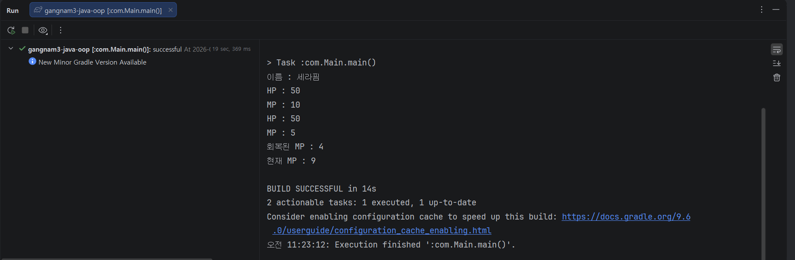

# 캡슐화 2026-09-18

- 액서스 제어 (access contro)
- 여관 클래스의 오류
- 왕 클래스이 문제점
- 멤버에 대한 액세스 제어
    - 접근 지정자
        - private
        - public
          HP를 private로 지정한 샘플코드
        -
- +public
- -private

## 캡슐화

- setter에서 값의 타당성을 검사

- 다른 개발자의 잘못된 접근으ㅔ 대한 제어방법
- 멤버에 관한 액세스 지정정석

-
- getter/
-

## static는 "공유", final은"변경불가" 핵심 코드

- static 필드와 static 메서드의 관계까지 연결해서 이해

- 중복 코드를 최소화하는 방법
  가장 중요한 부분이 생성자에서 다른 생성자를 호출하는 것입니다.

- this (현재 객체의 name 필드를 의미)와
  this ()(같은 클래스의 다른 생성자를 호출)의 차이

- 테스트 방식은 요청하신 대로 Given → When → Then 구조를 사용하고
  assertXXX ()로 결과를 검증합니다.

- 단위 (Unit) 테스트
  특정 모듈이 의도한 대로 잘 작동하는가를 테스트하는 가장 작은 단위의 테스트

- 테스트 기법
  동등 분할
  경계값 분석

- 테스트 방법론
  화이트 박스 테스트
  블랙박스 테스트
- 

## 딱 한 문장으로 외우기 ##

- tatic는 "공유", final은"변경불가"

- this (현재 객체의 name 필드를 의미)와
  this ()(같은 클래스의 다른 생성자를 호출)의 차이
  ** 오늘도 보람찬 하루 되셔요 **