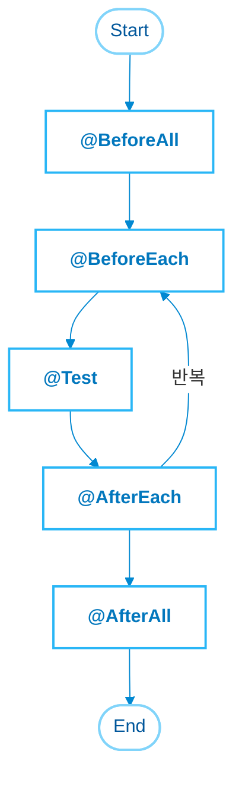

# [TIL] Day 06 - 캡슐화

- **작성자**: 엄시형 (SiHyeong Eom)
- **작성일**: 2026-09-18

---

## 1. 배운 점

- `Github 본문에 PR언급?` : \#PR 번호
- `Random() 예측 가능` : System.nanoTime()이 기본값으로 시드가 **고정**되어
  시드를 알면 **예측 가능**

### 캡슐화

- `알약 껍질(정보 은닉)` : 가루가 외부로 부터 **변질**되지 않게 보호
- `섭취 방법(복잡도 은닉)` : 안에 가루가 어떤 역할인지 몰라도
  삼키기만 하면 **간편히 상호작용** 가능

### Getter Setter
- `Getter` : 외부에서 값을 **읽는 용**
- Setter : 외부에서 값을 **쓰는 용**
- `정보 은닉` : public으로 변수를 선언하면 외부에서 수정이 가능 **읽기, 쓰기 전용**으로 사용
- `데이터 검증` : Setter 안의 **잘못된 값이 들어오지 못하도록** 할 수 있음

### 접근제어자

- `데이터 보호` : 외부에서 **수정 못하게 막음**
- `캡슐화 구현` : 상세한 **내부 구현은 숨겨** 사용자가 조작가능한 기능만 제공해
  **명확한 의도 전달**이 가능함
- `public` : **모든** 클래스 접근 가능
- `protected` :
  - **같은 패키지**안의 **모든 클래스** 접근 가능
  - **다른 패키지**의 **자식 클래스** 접근 가능
- `deafult(생략)` : **같은 패키지안**의 클래스 접근 가능
- `private` : **같은 클래스** 접근 가능

### JUnit5

- `JUnit` : Java **단위 테스트** 프레임워크
- `@Nested` : 테스트 클래스 안에서 내부 클래스를 정의해 **계층화** 할 때 사용
- `@AssertAll` :
  - 모든 테스트 코드를 **한 번에 실행**
  - 오류가 나도 **끝까지 실행한 뒤 한 번에 출력**
- `@RepeatedTest(int)` : **특정 횟수**만큼 반복 가능
- `@BeforeEach`: **테스트 전** 해당 함수를 실행
- `@ParameterizedTest` : **매개변수**를 통해 여러 번 테스트를 실행해줌
  **단독으로 쓰지 않고** `@ValueSource`, `@MethodSource`를 조합해서 쓴다
- `@ValueSource` : `@ParameterizedTest`에 **리터럴 값(10, "str" 등)의 배열**을 제공한다
- `@CsvSource` : **CSV 형식**으로 읽어 **파싱**하여 매개변수로 전달
  - `CSV` : 콤마로 구분되어 있는 텍스트 형식
  - `파싱` : **데이터나 텍스트**를 **컴퓨터가 이해하기 쉬운 구조**로 변환하는 작업
- `@MethodSource` : **복잡한 객체나 여러 속성의 파라미터**를 넘기고 싶을 때 사용한다
- `@TestInstance(TestInstance.Lifecycle.PER_CLASS)` : 기본적으로 테스트를 진행하면
  **계속 새로운 인스턴스를 생성** 해당 어노테이션을 쓰면 **새로운 인스턴스를 만들지 않음**
- `@Disabled` : 테스트에서 **제외**
- `Arguments(junit5)` : junit4에선 **Object\[]** 로 매개변수를 전달했음
- 하지만 junit5에서는 `Arguments`를 사용해 **가독성을 높임**
- 테스트 매개변수를 전달하기 위해 단순히 담아두는 **인터페이스**
- `Collection.of(...)` : **불변** 컬렉션으로 만듦
- `AssertSame` : **같은 객체**인지 확인
- `불변성(Immutability)` : 객체 내부의 데이터가 **절대 변하지 않게** 만드는 것

### JUnit5 생명주기 어노테이션

---

## 2. 가장 멘붕이었던 순간 & 트러블슈팅

- `문제상황` : 경계값 분석시 테스트 함수가 많아지는 현상이 발생
- `해결` : @ParameterizedTest를 통해 매개변수를 넘겨 테스트하는
  방식으로 해결 