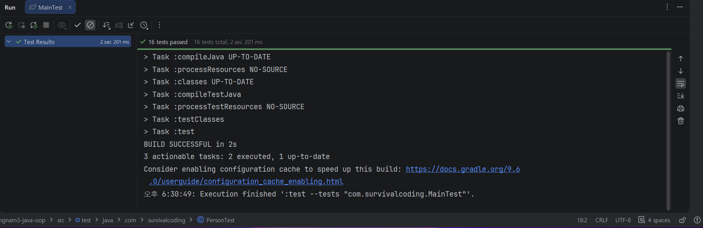

# 캡슐화 2026-09-18

- 액서스 제어 (access contro)
- 여관 클래스의 오류
- 왕 클래스이 문제점
- 멤버에 대한 액세스 제어
    - 접근 지정자
        - private
        - public
          HP를 private로 지정한 샘플코드
        -
- +public
- -private

1. 캡슐화란 무엇인가?

현실의 자동차를 생각해 보겠습니다.
운전자는 자동차 내부의 엔진, ECU, 변속기 등을 직접 만지지 않습니다.
name, birthYear 같은 중요한 데이터는 외부에서 마음대로 변경하지 못하도록 숨깁니다.

2. 왜 캡슐화가 필요한가?
   예를 들어 사람의 나이를 저장하는 클래스를 만들었다고 생각해 보겠습니다.
   캡슐화하지 않으면:
   public class Person {
   public int age;
   }

외부에서 마음대로:
Person person = new Person ();
person.age = 55;
할 수 있습니다.
그런데: person.age = -100;
도 가능합니다.
현실 세계에서 나이가 -100인 사람은 존재할 수 없습니다.
또: person.age = 999;
도 가능합니다.
따라서 필드에 이상한 값이 들어가지 않도록 통제할 필요가 있습니다.
이것이 캡슐화가 필요한 중요한 이유입니다.

3. 접근 지정자 (Access Modifier)
   Java에서는 외부에서 클래스의 멤버에 접근할 수 있는 범위를 지정할 수 있습니다.
4. private
   가장 중요한 접근 지정자입니다.
   public class Person {
   private String name;
   private int birthYear;
   }

여기서:
private String name;
은 Person 클래스 외부에서 직접 접근할 수 없습니다.
예를 들어:
Person person = new Person ("홍길동", 1971);
person.name = "이순신";
컴파일 오류가 발생합니다.
왜냐하면 name이 private이기 때문입니다.

5. 그렇다면 데이터를 어떻게 가져올까?
   여기서 getter가 등장합니다.
   public String getName () {
   return name;
   }
   그러면 외부에서는:
   System.out.println (person.getName ());
   처럼 사용할 수 있습니다.
   외부에서 name을 직접 가져가는 것이 아니라 Person이 제공하는 메서드를 통해 가져가는 것입니다.
6. Getter란?
   Getter는 쉽게 말하면:
   "내 데이터를 보여줘."
   라는 메서드입니다.
   System.out.println (person.getName ());
7. Setter란?
   Setter는 데이터를 변경하는 메서드입니다.
8. Setter에서 검사를 한다
   예를 들어 age라는 필드가 있다고 해보겠습니다.
   나이는 0보다 작을 수 없습니다.
9. 이것이 바로 "타당성 검사"
   문제에서 말하는: setter 내부에서는 인수의 타당성 검사를 수행한다.
   이것이 캡슐화의 핵심입니다.
10. 그런데 Person 문제에서는 Setter가 없는 이유
    앞에서 풀었던 Person 문제를 다시 보겠습니다.
    private final String name;
    private final int birthYear;
    왜 setter가 없을까요?
    문제에서: 이름과 태어난 해는 한번 정해지면 수정이 불가능하다.
    라고 했기 때문입니다.
    따라서: public void setName (String name)
    을 만들면 안 됩니다.
    final을 사용합니다.
    private final String name;
    private final int birthYear;
    생성자에서 한 번:
    public Person (String name, int birthYear) {
    this.name = name;
    this.birthYear = birthYear;
    }
    설정하고 끝입니다.
11. Person 클래스를 캡슐화 관점에서 다시 보기
    public class Person {

    private final String name;
    private final int birthYear;

    public Person (String name, int birthYear) {
    this.name = name;
    this.birthYear = birthYear;
    }

    public String getName () {
    return name;
    }

    public int getBirthYear () {
    return birthYear;
    }

    public int getAge () {
    int currentYear = java.time.LocalDate.now ().getYear ();
    return currentYear - birthYear;
    }
    }
    여기에는 캡슐화의 핵심이 거의 모두 들어 있습니다.

클래스
public class Person
→ 다른 클래스에서도 사용할 수 있습니다.
필드
private final String name;
private final int birthYear;
→ 외부에서 직접 접근할 수 없습니다.
Getter
public String getName ()
→ 이름을 읽을 수 있습니다.
public int getBirthYear ()
→ 태어난 연도를 읽을 수 있습니다.
Setter
없습니다.
→ 이름과 태어난 연도는 변경하면 안 되기 때문입니다.

12. "캡슐화의 정석"을 쉽게 해석하면
    교재의 내용을 다시 보겠습니다.
    클래스는 public, 메소드는 public, 필드는 private로 지정.
    쉽게 말하면:
    public class Person {

    private String name;
    private int age;

    public String getName () {
    return name;
    }

    public void setAge (int age) {
    // 검사
    this.age = age;
    }

}
외부에서는 필드를 직접 건드리지 않고 메서드라는 문을 통해서만 접근합니다.

13. 중요한 예외: 모든 필드에 Setter를 만드는 것은 아니다
    private String name;

public String getName () {
return name;
}

public void setName (String name) {
this.name = name;
}

무조건 getter와 setter를 모두 만드는 것이 캡슐화의 목적은 아닙니다.
변경하면 안 되는 데이터라면 Setter를 만들지 않아야 합니다.
예를 들어:

private final String name;
private final int birthYear;

이라면:

getName ()       
getBirthYear ()

이것이 더 강한 캡슐화입니다.

14. 오늘 배운 내용을 한 문장으로 정리
    캡슐화는: "데이터를 private으로 숨기고, 필요한 경우 public 메서드를 통해서만 접근하게 하며, 값을 변경할 때는 올바른 값인지 검사하는 것"
    입니다.

-

### 핵심은 딱 한 문장으로 기억하면 됩니다. ###

# **"객체의 중요한 데이터는 숨기고, 정해진 방법을 통해서만 접근하게 만든다."**