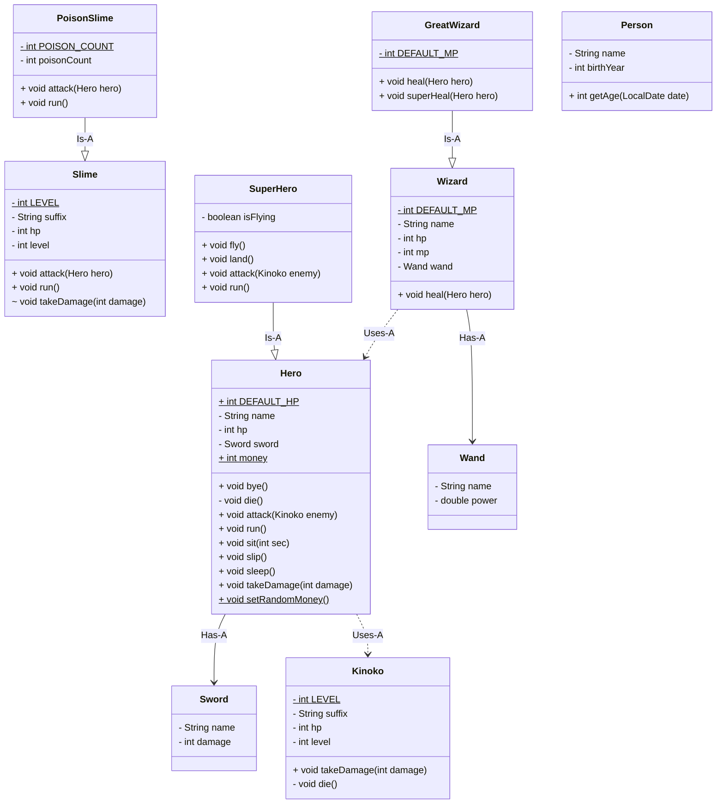

# 상속

## 용어 정리

- `상속`: 기존의 클래스를 재사용하여 새로운 클래스를 생성. 두 클래스는 `Super` 와 `Sub` 관계로 비유된다
- `Super`: 기능과 속성을 물려주는 원래의 클래스
- `Sub`: `Super` 클래스의 모든 기능과 속성을 물려받는 새로운 클래스

## 클래스 다이어그램 코드



## 클래스 작성 테스트 코드

```java
@DisplayName("PoisonSlime 클래스 테스트")
class PoisonSlimeTest {

    @Test
    @DisplayName("생성자 호출 시 poisonCount는 기본값 5로 초기화되어야 한다")
    void constructor_shouldInitializePoisonCount_toFive() {
        // given & when
        PoisonSlime poisonSlime = new PoisonSlime("독슬라임");
        int expected = 5;

        // then
        assertEquals(expected, poisonSlime.getPoisonCount());
    }

    @Test
    @DisplayName("attack을 하면 기본 데미지와 추가 독 데미지가 함께 적용되어야 한다")
    void attack_shouldApplyBaseDamageAndPoisonDamage() {
        // given
        PoisonSlime poisonSlime = new PoisonSlime("독슬라임");
        Hero hero = new Hero("히어로");
        int expectedHeroHp = 72;
        int expectedPoisonCount = 4;

        // when
        poisonSlime.attack(hero);

        // then
        assertEquals(expectedHeroHp, hero.getHp());
        assertEquals(expectedPoisonCount, poisonSlime.getPoisonCount());
    }
}
```

```java
@DisplayName("SuperHero 클래스 테스트")
class SuperHeroTest {

    SuperHero superHero;

    @BeforeEach
    void setUp() {
        superHero = new SuperHero("홍길동");
    }

    @Test
    @DisplayName("isFlying이 true이면 attack 시 적에게 추가 피해를 입혀야 한다")
    void attack_shouldDealExtraDamage_whenFlying() {
        // given
        superHero.fly();
        Kinoko kinoko = new Kinoko("버섯", 30);
        int expectedSuperHeroHp = 98;
        int expectedKinokoHp = 25;

        // when
        superHero.attack(kinoko);

        // then
        assertEquals(expectedSuperHeroHp, superHero.getHp());
        assertEquals(expectedKinokoHp, kinoko.getHp());
    }

    @Test
    @DisplayName("isFlying이 false이면 attack 시 적에게 추가 피해를 입히지 않아야 한다")
    void attack_shouldNotDealExtraDamage_whenNotFlying() {
        // given
        Kinoko kinoko = new Kinoko("버섯", 30);
        int expectedSuperHeroHp = 98;
        int expectedKinokoHp = 30;

        // when
        superHero.attack(kinoko);

        // then
        assertEquals(expectedSuperHeroHp, superHero.getHp());
        assertEquals(expectedKinokoHp, kinoko.getHp());
    }
}
```

```java
@DisplayName("GreatWizard 클래스 테스트")
class GreatWizardTest {

    GreatWizard greatWizard;

    @BeforeEach
    void setUp() {
        greatWizard = new GreatWizard();
    }

    @Test
    @DisplayName("생성자 호출 시 mp는 기본값 150으로 초기화되어야 한다")
    void constructor_shouldInitializeMp_to150() {
        // given
        int expected = 150;

        // then
        assertEquals(expected, greatWizard.getMp());
    }

    @Test
    @DisplayName("heal을 하면 25만큼 hp를 회복하고 mp를 5 소모해야 한다")
    void heal_shouldRecoverHp_by25_andConsumeMp_by5() {
        // given
        Hero hero = new Hero("히어로");
        int expectedHeroHp = 125;
        int expectedMp = 145;

        // when
        greatWizard.heal(hero);

        // then
        assertEquals(expectedHeroHp, hero.getHp());
        assertEquals(expectedMp, greatWizard.getMp());
    }
}
```

## 정리

- `상속`
  - `extends` 를 사용하여 기존 클래스를 기초로 하는 새로운 클래스를 정의할 수 있다
  - `Super` 클래스의 멤버는 자동적으로 `Sub` 클래스에 상속되므로, `Sub` 클래스에는 추가된 부분만 기술하면 된다
  - `Super` 클래스에 있는 메서드를 `Sub` 클래스에서 재작성하는 것을 `Override` 한다고 한다
  - `final` 을 붙인 클래스는 상속이 되지 않는다
  - `final` 이 붙은 메서드는 `Override` 되지 않는다
  - `올바른 상속` 이란 `is-a` 관계를 의미한다
  - `잘못된 상속` 이란 개념적으로 `is-a` 관계가 되지 못하는 경우를 의미한다
    -`상속` 을 잘못하면 클래스를 확장할 때 현실 세계와 모순이 생긴다
    - 객체 지향 프로그래밍(OOP)의 특징 중 하나인 `다형성` 을 이용할 수 없게 된다
  - `상속` 에는 추상적, 구체적 관계에 있다는 것을 정의하는 역할도 있다
    - 추상적 개념: `Super` 클래스
    - 구체적 개념: `Sub` 클래스

- `인스턴스`
  - 인스턴스 는 내부에 `Super` 클래스의 인스턴스를 가지는 다중 구조를 가진다
  - 보다 외측의 인스턴스 에 속하는 메서드가 우선적으로 동작한다
  - 외측의 인스턴스 의 속하는 메서드는 `super` 를 사용하여 내측 인스턴스 멤버에 접근할 수 있다

- `생성자 동작`
  - 다중 구조의 인스턴스 가 생성되는데, JVM은 자동적으로 가장 외측 인스턴스 의 생성자를 호출한다
  - 모든 생성자는, `Super` 인스턴스의 생성자를 호출할 필요가 있다
  - 생성자의 선두에 `super()` 가 없으면 암묵적인 `super()` 가 추가된다
