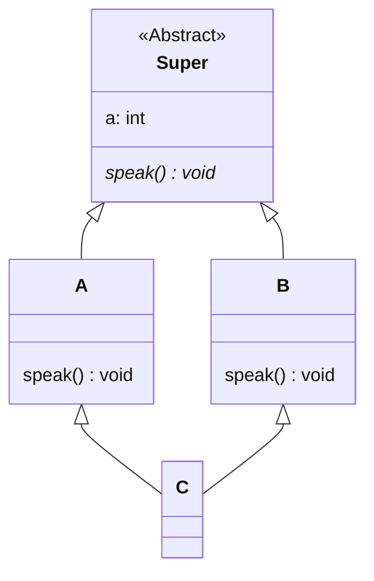

# [TIL] Day 08 - 추상클래스와 인터페이스

- **작성자**: 엄시형 (SiHyeong Eom)
- **작성일**: 2026-09-30

---

## 1. 배운 점

### 추상메서드

- **인스턴스화 가능한 구체 하위 클래스에서 반드시 오버라이딩**해야만 사용할 수 있는 메소드

### 추상클래스

- **하나 이상의 추상 메소드**를 포함하는 클래스
- 상속받는 자식 클래스들 간의 **코드 중복을 제거**하고 공통된 틀(기본 기능 + 확장 포인트)을 제공하기 위함

### 인터페이스

- 다른 클래스 사이의 중간 매개 역할
- 클래스가 구현해야 하는 메서드의 목록만 정의해 둔 표준
- 서로 관계가 없는 서로 다른 클래스들이 **동일한 동작(메서드)을 보장**받도록 규격화하는 것
- 자바8부터 인터페이스에 default 메소드나 static 메소드를 추가할 수 있음
- 자바9부터 private 메소드 추가 가능
```java
public interface Thing {

    // 자바8부터
    default void Attack() {
        a();
    }

    // 자바9부터
    private void a() {
        System.out.println("A");
    }
}
```


| **구분**           | **추상 클래스**                      | **인터페이스**                                   |
| ---------------- | ------------------------------- | ------------------------------------------- |
| **개념적 관계**       | **IS-A**                        | **CAN-DO**                                  |
| **존재 목적**        | **공통 코드 재사용** 및 계층 구조 형성        | **행동 규약(스펙)** 강제 (다형성 극대화)                  |
| **인스턴스화**        | **불가능**                         | **불가능**                                     |
| **추상 메서드 포함 여부** | **가능**<br>(구현된 메서드 + 추상 메서드 혼용) | **가능** <br>(기본적으로 모두 추상 메서드)                |
| **상속**           | **단일 상속**                       | **다중 구현** 가능 + **인터페이스끼리 상속 가능**            |
| **멤버 변수(필드)**    | 제한 없음                           | **상수만 가능**(`static final`)                  |
| **생성자**          | 있음                              | 없음                                          |
| **접근 제어자**       | 제한 없음                           | 무조건 public<br>(private, default도 버전에 따라 가능) |

#### 인터페이스가 다중상속이 가능한 이유 (클래스 다중 상속이 불가능한 이유)

##### 다이아몬드 문제



- 문제점(클래스)
    - **메서드 호출의 모호성** : A, B 클래스가 **부모로 부터 Speak()를 구현**했을때 C.speak()를 하면
      A.Speak()를 할지 B.Speak()를 할지 컴파일러는 **모호함을 해결하지 못하고 에러 발생**
    - **데이터 중복과 부모 객체의 이중 생성** : C인스턴스의 a변수의 값을 변경하려고 하면
      **Super의 인스턴스가 2개 존재해**  A, B인스턴스의 **어떤 a값을 변경해야 하는지 모르는 현상 발생**
    - 자바는 이 **복잡함**을 피하기 위해 클래스의 **다중 상속을 포기**
    - C++은 **가상 상속**이라는 문법을 통해 Super 부모는 하나만 만들도록 **다중 상속**을 지원

- 하지만 인터페이스를 사용할 경우 **메서드 선언만 존재**해 똑같은 메서드를 선언하더라도 구현은 자식이 하니깐 **모호함이 발생하지 않음**
- 자바8부터는 default 메소드를 지원해 똑같은 메서드가 있을 시 super로 명시적 콜
```java
public void callA() {
    A.super.callA();
    B.super.callA();
}
```

---
[추상클래스](https://www.tcpschool.com/java/java_polymorphism_abstract)