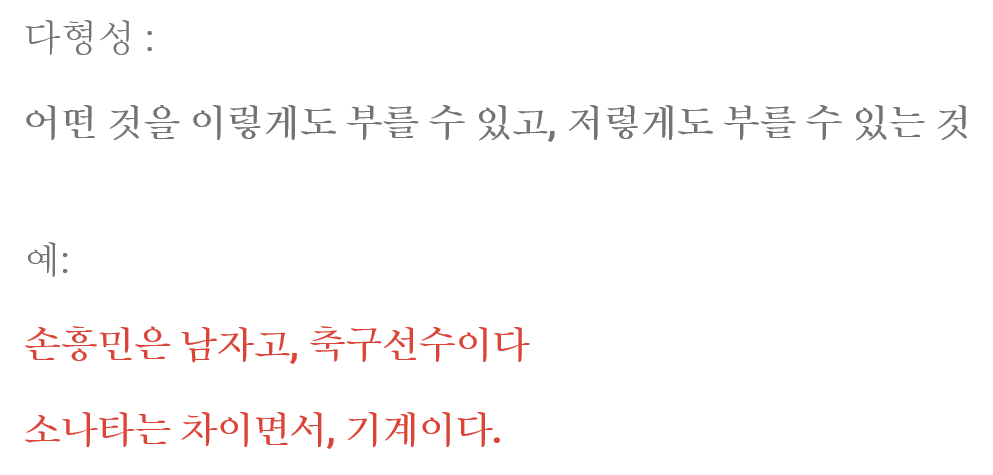

# 상속과 추상화 2026-09-30

오늘은 11장(상속)에 이어 12장(추상 클래스와 인터페이스)을 정리한다.

## 1. 단계. 상속

    이제 객체지향의 강력한 기능인 상속입니다.
    예를 들어:
     Person
        │
        ├── Student
        │
        └── Teacher

    학생과 선생님 모두 사람입니다.
    공통 기능을 Person에 만들고 물려줄 수 있습니다.

### is-a 관계

상속은 **"~은 ~이다"**(is-a) 관계에만 써야 합니다.
"구성 관계(has-a)"를 상속으로 표현하면 안 됩니다.

public class Slime {

    public static final int MAX_HP = 100;

    // hp 는 필드 선언부에서 초기화된다. 생성자가 아니라 "선언"에서 초기화.
    public int hp = MAX_HP;
    public String suffix;
    public final int level = 10;

    private String name;

    // 생성자 오버로딩
    public Slime() {
    }

    public Slime(String name) {
        this.name = name;
    }

    // Getter
    public String getName() {
        return name;
    }

    public int getHp() {
        return hp;
    }

    // Setter — private 인 name 과 달리 hp 는 public 필드 + setter 를 둘 다 둔다.
    public void setHp(int hp) {
        this.hp = hp;
    }

    // 보통 공격 — hero.setHp() 를 통해 용사의 HP 를 10 깎는다.
    public void attack(Hero hero) {
        System.out.println(name + "이 공격했다!");
        hero.setHp(hero.getHp() - 10);
        System.out.println("10포인트 데미지");
    }
}

여기서 상속을 이용해 독슬라임을 만든다.
슬라임은 슬라임이니까(is-a) 상속이 맞다.

public class PoisonSlime extends Slime {
    // 부모가 갖고 있지 않은 값은 자식이 자기 필드로 추가한다.
    // 이 필드도 super 로 넘길 수 없으니 자식이 직접 초기화한다.
    private int poisonCount = 5;
    public PoisonSlime(String name) {
        // 부모 생성자에 값을 넘겨 부모 필드(name)를 채운다.
        // 부모의 hp 는 필드 초기화(public int hp = MAX_HP)로 이미 채워져 있다.
        super(name);
    }
    @Override
    public void attack(Hero hero) {
        // 부모 attack 을 그대로 재사용한다.
        super.attack(hero);
        if (poisonCount > 0) {
            System.out.println("추가로, 독 포자를 살포했다!");
            // 독 데미지 = 용사 HP / 5
            // HP 를 감소시키기 "전에" 계산해야 한다.
            final int poisonDamage = hero.getHp() / 5;
            hero.setHp(hero.getHp() - poisonDamage);
            System.out.println(poisonDamage + "포인트 데미지");
            poisonCount--;
        }
    }
}

여기서 상속의 3요소가 전부 나온다.
`super` 는 두 가지로 쓴다.

`super.attack(hero)` 덕분에 독슬라임이 "일반 공격 + 독 공격"을 둘 다 하는 걸로,
코드를 다시 쓰지 않고 부모 기능을 빌려 쓸 수 있다. 이게 상속의 진짜 이유다.

### 다형성

`SuperHero` 는 `Hero` 를 상속하고 `run()` 만 바꾼다.


public class SuperHero extends Hero {
    private boolean isFlying;
    public SuperHero(String name, int hp) {
        super(name, hp);
    }
    // 부모의 run() 을 완전히 다른 동작으로 대체한다.
    @Override
    public void run() {
        System.out.println("멋지게 퇴각했다");
    }
    public void fly() {
        isFlying = true;
        System.out.println(getName() + "이 날아올랐다.");
    }
    public void land() {
        isFlying = false;
        System.out.println(getName() + "이 착륙했다.");
    }
}

여기서 **변수의 타입과 실제 객체가 다르면 실제 객체의 메서드가 실행된다.**

Hero hero = new Hero("평범한영웅", 100);
hero.run();          // 평범한영웅는 도망쳤다! / GAME OVER

Hero superHero = new SuperHero("한석봉", 100);
superHero.run();     // 멋지게 퇴각했다


변수 선언 타입은 둘 다 `Hero` 인데 결과가 다르다.
이게 **다형성(Polymorphism)** 이다.


List<Hero> heroes = List.of(new Hero("평범한영웅", 100), new SuperHero("한석봉", 100));

heroes.get(0).run();  // GAME OVER
heroes.get(1).run();  // 멋지게 퇴각했다

같은 `run()` 호출인데 담긴 객체에 따라 다르게 동작한다.
그래서 우리는 **상위 타입(`Hero`)으로만 다룰 수 있다.** 새 용사 클래스를 추가해도
리스트나 반복문 코드는 손댈 필요가 없다. 이게 상속 + 다형식의 실질적 이득이다.

`GreatWizard` 도 같은 방식이다. `Wizard.heal()` 과 `GreatWizard.heal()` 의 회복량이 다르다.

변수 타입이 `Wizard` 여도 실제 객체가 `GreatWizard` 면 +25 가 적용된다.
그리고 마나가 부족하면 예외를 던지는 대신 `"마나가 부족합니다"` 를 출력한다.
상속하면서 **약점을 메워주는(규칙 약화, LSP)** 구조다.

- 변수는 객체가 가지고 있는 정보이고
- 메서드는 객체가 할 수 있는 행동이다.

## 2. 단계. 추상 클래스와 인터페이스

11장에서 계층을 3단계(`Hero` → `SuperHero` → `GreatWizard`)로 늘리는 방법을 배웠다.
하지만 상속에는 **엄격한 제약**이 있다. 클래스는 부모를 하나만 가질 수 있다.
12장은 그 제약을 피하면서 "이 계층에 반드시 있어야 하는 메서드"를 강제하는 방법을 다룬다.

### 추상 클래스가 해결한 문제

`Monster` 에서 공통 기능(데미지 주기, 죽기)을 뽑아 `AdvancedMonster` 로 상속했다.
그런데 여기서 문제가 생긴다. 게임이 `Character` 를 다룰 때가 되면,

- `Wizard` 는 `fly()` 를 구현하지 않았는데 다형성 리스트에 넣을 수 있을까?
- 스파이더맨에게 HP 를 물을 건데 `SpiderMan` 에는 `getHp()` 가 없다.

상속 계층에 넣을 수 있는 타입이 "메서드가 실제로 존재하는 것"이 아니라
**"컴파일러가 계층 구조상 가능하다고 판단한 것"** 이기 때문에 이런 실수가 통과한다.
`instanceof` 로 확인하면 이런 실수를 즉시 알 수 있었다.

### abstract class — 상속 + "무조건 구현해라"

`Character` 를 추상 클래스로 만들면, 컴파일러가 두 가지를 막아준다.

1. `Character` 자체를 `new` 할 수 없다 (구현이 덜 된 클래스를 만들지 못하게)
2. 자식이 `attack()` 를 반드시 구현해야 한다 (까먹을 수 없게)


public abstract class Character {

    private final String name;

    public Character(String name) {
        this.name = name;
    }

    public String getName() {
        return name;
    }

    // 몸통이 없다. 이 메서드를 반드시 구현하라고 요구만 한다.
    public abstract void attack();
}
``

`abstract` 는 **"구현을 잊지 못하게 하는 안전장치"** 라고 이해하면 된다.
`Monster` 는 `Character` 를 상속하면서 `attack()` 를 반드시 채워야 한다.


`AdvancedMonster` 는 `Monster` 를 상속하므로 `attack()` 을 다시 구현해야 한다.
**2단계 계층을 거쳐도 추상 메서드는 계속 따라온다.**


public class AdvancedMonster extends Monster {

    private final int rewardExp;

    public AdvancedMonster(String name, int hp, int attackDamage, int rewardExp) {
        super(name, hp, attackDamage);
        this.rewardExp = rewardExp;
    }

    @Override
    public void attack() {
        System.out.println("[고도화] " + getName() + "이(가) " + getAttackDamage() + "의 힘으로 공격합니다.");
    }

    public void die() {
        System.out.println(getName() + "을(를) 처치했습니다. 경험치 " + rewardExp + " 획득!");
    }
}


### 인터페이스 — 상속 없이 "역할"만 빌려오기

추상 클래스는 "같은 계통이면서 기능이 조금 다른 것"에 잘 맞는다.
하지만 "날 수 있는 것", "공격할 수 있는 것"은 계통과 상관없다.
스파이더맨은 영웅이면서 시민이다. 여기서 필요한 게 인터페이스다.


public interface Attackable {

    // 인터페이스 필드는 자동으로 public static final 이 된다.
    // (= public static final int MAX_ATTACK_PER_TURN = 3;)
    int MAX_ATTACK_PER_TURN = 3;

    void attack();
}


`Flyable` 은 되게 담백하다. `fly()` 하나뿐이다.


public interface Flyable {
    void fly();
}


### implements 다중 구현
public class SpiderMan implements SuperFlyable, Attackable {
    // fly(), land(), attack() 세 개를 모두 구현해야 한다.
}


`Monster` 가 쓰는 것과 **완전히 다른 클래스들**(`SpiderMan`, `Zombie`)이
`Attackable` 로 묶인다. 계통이 다르다는 것이 이 방식의 장점이다.

public interface SuperFlyable extends Flyable {

    @Override
    void fly();   // 물려받은 메서드. 다시 선언해도 문법적으로 문제없다.

    void land();  // 이 인터페이스에만 있는 메서드
}


`SuperFlyable` 이 `Flyable` 를 상속하므로 `land()` 만 추가했다.
`@Override` 처럼 남는 표시가 없는 이유는 `public abstract` 가 자동으로 붙기 때문이다.

### extends 와 implements 동시 사용

`Wizard` 는 12장 전체에서 **유일하게** 클래스를 상속하면서 인터페이스까지 구현한다.
"일반 생명체이면서 공격할 수 있고 마법을 사용할 수 있다"는 뜻이다.


public class Wizard extends Character implements Attackable, MagicCaster {

    public static final int MAGIC_COST = 10;
    private int mp;

    public Wizard(String name, int mp) {
        super(name);
        this.mp = mp;
    }

    @Override
    public void attack() {
        System.out.println(getName() + "이(가) 지팡이로 근접 공격합니다!");
    }

    @Override
    public void castMagic() {
        if (mp < MAGIC_COST) {
            throw new IllegalStateException(
                    getName() + "의 마력이 부족합니다. 필요: " + MAGIC_COST + ", 보유: " + mp
            );
        }
        mp -= MAGIC_COST;
        System.out.println(getName() + "이(가) 화염구를 던집니다. 남은 MP: " + mp);
    }
}


그래서 실제 구조는 항상 "**클래스는 하나, 인터페이스는 여러 개**"가 된다.
클래스 계층(extends)으로 **구현 세부사항**을 물려받고,
인터페이스(implements)로 **역할**을 여러 개 붙인다. 두 목적이 다르기 때문에 둘 다 쓴다.

### 인터페이스 타입으로 모으면 다형성

List<Attackable> party = List.of(new Zombie("좀비", 12), new SpiderMan("스파이더맨"), new Wizard("김영한", 100));
for (Attackable x : party) {
    x.attack();
}


`Zombie`, `SpiderMan`, `Wizard` 는 서로 다른 계통(또는 아예 계통이 없다)인데도
하나의 리스트에 담기고 `attack()` 하나로 다뤄진다.
11장에서 `List<Hero>` 로 했던 것과 같은 이득이다.

### 12장을 별도 패키지로 분리한 이유

기존 `com.survivalcoding` 패키지에는 11장 `Wizard`, `Slime` 이 이미 있다.
12장에도 `Wizard` 가 있어서 이름이 겹친다. 그래서
`com.survivalcoding.day12_abstract_interface` 로 나눴다.
장별로 패키지를 나누면 "어느 장에서 배운 것인지"가 소스에서 바로 보인다.

### 컴파일 에러로 직접 확인한 제약

Javadoc에 "컴파일 에러"라고 적어둔 규칙을 실제로 위반해 컴파일해 봤다.

**인터페이스 메서드는 `public` 이 강제되기 때문에 생략하면 안 된다.**

## 오늘 어려웠던 점 / 오류를 해결한 과정

### 1. 테스트는 통과하는데 게임이 죽었다

테스트는 64개 다 통과했는데 `Main` 을 실행하니 시작부터 죽었다.

Exception in thread "main" java.lang.IllegalArgumentException:
    이름은 null일 수 없고 3문자 이상이어야 합니다.
    at com.survivalcoding.Hero.setName(Hero.java:82)
    at com.survivalcoding.Main.main(Main.java:25)


원인은 `Main.java` 의 `hero.setName("준석")`. "준석" 은 2글자라
`Hero.setName` 의 3글자 검증에 걸렸다. `MainTest` 는 "준석이"(3글자)를 써서
테스트는 통과했는데, 정작 게임은 죽고 있었다.

**배운 것:** 
테스트가 통과한다고 실행 코드가 맞는 건 아니다.
검증 로직과 실제 호출부가 따로 놀아날 수 있다. 직접 돌려봐야 한다.

### 2. 테스트가 아니라 컴파일이 먼저 막았다

상속 관계가 맞는지 확인하려고 `instanceof` 를 썼는데 컴파일 에러가 났다.

error: incompatible types: King cannot be converted to Hero

컴파일러가 "King 은 절대 Hero 일 수 없다"를 정적으로 증명해서 막은 것이다.
같은 타입 계층인데도 컴파일 에러가 난다는 게 충격이었다.
검증하려면 `Object` 로 한 단계 올려서 런타임에 비교해야 했다.


Object kingAsObject = king;
assertFalse(kingAsObject instanceof Hero);


**배운 것:** 
컴파일러는 계층 구조를 안다. 우리가 못 짚는 걸 이미 아는 게 많다.

### 3. 내가 생각한 대로 코드가 되어 있지 않았다

`toString()` 이 오버라이드되어 있다고 가정하고 테스트를 썼는데 실패했다.
확인해 보니 `Hero` 에는 `toString` 이 없었다. `Object` 의 기본 구현
(`클래스명@해시`)이 쓰이고, `SuperHero` 만 오버라이드해 있었다.

**배운 것:** 
내 가정이 틀릴 수 있다. 테스트를 그대로 믿지 말고
실제 코드를 확인해야 한다. (그래서 테스트는 "바라는 동작"이 아니라
"실제 동작"을 적어야 한다는 걸 배웠다.)

### 4. 테스트가 찾아낸 버그: HP 가 음수가 된다 (→ 고쳤습니다)

`Hero.setHp()` 는 음수를 0 으로 보정한다.

public void setHp(int hp) {
    if (hp < 0) {
        this.hp = 0;
    } else {
        this.hp = hp;
    }
}

그런데 `attack(Kinoko)` 는 `setHp` 를 안 쓰고 직접 뺐다.
public void attack(Kinoko enemy) {
    System.out.println("반격을 받았다");
    this.hp -= 2;              // setHp 를 거치지 않는다!
    if (this.hp < 1) {         // 그래서 HP 가 -1 이 될 수 있다
        die();
    }
}

HP 5 로 시작해서 반격을 세 번 받으면 `5 → 3 → 1 → -1`.
`setHp` 는 0 으로 막아주는데 이 경로는 막아주지 않고 -1 이 된다.
두 방법의 계약이 서로 어긋나 있는 셈이다.

테스트를 쓰다가 이걸 발견했다. 처음에는 "이게 바람직한 동작일까?" 하고
실제 동작(-1)을 그대로 테스트로 남겨뒀다. 하지만 리뷰 받고 생각해 보니
setHp` 의 계약이 "HP 는 음수가 되지 않는다" 이므로, `attack` 쪽이 틀렸다.
HP 를 감소시키는 방법이 여러 개면 보정 로직을 한 곳에 모아야 한다.

// 고친 코드
public void attack(Kinoko enemy) {
    System.out.println("반격을 받았다");

    // 직접 줄이지 않고 setHp() 를 거친다.
    this.setHp(this.hp - 2);

    if (this.hp < 1) {
        die();
    }
}

이제 HP 5 에서 세 번 맞으면 `5 → 3 → 1 → 0` 으로 멈춘다.

// regression test — 반격이 0 아래로 내려가지 않는지 확인
Hero hero = new Hero("한석봉", 1);
captureOutput(() -> hero.attack(kinoko));
assertEquals(0, hero.getHp());   // 예전에는 -1 이었다.

**배운 것:** 
테스트를 쓰다 보면 버그가 나온다. 그때 원하는 동작과 실제
동작이 다르면, 임의로 하나를 고르지 말고 먼저 테스트로 기록하고,
어느 쪽이 계약에 맞는지 판단한 다음 고친다. 그리고 고친 뒤에는 반드시
regression test 를 남겨야 한다. 안 그러면 같은 버그가 다시 돌아온다.

그리고 이런 일도 있었다. `setHp(this.hp - 2)` 는 `this.hp -= 2` 보다
불필요하게 느려 보인다. 실제로 누가 "당연히 직접 뺐지" 하고 최적화하면
`-1` 버그가 부활한다. 그래서 코드에도 이유를 주석으로 남겼다.

**배운 것:** 
수정한 이유를 주석으로 남기는 것도 일이다.
"왜 이렇게 썼는지" 를 안 남기면 다음 사람이 좋은 의도로 버그를 되살린다.

### 5. 같은 실수가 두 번났다: 마력이 음수가 된다 (→ 고쳤습니다)

`Wizard.castMagic()` 를 처음에 이렇게 썼다.

// 틀린 코드
public void castMagic() {
    if (mp <= 0) {                          // "0 이하인가" 만 본다
        throw new IllegalStateException(getName() + "의 마력이 부족합니다.");
    }
    mp -= 10;                                // 마력 5 인 상태에서도 그냥 뺀다
    System.out.println(getName() + "이(가) 화염구를 던집니다. 남은 MP: " + mp);
}

마력이 5 인 상태에서 마법을 쓰면 `if (mp <= 0)` 을 통과한다.
그냥 `5 - 10` 이 되어 **MP 가 -5** 가 된다.

이건 오전에 고친 `Hero.setHp` 버그와 **똑같은 실수**였다.
"값을 줄이기 전에 검사할 때, 0 인지 보는 게 아니라 필요한 양과 비교해야 한다."
11장에서 배운 교훈을 12장에서 그대로 또 당했다. 같은 파일을 다른 날에 다시 열어볼 때가 있다.

// 고친 코드
@Override
public void castMagic() {
    if (mp < MAGIC_COST) {                   // 필요한 양과 비교한다
        throw new IllegalStateException(
                getName() + "의 마력이 부족합니다. 필요: " + MAGIC_COST + ", 보유: " + mp
        );
    }
    mp -= MAGIC_COST;
    System.out.println(getName() + "이(가) 화염구를 던집니다. 남은 MP: " + mp);
}```

`MAGIC_COST` 라는 상수를 만들어 둔 것도 도움이 되었다.
"10" 이라는 숫자가 마력인지 공격력인지 헷갈리는 일 없이,
"화염구 한 번에 필요한 양" 이라는 이름으로 의도가 코드에 남는다.


assertThrows(IllegalStateException.class, () -> wizard.castMagic());  // MP 5```

**배운 것:** 
자신이 이미 한 번 짚은 종류의 버그는 다른 파일에서도 그대로 반복된다.
그리고 `10` 같은 숫자 리터럴에는 이름이 필요하다. 상수 이름은 코드가 설명하지 못하는
부분을 설명해 주는 가장 싼 수단이다.

### 6. `Character` 라는 이름이 `java.lang.Character` 와 겹친다

12장에는 `Character` 라는 추상 클래스가 나온다. 이게 Java에는 이미
`java.lang.Character`(char 를 감싸는 래퍼 클래스)가 있다.
다른 패키지에서 와일드카드 import 로 불러오면 컴파일이 막힌다.


error: reference to Character is ambiguous
  both class com.survivalcoding.day12_abstract_interface.Character in ...
  and class java.lang.Character in java.lang match


주의할 점은 같은 패키지 안에서는 문제가 없다는 것이다.
같은 패키지의 타입이 우선하므로 `Monster extends Character` 가 그대로 컴파일된다.
그래서 "내 코드에서는 되는데 다른 사람이 쓰면 안 된다" 는 상황만 발생한다.

나도 실제로 이걸 만났다. 12장 데모 코드를 다른 패키지에서 실행하려는데
내가 만든 `Character` 와 JDK 의 `Character` 가 충돌해서 컴파일이 안 됐다.
javadoc 에 경고를 적어둔 뒤에 내가 그 경고에 걸린 셈이다.

해결 방법은 두 가지였다.

// 방법 1: 원하는 타입 하나만 정확히 import 한다 (와일드카드 대신)
import com.survivalcoding.day12_abstract_interface.Character;

// 방법 2: 이름을 바꾼다. 예: BaseCharacter, GameCharacter


수업에서 다루는 이름이라 그대로 두기로 했다. 하지만 실제 프로젝트라면
`String`, `Integer` 처럼 JDK 가 이미 쓰고 있는 이름을 피하는 편이 좋다.

**배운 것:** 
컴파일 에러 메시지가 "ambiguous"(모호하다)면, 내가 만든 것과 이미 있는 것이
이름이 겹친다는 뜻이다. "JDK 의 이름" 목록을 기억해 두면 추정이 빨라진다.

### 7. 내 진단이 틀렸다: 오타를 유니코드 문제로 착각했다

12장 테스트를 처음 실행했을 때 두 개가 실패했다.
그중 하나가 출력을 담는 테스트였다.


expected: <true> but was: <false>```

단언문은 이랬다. `Zombie` 가 "물어뜯습니다" 를 출력하는데,
그 문자열이 들어 있는지를 확인하는 테스트였다.

첫 판단은 "한글 유니코드 정규화 문제"였다. 이유는 그렇게 생겼으니까.
한글은 합성형(NFC)과 분해형(NFD)이 있는데, 에디터가 소스를 다르게 저장하면
화면상 똑같은데 문자열 비교가 어긋난다고 알고 있었으니까.
그래서 테스트 헬퍼에 `Normalizer.normalize(..., Form.NFC)` 를 넣었다.

**그런데 그게 완전히 틀린 진단이었다.**

39개 소스 파일을 전수 검사했는데 NFD 로 저장된 파일은 하나도 없었다.
전부 NFC 였다. 진짜 원인은 내 오타였다.

`
소스 Zombie.java  : 물어[뜯]습니다   ← 뜯  (U+B72F)
내 단언문         : 물어[씯]습니다   ← 씯  (U+B71F)


`뜯` 과 `씯` 은 서로 다른 한글 음절이다. 정규화와 무관하게 그냥 다른 글자였다.
아무것도 해결하지 못한 `Normalizer` 를 넣은 상태였으니 그건 되돌렸다.

더 나쁜 건, 잘못된 진단을 근거로 Javadoc 에 거짓 설명까지 썼다는 점이다.
"소스가 NFD 로 저장될 수 있다"는 주석이 코드에 남았다면,
누군가 그 문제를 실제로 겪을 때마다 헛은 길로 안내했을 것이다.

**배운 것:** 
검증 없이 "그럴듯한 이유"를 붙여 붙이면 코드가 아니라 설명이 먼저 오염된다.
구체적이고 신기한 가설일수록 의심해야 한다. 한글 인코딩 문제는 흔하고
그럴듯하지만, 확인하기는 간단하다. 코드포인트(유니코드 값)를 하나씩 찍어서
비교하면 1 분 안에 판정된다. 이상할 때는 더 신기한 가설이 아니라
**더 단순하고 직접 확인 가능한 가설**부터 검증한다.

## 테스트 코드

`King` 은 `Hero` 를 상속하지 않는다. 왕이 용사 "이므로"가 아니라
용사를 "갖고" 있을 뿐(has-a)이기 때문이다. 그래서 테스트로 확인했다.

Object king = new King();
assertFalse(king instanceof Hero);   // 합성이지 상속이 아니다

기존 테스트는 "각 클래스가 기대대로 동작하나"만 봤다.
`InheritanceTest` 는 **상속 관계 자체가 의도대로 성립했는지** 감시한다.
그래서 `Hero` 타입 변수에 `Hero` 와 `SuperHero` 를 함께 담아 같은 메서드를
부르면 결과가 달라지는지 확인한다. 이것이 다형성이 실제로 작동한다는 증거다.


// 1장 수업에서 만든 Hero → 상속의 출발점
public class Hero {
    public static final int MAX_HP = 100;
    static int money = 100;
    private String name;
    private int hp;
    private String sword;
    public void setName(String name) {
        if (name == null || name.length() < 3) {
            throw new IllegalArgumentException("이름은 null일 수 없고 3문자 이상이어야 합니다.");
        }
        this.name = name;
    }
    public void setHp(int hp) {
        if (hp < 0) {
            this.hp = 0;
        } else {
            this.hp = hp;
        }
    }
    public void sleep() {
        this.hp = MAX_HP;
        System.out.println(this.name + "는 잠을 자고 HP를 회복했다!");
    }
}

### 12장 테스트는 무엇을 지키는가

11장 `InheritanceTest` 가 "상속 관계가 의도대로 성립했는지"를 봤다면,
12장 테스트는 컴파일러가 보장하지 못하는 것을 주로 본다.
`AbstractClassTest`(17개)와 `InterfaceTest`(22개)로 나눴다.

`AbstractClassTest` 가 지키는 것:

- `Character` 가 진짜 `abstract` 인가, `abstract` 메서드에 몸통이 없는가
- 자식(`Monster`, `AdvancedMonster`)이 추상 메서드를 반드시 채웠는가
- 3단계 계층(`Character` → `Monster` → `AdvancedMonster`)이 성립하는가

`InterfaceTest` 가 지키는 것:

- 인터페이스 메서드가 정말 `public abstract` 인가 (아니면 재정의만 해도 컴파일된다)
- 인터페이스에 인스턴스 필드가 없는가, 필드가 `public static final` 인가
- `SuperFlyable` 이 `Flyable` 을 상속했는가, 물려받은 `fly()` 도 여전히 추상인가
- **인터페이스 타입으로 다형성이 되는가**

### 다형성을 실제 출력으로 증명하기

11장에서는 `Hero h = new SuperHero(); h.run();` 결과를 눈으로 확인했다.
12장은 이걸 **인터페이스로** 하고, "아무 타입이나 섞어도 되는가"까지 확인한다.


// 인터페이스 3종을 implements 한 서로 다른 계통의 클래스를 한 리스트에 담는다
List<Attackable> party = List.of(
        new Zombie("좀비", 12),        // Character 를 상속하지 않는다
        new SpiderMan("스파이더맨"),     // Character 를 상속하지 않는다
        new Wizard("김영한", 100)       // Character 를 상속한다
);

for (Attackable x : party) {
    x.attack();   // 담은 객체마다 다른 구현이 실행된다
}


`Zombie` 과 `SpiderMan` 은 `Character` 를 상속하지 않는데도,
`Wizard` 와 함께 `List<Attackable>` 에 담기고 `attack()` 하나로 다뤄진다.
이것이 인터페이스의 존재 이유이고, 11장 `List<Hero>` 의 이득을 계통과 무관하게 얻는 방법이다.

// extends 와 implements 를 동시에 쓰는 타입 확인
assertTrue(new Wizard("김영한", 100) instanceof Character);      // 클래스 상속
assertTrue(new Wizard("김영한", 100) instanceof Attackable);    // 인터페이스 1
assertTrue(new Wizard("김영한", 100) instanceof MagicCaster);   // 인터페이스 2

// 구현 클래스가 Character 가 아니어도 인터페이스 타입으로는 다룰 수 있다
assertFalse(new Zombie("좀비", 12) instanceof Character);

### 계약이 아니라 "상태 변화"를 검증하기

`castMagic` 테스트는 예외만 확인하지 않고 **남은 마력**까지 확인한다.
버그가 "마력이 음수가 된다"였으므로, 잔액을 보지 않으면 통과시켜버린다.

// 정상: 마력 30 → 20
Wizard wizard = new Wizard("김영한", 30);
captureOutput(() -> wizard.castMagic());
assertEquals(20, wizard.getMp());

// 부족: 마력 5 < MAGIC_COST(10) 이므로 예외. 여기서 음수가 되면 안 된다
Wizard weak = new Wizard("김약한", 5);
assertThrows(IllegalStateException.class, () -> weak.castMagic());
assertEquals(5, weak.getMp());   // 예외 뒤에도 마력은 그대로여야 한다
`

마지막 `assertEquals(5, weak.getMp())` 가 핵심이다.
`if (mp <= 0)` 으로 검사하면 예외는 던졌어도 이미 `mp` 가 깎여 있을 수 있다.
**"에러를 던졌다"만으로는 충분하지 않고, 상태가 깨끗한지까지 확인해야 한다.**

- Class는 설계도이고, Object는 그 설계도로 만들어진 실제 물건이다.

- 변수는 객체가 가지고 있는 정보이고, 메서드는 객체가 할 수 있는 행동이다.

- this (현재 객체의 name 필드를 의미)와 this ()(같은 클래스의 다른 생성자를 호출)의 차이

- super(...) 는 부모 생성자를, super.호출() 은 부모 메서드를 부른다.

- 상속은 is-a(구성 관계가 아님)에만, 다형성은 "변수 타입이 아닌 실제 객체가 메서드를 결정한다".

- `abstract` 는 구현을 강제하고, `interface` 는 역할을 정의한다.

- 클래스는 하나만 상속(`extends`)하지만 인터페이스는 여러 개 구현(`implements`)할 수 있다.


## 딱 한 문장으로 외우기

- 상속은 "is-a" 만 받아들인다. 슬라임은 슬라임이다(extends Slime),
  왕은 용사가 아니라 왕이다(용사를 필드로 가진다).has-a 를 상속으로 표현하면 안 된다.

- 변수의 타입이 아니라 실제 객체가 메서드를 결정한다.
  `Hero h = new SuperHero(); h.run();` → 멋지게 퇴각했다. 이것이 다형성이다.

- **추상 클래스는 "구현을 잊지 못하게 강제"한다.
- ** `abstract void attack();` 을 선언하면 자식은 반드시 `attack()` 을 구현해야 한다.
- **인터페이스는 "역할"을 정의한다
- ** `implements Attackable, Flyable` 처럼 여러 역할을 동시에 붙일 수 있다. 클래스 계통과 무관한 능력을 묶는데 좋다.
- **인터페이스 간 상속은 `extends`.
- ** `interface SuperFlyable extends Flyable` — 구현이 아니라 약속을 물려받는다.
- **extends와 implements는 다른 목적이다.
- ** 클래스 계층(extends)으로 구현을 물려받고, 인터페이스(implements)로 역할을 덧붙인다.
- **인터페이스 메서드는 `public` 이 강제된다.
- ** 구현할 때 접근 제한자를 줄일 수 없다.
- **추상 클래스는 인스턴스화할 수 없다.
- ** `new Character(...)` 는 컴파일 에러가 난다.

- **오늘 보람찬 하루 되셨어요.**