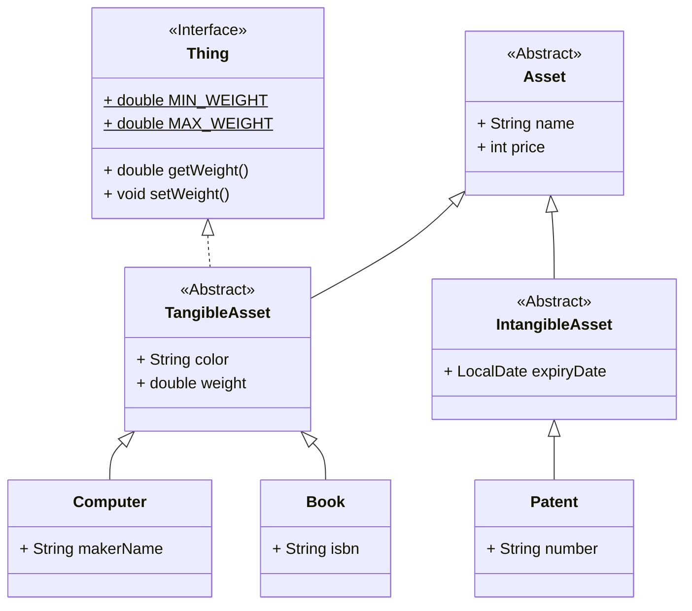

# 추상 클래스와 인터페이스

## 용어 정리

- `추상 클래스`: 상세 부분이 일부 미정인, 상속의 재료로 사용되는 클래스. `abstract` 키워드를 붙여 추상화임을 명시한다.
- `추상 메서드`: 선언만 있고 구현은 없는 메서드. `추상 메서드` 를 가지려면 반드시 `추상 클래스` 여야 한다.
- `인터페이스`: `추상 클래스` 중에 기본적으로 `추상 메서드` 만 가지고 있는 것을 `인터페이스` 로 취급한다.

## 클래스 다이어그램 코드



## 클래스 작성 테스트 코드

```java
@DisplayName("TangibleAsset 클래스 테스트")
public class TangibleAssetTest {

    private static final String EXPECTED_ERROR_MESSAGE = "설정할 무게는 0.0 이상 180.0 이하입니다";
    private TangibleAsset tangibleAsset;

    @BeforeEach
    void setUp() {
        tangibleAsset = new TangibleAsset() {
        };
    }

    @Test
    @DisplayName("무게가 0 미만이거나 180 초과인 경우 IllegalArgumentException 예외가 발생해야 한다")
    void setWeight_shouldThrowException_whenWeightIsOutOfRange() {
        // 하한 경계값 바깥: -0.1, -1.0
        assertThrows(IllegalArgumentException.class, () -> tangibleAsset.setWeight(-0.1));
        assertThrows(IllegalArgumentException.class, () -> tangibleAsset.setWeight(-1.0));

        // 상한 경계값 바깥: 180.1, 181.0
        assertThrows(IllegalArgumentException.class, () -> tangibleAsset.setWeight(180.1));
        assertThrows(IllegalArgumentException.class, () -> tangibleAsset.setWeight(181.0));
    }

    @Test
    @DisplayName("예외 발생 시 올바른 에러 메시지를 반환해야 한다")
    void setWeight_shouldReturnCorrectErrorMessage_whenThrowsException() {
        // given
        double invalidWeight = -1.0;

        // when
        IllegalArgumentException error = assertThrows(IllegalArgumentException.class,
                () -> tangibleAsset.setWeight(invalidWeight));

        // then
        assertEquals(EXPECTED_ERROR_MESSAGE, error.getMessage());
    }

    @Test
    @DisplayName("정상 범위(0.0 이상 180.0 이하)의 무게는 정상적으로 설정되어야 한다")
    void setWeight_shouldSetWeightSuccessfully_whenWeightIsInRange() {
        // 하한 경계값 (0.0)
        tangibleAsset.setWeight(0.0);
        assertEquals(0.0, tangibleAsset.getWeight());

        // 중간 정상값 (90.0)
        tangibleAsset.setWeight(90.0);
        assertEquals(90.0, tangibleAsset.getWeight());

        // 상한 경계값 (180.0)
        tangibleAsset.setWeight(180.0);
        assertEquals(180.0, tangibleAsset.getWeight());
    }
}
```

## 정리

- `추상 클래스의 제약`
  - `추상 메서드` 는 오버라이드를 강제한다.
  - `추상 클래스` 는 인스턴스화를 금지한다.
  - `is-a` 관계 정의를 가진다. (e.g. 상자는 가구다)
  - 다중 구현이 불가능하다. (단일 상속)
  - `Super` 클래스에 종속된다.
  - `extends` 키워드로 사용할 수 있다.

- `인터페이스`
  - `private`, `default`, `static` 지정자가 없는 메서드는 암시적으로 `public abstract` 이다.
  - `default`, `static`, `private` 메서드는 반드시 구현(본문)을 가져야 한다.
  - `인터페이스` 에 선언된 필드는 `public` 이고 `static` 이며 `final` 이다.
  - `인터페이스` 를 구현한 클래스는 공통 메서드를 구현하도록 강제된다.
  - `can-do` 관계 정의를 가진다. (e.g. 상자는 열릴 수 있다)
  - 다중 구현이 가능하다.
  - 독립적이며 모듈화에 유리하다.
  - `implements` 키워드로 사용할 수 있다.
