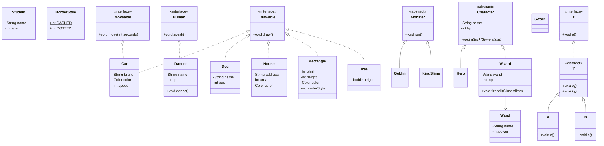

# 컬렉션 / 다형성

## 용어 정리

- `Array`: 메모리 크기가 고정된 연속적인 배열
- `ArrayList`: 내부 배열의 크기를 동적으로 확장하는 가변 배열
- `List`: 순서대로 쌓여있는 구조 (아이템의 중복 허용)
- `Map`: 키(key)와 값(value)의 쌍으로 저장 (키의 중복 불가)
- `Set`: 중복을 허용하지 않는 집합 (순서 보장 여부는 구현체에 따라 다름)
- `Iterator`: 컬렉션의 요소를 하나씩 가리키는 객체
- `다형성`: 어떤 것을 이렇게도 부를 수 있고, 저렇게도 부를 수 있는 것

## 클래스 다이어그램 코드

## 정리

- `컬렉션`
  - 기본형(int, double, boolean 등)을 취급할 수 없다.
  - `Set` 은 `get()` 메서드를 제공하지 않기 때문에 반복이 필요하면 `Iterator` 를 사용하거나 `forEach()` 메서드를 사용한다.
  - `Set` 의 순회 순서는 구현체에 따라 다르다.
    - `HashSet` 은 순서를 보장하지 않는다.
    - `LinkedHashSet` 은 삽입한 순서를 유지한다.
    - `TreeSet` 은 정렬된 순서로 순회한다.
  - `Map` 은 필요한 데이터에 따라 순회 방법을 고른다.
    - 키만 필요하면 `keySet()` 을 순회한다.
    - 값만 필요하면 `values()` 를 순회한다.
    - 키와 값이 모두 필요하면 `entrySet()` 을 순회하고, `getKey()`, `getValue()` 로 꺼낸다.
  - `Map` 의 순회 순서는 구현체에 따라 다르다.
    - `HashMap` 은 순서를 보장하지 않기 때문에 출력 순서가 넣은 순서와 다를 수 있다.
    - `LinkedHashMap` 은 삽입한 순서를 유지한다.
    - `TreeMap` 은 키의 정렬 순서로 순회한다.

- `다형성을 활용하는 방법`
  - 선언을 상위 개념으로, 인스턴스 생성은 하위 개념으로 한다. (추상적인 선언 = 상세 정의로 인스턴스화)
  - 어떤 멤버를 이용할 수 있는가는 상자의 타입이 결정한다.
  - 멤버가 어떻게 움직이는지는 내용의 타입이 결정한다.
  - 캐스트 연산자를 이용하면, 상위 타입의 변수를 하위 타입으로 강제 대입(다운캐스트)할 수 있다.
  - 잘못된 캐스트는 발생 시점에 따라 구분된다.
    - 상속 관계가 없는 클래스처럼 성립할 수 없는 캐스트는 컴파일 오류가 발생한다.
    - 컴파일은 통과했지만 실제 인스턴스 타입이 맞지 않으면 런타임에 `ClassCastException` 이 발생한다.
    - 런타임 예외를 피하려면 캐스트 전에 `instanceof` 로 타입을 확인한다.
  - 동일한 타입으로 취급하여 공통 메소드를 통합하고 코드의 중복을 제거한다.
  - 동일시 취급해도, 각각의 인스턴스는 각 클래스의 정의를 따르고 다른 동작을 한다.
