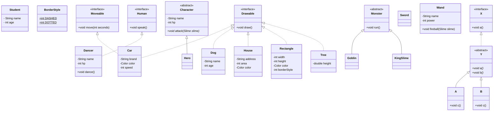

# 컬렉션 / 다형성

## 용어 정리

- `Array`: 메모리 크기가 고정된 연속적인 배열
- `ArrayList`: 내부 배열의 크기를 동적으로 확장하는 가변 배열
- `List`: 순서대로 쌓여있는 구조 (아이템의 중복 허용)
- `Map`: 키(key)와 값(value)의 쌍으로 저장 (키의 중복 불가)
- `Set`: 순서가 없는 집합 (중복 불가)
- `Iterator`: 리스트의 요소를 하나씩 가리키는 객체
- `다형성`: 어떤 것을 이렇게도 부를 수 있고, 저렇게도 부를 수 있는 것

## 클래스 다이어그램 코드

## 정리

- `컬렉션`
  - 기본형(int, double, boolean 등)을 취급할 수 없다.
  - `Set` 은 `get()` 메서드를 제공하지 않기 때문에 반복이 필요하면 `Iterator` 를 사용하거나 `forEach()` 메서드를 사용한다.
  - `Map` 에서 저장된 값을 하나씩 얻기 위해서는 `keySet()` 메서드를 사용한다.
  - `HashMap` 은 순서를 보장하지 않기 때문에 매번 출력 결과의 순서가 다르게 표시될 수 있다.

- `다형성을 활용하는 방법`
  - 선언을 상위 개념으로, 인스턴스 생성은 하위 개념으로 한다. (추상적인 선언 = 상세 정의로 인스턴스화)
  - 어떤 멤버를 이용할 수 있는가는 상자의 타입이 결정한다.
  - 멤버가 어떻게 움직이는지는 내용의 타입이 결정한다.
  - 인스턴스의 타입 체크는 `instanceof` 연산자를 사용한다.
  - 캐스트 연산자를 이용하면, 강제 대입이 가능하다.
  - 부정한 대입이 발생할 경우, `ClassCastException 이 발생한다.
  - 동일한 타입으로 취급하여 공통 메소드를 통합하고 코드의 중복을 제거한다.
  - 동일시 취급해도, 각각의 인스턴스는 각 클래스의 정의를 따르고 다른 동작을 한다.
