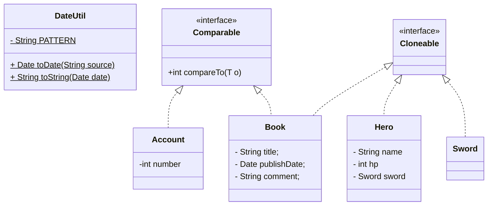

# 인스턴스 조작

## 용어 정리

- `Object`: 모든 클래스는 `Object` 클래스의 메서드를 가지고 있다. 타입 변수에는 모든 인스턴스를 대입할 수 있다.
- `toString()`: 문자열 표현을 얻는다. Override 하여 원하는 결과를 얻도록 수정할 수 있다.
- `equals()`: 두 객체의 내용(값)을 비교한다. 동등성 규칙을 정의할 수 있다.
- `hashCode()`: 해시값을 조회한다. 동등성 규칙을 정의할 수 있다.
- `clone()`: 객체의 메모리 값을 그대로 복사하여 새로운 객체를 생성한다.
- `compareTo()`: `Comparable` 인터페이스의 추상 메서드. 객체의 순서를 정의할 때 사용한다.
- `compare()`: `Comparator` 인터페이스의 추상 메서드. 기본 정렬 기준 외 새로운 정렬 기준을 정의할 때 사용한다.

## 클래스 다이어그램 코드



## 클래스 작성 테스트 코드

```java
@DisplayName("Book 클래스 테스트")
public class BookTest {

    @Test
    @DisplayName("제목과 출판일이 같으면 서로 다른 인스턴스여도 같은 책이어야 한다")
    void equals_withSameTitleAndDate_shouldReturnTrue() throws ParseException {
        // given
        Book book1 = new Book("혼자 공부하는 자바", DateUtil.toDate("2024-02-01"), "혼자 공부하는 자바");
        Book book2 = new Book("혼자 공부하는 자바", DateUtil.toDate("2024-02-01"), "혼공자");

        // when
        boolean result = book1.equals(book2);

        // then
        assertFalse(book1 == book2);
        assertTrue(result);
        assertEquals(book1.hashCode(), book2.hashCode());
    }

    @Test
    @DisplayName("제목과 출판일이 같은 책은 List에서 동등한 책으로 찾을 수 있어야 한다")
    void arrayList_withEqualBooks_shouldContain() throws ParseException {
        // given
        Book book1 = new Book("혼자 공부하는 자바", DateUtil.toDate("2024-02-01"), "혼자 공부하는 자바");
        Book book2 = new Book("혼자 공부하는 자바", DateUtil.toDate("2024-02-01"), "혼공자");
        List<Book> books = Arrays.asList(book1);

        // when
        boolean result = books.contains(book2);

        // then
        assertTrue(result);
    }

    @Test
    @DisplayName("제목과 출판일이 같은 책은 Set에 하나만 저장되어야 한다")
    void hashSet_withEqualBooks_shouldContainOnlyOne() throws ParseException {
        // given
        Book book1 = new Book("혼자 공부하는 자바", DateUtil.toDate("2024-02-01"), "혼자 공부하는 자바");
        Book book2 = new Book("혼자 공부하는 자바", DateUtil.toDate("2024-02-01"), "혼공자");
        Set<Book> books = new HashSet<>();

        // when
        books.add(book1);
        books.add(book2);

        // then
        assertEquals(1, books.size());
    }

    @Test
    @DisplayName("제목과 출판일이 같은 책은 Map에 한 쌍만 저장되어야 한다")
    void hashMap_withEqualBooks_shouldContainOnlyOne() throws ParseException {
        // given
        Book book1 = new Book("혼자 공부하는 자바", DateUtil.toDate("2024-02-01"), "혼자 공부하는 자바");
        Book book2 = new Book("혼자 공부하는 자바", DateUtil.toDate("2024-02-01"), "혼공자");
        Map<Book, String> books = new HashMap<>();

        // when
        books.put(book1, book1.getComment());
        books.put(book2, book2.getComment());

        // then
        assertEquals(1, books.size());
    }

    @Test
    @DisplayName("Collections.sort()를 하면 출판일이 최신인 책부터 정렬되어야 한다")
    void sort_shouldOrderByNewestPublishDate() throws ParseException {
        // given
        Book book1 = new Book("혼자 공부하는 자바", DateUtil.toDate("2024-02-01"), "혼자 공부하는 자바");
        Book book2 = new Book("이펙티브 자바", DateUtil.toDate("2018-11-01"), "이펙티브 자바");
        Book book3 = new Book("이펙티브 코틀린", DateUtil.toDate("2025-06-09"), "이펙티브 코틀린");
        List<Book> books = new ArrayList<>(List.of(book1, book3, book2));

        // when
        Collections.sort(books);

        // then
        assertEquals(book3, books.get(0));
        assertEquals(book1, books.get(1));
        assertEquals(book2, books.get(2));
    }

    @Test
    @DisplayName("clone()은 원본과 같은 값을 가진 독립된 인스턴스를 반환해야 한다")
    void clone_shouldReturnIndependentCopy() throws ParseException {
        // given
        Book book = new Book("혼자 공부하는 자바", DateUtil.toDate("2024-02-01"), "혼자 공부하는 자바");

        // when
        Book bookCopy = book.clone();
        book.setPublishDate(DateUtil.toDate("2018-11-01"));

        // then
        assertFalse(book == bookCopy);
        assertEquals(DateUtil.toDate("2024-02-01"), bookCopy.getPublishDate());
    }
}
```

## 정리

- `Set/Map의 동작 원리`
  - `Set` 과 `Map` 계열은 요소를 검색할 때 `equals()` 보다 비용이 값싼 `hashCode()` 비교를 사용한다.
  - 모든 객체는 해시값을 가진다.
  - 동일한 객체는 항상 같은 해시값을 가진다.
  - 단, 같은 해시값이라고 하여 항상 동일한 객체는 아니다.

- `List의 요소 정렬`
  - `Collection.sort()` 메서드는 컬렉션 내부를 정렬한다.
  - `Comparable` 인터페이스를 통해 정렬 규칙을 정의하며, 정렬 대상은 반드시 `Comparable` 인터페이스를 구현해야 한다.
  - `a` 와 `b` 가 매개변수인 경우 아래와 같다.
    - `a` 가 `b` 보다 작으면 음수(-1)
    - `a` 와 `b` 가 같으면 0
    - `a` 가 `b` 보다 크면 양수(+1)

- `Comparator` 인터페이스
  - `Comparable` 인터페이스를 구현하지 않은 객체도 즉석에서 정렬 규칙을 정해줄 수 있다.
  - 정렬 규칙은 `Comparable` 인터페이스의 `compareTo()` 메서드 규칙과 동일하다.

- `Cloneable` 인터페이스
  - `Cloneable` 인터페이스를 구현하여 복사를 지원할 수 있다.
  - 복사에는 `얕은 복사` 와 `깊은 복사` 가 있다.

- `얕은 복사(Shallow Copy)`
  - 객체 자체는 새로 생성되지만, 객체 내의 참조 타입 필드(다른 객체에 대한 참조)는 원본과 동일한 객체를 참조한다.
  - 중첩된 객체는 복사되지 않고 주소만 복사된다.
  - 원본 객체의 참조 타입 필드를 변경하면 복사본의 해당 필드도 함께 변경된다.

- `깊은 복사(Deep Copy)`
  - 객체 자체뿐만 아니라, 객체 내의 모든 참조 타입 필드(중첩된 객체)까지도 재귀적으로 완전히 새로 생성하여 복사한다.
  - 원본 객체와 복사본 객체는 완전히 독립적이다.
  - 한쪽은 변경해도 다른 쪽에는 영향을 주지 않는다.
