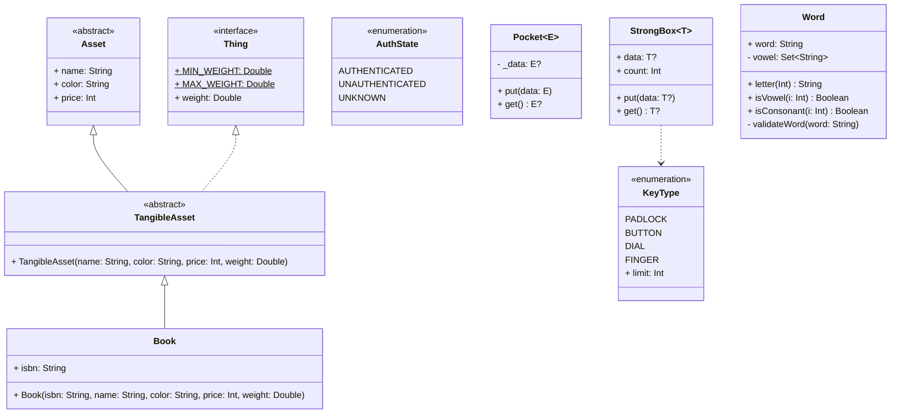

# 제네릭 / 열거형 / 문자열 조작

## 용어 정리

- `Generic`: 사용하는 시점에 타입을 원하는 형태로 정의할 수 있다. 타입 안전(Type Safe) 효과를 가진다.
- `enum`: 정해 둔 값만 넣어둘 수 있는 타입
- `String Interpolation`: `${수식}` 을 활용한 문자열 결합
- `StringBuilder`: `append()` 메서드로 결합한 결과를 내부 메모리(버퍼)에 담아 두고 `toString()` 으로 결과를 얻는다.
- `Accessor`: 접근자. 객체의 멤버 변수 값을 읽어 반환하는 메서드.
- `Mutator`: 설정자. 객체의 상태나 변수 값을 변경하는 메서드.

## 클래스 다이어그램 코드



## 클래스 작성 테스트 코드

```kotlin
@DisplayName("StrongBox 클래스 테스트")
class StrongBoxTest {

    private lateinit var strongBox: StrongBox<KeyType>

    @BeforeEach
    fun setUp() {
        strongBox = StrongBox<KeyType>(KeyType.PADLOCK)
    }

    @Test
    fun `금고는 키 타입의 정해진 사용횟수에 도달하면 열린다`() {
        // given
        val limit = KeyType.PADLOCK.limit // 1024

        // when
        repeat(limit) { _ ->
            strongBox.get()
        }

        // then
        assertEquals(limit, strongBox.count)
        assertNotNull(strongBox.get())
    }

    @Test
    fun `금고는 키 타입의 정해진 사용횟수에 도달하지 못하면 null을 반환한다`() {
        // given
        val limit = KeyType.PADLOCK.limit // 1024

        // when
        repeat(limit.minus(2)) { _ ->
            strongBox.get()
        }

        // then
        assertNotEquals(limit, strongBox.count)
        assertNull(strongBox.get())
    }

    @Test
    fun `금고의 키 타입을 새로 정의하면 사용횟수는 0으로 초기화된다`() {
        // given
        val limit = KeyType.PADLOCK.limit // 1024

        // when
        repeat(limit) { _ ->
            strongBox.get()
        }

        strongBox.put(KeyType.BUTTON)

        // then
        assertEquals(0, strongBox.count)
    }
}
```

```kotlin
@DisplayName("Word 클래스 테스트")
class WordTest {

    private lateinit var word: Word

    @BeforeEach
    fun setUp() {
        word = Word("Android")
    }

    @Test
    fun `isVowel을 하면 지정된 글자가 모음인지를 판별해야 한다`() {
        // given
        val index = 0 // `A`ndroid

        // when & then
        assertTrue(word.isVowel(index))
    }

    @Test
    fun `isConsonant를 하면 지정된 글자가 자음인지를 판별해야 한다`() {
        // given
        val index = 1 // A`n`droid

        // when & then
        assertTrue(word.isConsonant(index))
    }

    @Test
    fun `글자가 알파벳이 아니면 false를 반환해야 한다`() {
        // given
        word = Word("###")
        val index = 0 // `#`##

        // when & then
        assertFalse(word.isVowel(index))
        assertFalse(word.isConsonant(index))
    }

    @Test
    fun `글자는 소문자로 변환되어야 한다`() {
        // given
        val index = 0 // `A`ndroid
        val a = word.letter(index) // a

        // when & then
        assertEquals("a", a)
        assertEquals("A".lowercase(), a)
    }

    @Test
    fun `글자 길이 미만의 인덱스는 글자의 첫 번째 인덱스로 보정한다`() {
        // given
        val index = -100 // `A`ndroid
        val a = word.letter(index) // a

        // when & then
        assertEquals("a", a)
    }

    @Test
    fun `글자 길이를 초과하는 인덱스는 글자의 마지막 인덱스로 보정한다`() {
        // given
        val index = 100 // Androi`d`
        val d = word.letter(index) // d

        // when & then
        assertEquals("d", d)
    }

    @Test
    fun `글자가 빈 상태로 생성하면 IllegalArgumentException 예외를 던진다`() {
        // when & then
        assertThrows(IllegalArgumentException::class.java) {
            Word("")
        }
    }

    @Test
    fun `글자를 빈 상태로 변경하면 IllegalArgumentException 예외를 던진다`() {
        // when & then
        assertThrows(IllegalArgumentException::class.java) {
            word.word = ""
        }
    }
}
```

## 정리

- `타입이 없을 때의 문제점`
  - 런타임 에러가 나기 쉽다.
  - `IDE` 가 컴파일 에러를 미리 찾을 수 없다.
  - `제네릭(Generic)` 통해 사용하는 시점에 타입을 원하는 형태로 정의할 수 있다.

- `enum을 통한 상태 정의 및 제약`
  - `enum` 클래스는 `when` 과의 조합으로 모든 처리를 강제할 수 있다.

- `문자열 처리`
  - 문자열 일부를 떼어내려면 `substring()` 을 사용한다.
  - 문자열 일부를 치환하려면 `replace()` 를 사용한다.
  - 문자열을 분리하려면 `split()` 를 사용한다.
  - 문자열을 소문자로 변경하려면 `lowercase()` 를 사용한다.
  - 문자열을 대문자로 변경하려면 `uppercase()` 를 사용한다.
  - 문자열 내 특정 글자의 위치를 찾으려면 `indexOf()` 를 사용한다.
  - 문자열 내 특정 글자의 포함 여부를 찾으려면 `contains()` 를 사용한다.
  - 문자열 내 특정 글자로 끝나는 지를 확인하려면 `endsWith()` 를 사용한다.
  - 문자열 내 특정 글자가 뒤에서 몇 번째에 존재하는 지를 찾으려면 `lastIndexOf()` 를 사용한다.
  - 문자열의 좌우 공백을 제거하려면 `trim()` 을 사용한다.

- `문자열 비교와 불변성`
  - `==` 는 문자열의 값(내용)을 비교하고, `===` 는 같은 객체(참조)인지를 비교한다.
  - 문자열 리터럴끼리의 결합(`"hel" + "lo"`)은 같은 객체를 재사용하지만, 실행 중에 결합한 문자열(`"hel" + getLo()`)은 새 객체이므로 `===` 비교 시 `false` 가 된다.
  - 문자열은 불변(Immutable)이라 `replace()`, `uppercase()` 등은 원본을 바꾸지 않고 새 문자열을 반환한다. 결과를 사용하려면 변수에 다시 담아야 한다.

- `문자열 결합 방법`
  - `+ 연산`: 가장 직관적이고 간단한 결합 방법이다. 하지만 반복문 안에서 사용하면 매번 `새로운 객체를 생성` 하여 성능이 크게 떨어진다.
  - `String Interpolation`: 문자열 사이에 `변수나 수식` 을 직접 삽입하여 작성한다.
  - `StringBuilder`: 내부 버퍼를 `변경 가능한(Mutable) 방식` 으로 사용한다. 새로운 객체를 만들지 않고 문자열을 추가하여, 반복문 내 결합이나 대용량 데이터 처리에 적합하다.
  - `StringBuffer`: `StringBuilder` 와 사용법과 기능은 동일하나 `동기화(Synchronization)` 키워드가 지원되어 여러 스레드가 동시에 접근해도 안전하다. 단, 동기화 비용 때문에 싱글 스레드에서는 `StringBuilder` 보다 약간 느리다.
