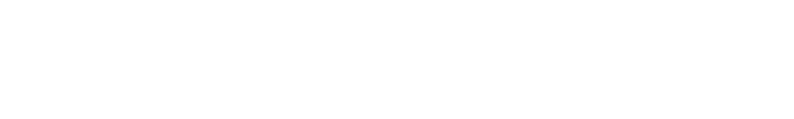

 다형성 2026-10.01

오늘은 13장을 정리한다.

## 1. 다형성
여러 형대로 동작할 수 있는 성질을 의미 합니다.
부모 클레스를 똑같이 참조할 수있다는것 바로 다형성.
손흥민은 남자고, 축구선수이다.
소나타는 차면선, 기계이다.

### 공통 메소드를 통합

house.draw()

dog.draw()

car.draw()

### Interface정의
public interface Drawable {
    void draw();
}

### Polymorphism (다형성)
final Drawable d = elements[i]; // 실제 타입은 런타임에 결정됨.
d.draw(); // 실제 구현체의 draw() 메서드가 호출됨.

## 다형성을 활용하는 방법.
선언을 상위 개념으로 인스턴스 생성은 하위 개념으로 한다.
추상적인선언 = 상세정의로 인스턴스화.

Charcter character = new Hero("홍길동", 100);

[essential.mdc](../../../Users/USER/Downloads/essential.mdc)

**배운 것:** 
조금씩 생각나는것도 같고, 막혀있는것 같기도하고...
기초은 한계도달...

### 내가 생각하고싶지 않았다

**배운 것:** 
하나하나 직접 입력하면서 생각하자.

### 다형성을 실제 출력으로 증명하기

- **오늘 보람찬 하루 되셨어요.**