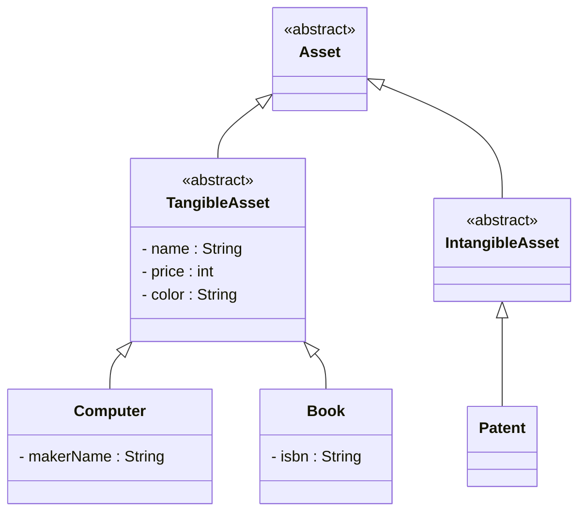

```mermaid
classDiagram

    class Asset {
        <<abstract>>
    }
    
    class TangibleAsset {
        <<abstract>>
        - name : String
        - price : int
        - color : String
    }
        
    class Computer {
        - makerName : String
    }
    
    class Book {
        - isbn : String
    }
    
    class IntangibleAsset {
        <<abstract>>
    }
    
    class Patent {
        
    }

    Asset <|-- TangibleAsset
    Asset <|-- IntangibleAsset 
    IntangibleAsset <|-- Patent 
    TangibleAsset <|-- Computer 
    TangibleAsset <|-- Book 
    

```