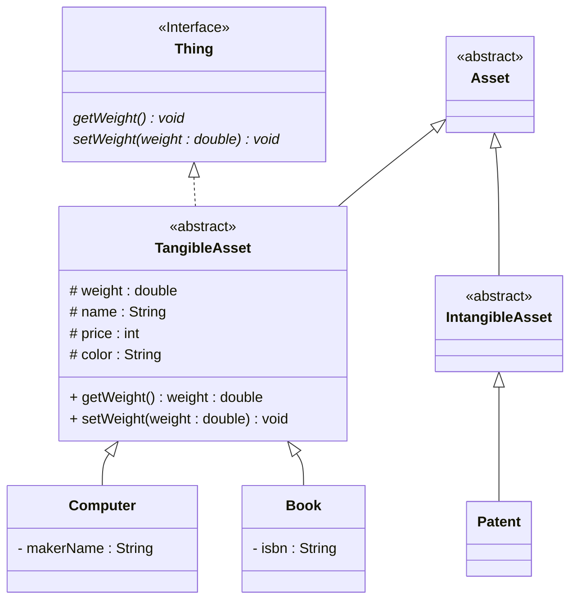

```mermaid
classDiagram

    class Asset {
        <<abstract>>
    }
    
    class TangibleAsset {
        <<abstract>>
        # weight : double
        # name : String
        # price : int
        # color : String
        
        + getWeight() weight : double 
        + setWeight(weight : double) void
    }
        
    class Computer {
        - makerName : String
    }
    
    class Book {
        - isbn : String
    }
    
    class IntangibleAsset {
        <<abstract>>
    }
    
    class Patent {
        
    }
    
    class Thing {
        <<Interface>>
        getWeight() void *
        setWeight(weight : double) void *
    }

    Asset <|-- TangibleAsset
    Asset <|-- IntangibleAsset
    
    IntangibleAsset <|-- Patent
    
    TangibleAsset <|-- Computer 
    TangibleAsset <|-- Book 
    
    Thing <|.. TangibleAsset
    

```