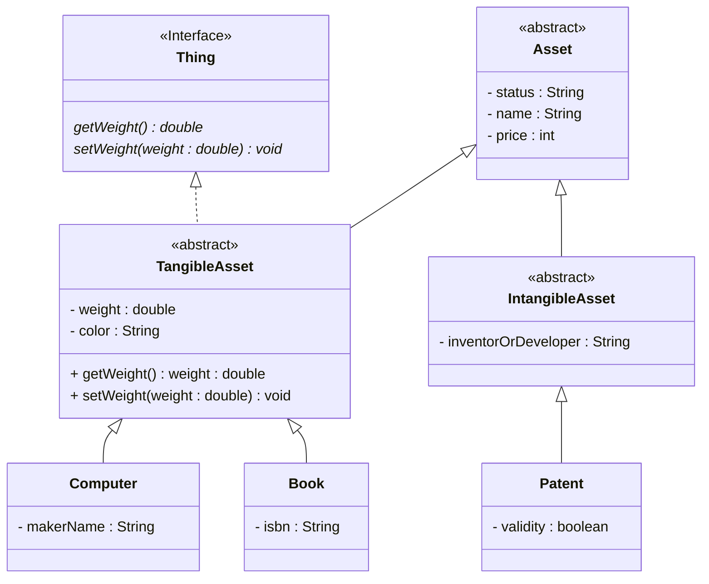

```mermaid
classDiagram

    class Asset {
        <<abstract>>
        - status : String
        - name : String
        - price : int
    }
    
    class TangibleAsset {
        <<abstract>>
        - weight : double
        - color : String
        
        + getWeight() weight : double 
        + setWeight(weight : double) void
    }
        
    class Computer {
        - makerName : String
    }
    
    class Book {
        - isbn : String
    }
    
    class IntangibleAsset {
        <<abstract>>
        - inventorOrDeveloper : String
    }
    
    class Patent {
        - validity : boolean
    }
    
    class Thing {
        <<Interface>>
        getWeight() double *
        setWeight(weight : double) void *
    }

    Asset <|-- TangibleAsset
    Asset <|-- IntangibleAsset
    
    IntangibleAsset <|-- Patent
    
    TangibleAsset <|-- Computer 
    TangibleAsset <|-- Book 
    
    Thing <|.. TangibleAsset
    

```