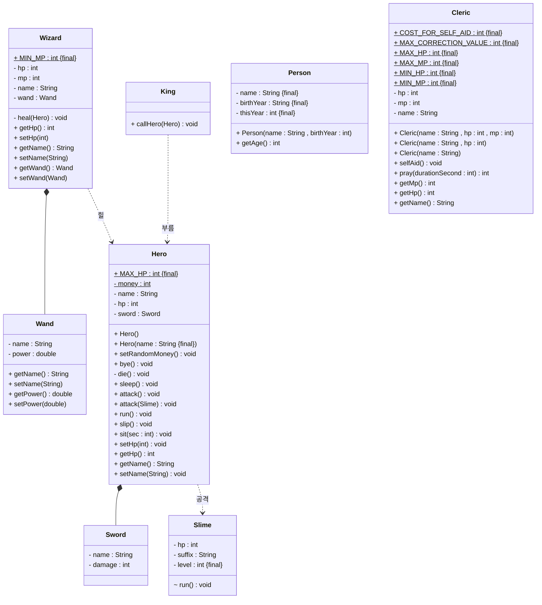

```mermaid
classDiagram
    class Slime {
        - hp : int
        - suffix : String
        - level : int &lbrace;final&rbrace;
        ~ run() void
    }
    
    class Wizard {
        + MIN_MP : int &lbrace;final&rbrace;$
        - hp : int
        - mp : int
        - name : String
        - wand : Wand
        - heal(Hero) void 
        + getHp() int
        + setHp(int)
        + getName() String
        + setName(String)
        + getWand() Wand
        + setWand(Wand)
    }
    
    class King {
        + callHero(Hero) void
    }
    
    class Sword {
        - name : String
        - damage : int
    }
    
    class Wand {
        - name : String
        - power : double
        + getName() String
        + setName(String)
        + getPower() double
        + setPower(double)
    }

    class Hero {
        + MAX_HP : int &lbrace;final&rbrace;$
        - money : int $
        - name : String
        - hp : int
        - sword : Sword
        + Hero()
        + Hero(name : String &lbrace;final&rbrace;)
        + setRandomMoney() void
        + bye() void
        - die() void
        + sleep() void
        + attack() void
        + attack(Slime) void
        + run() void
        + slip() void
        + sit(sec : int) void
        + setHp(int) void
        + getHp() int
        + getName() String
        + setName(String) void
    }

    class Person {
        - name : String &lbrace;final&rbrace;
        - birthYear : String &lbrace;final&rbrace;
        - thisYear : int &lbrace;final&rbrace;
        + Person(name : String , birthYear : int)
        + getAge() int
    }

    class Cleric {
        + COST_FOR_SELF_AID : int &lbrace;final&rbrace; $
        + MAX_CORRECTION_VALUE : int &lbrace;final&rbrace; $
        + MAX_HP : int &lbrace;final&rbrace; $
        + MAX_MP : int &lbrace;final&rbrace; $
        + MIN_HP : int &lbrace;final&rbrace; $
        + MIN_MP : int &lbrace;final&rbrace; $
        - hp : int
        - mp : int
        - name : String
        + Cleric(name : String , hp : int , mp : int )
        + Cleric(name : String , hp : int )
        + Cleric(name : String )
        + selfAid() void
        + pray(durationSecond : int) int
        + getMp() int
        + getHp() int
        + getName() String
    }

    Wizard *-- Wand
    Wizard ..> Hero: 힐
    King ..> Hero : 부름
    Hero *-- Sword
    Hero ..> Slime : 공격
```

