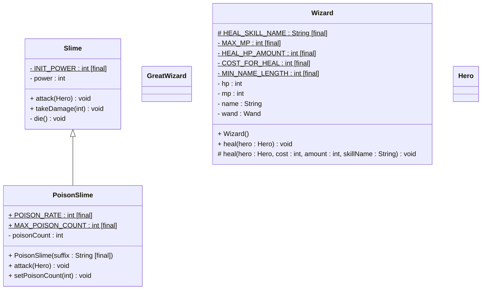

```mermaid
classDiagram

    class Slime {
        - INIT_POWER : int [final] $
        - power : int
        + attack(Hero) void
        + takeDamage(int) void
        - die() void
    }

    class PoisonSlime {
        + POISON_RATE : int [final] $
        + MAX_POISON_COUNT : int [final] $
        - poisonCount : int
        + PoisonSlime(suffix : String [final])
        + attack(Hero) void
        + setPoisonCount(int) void
    }
    
    class GreatWizard {
        
    }
    
    class Wizard {
        # HEAL_SKILL_NAME : String [final] $
        - MAX_MP : int [final] $
        - HEAL_HP_AMOUNT : int [final] $
        - COST_FOR_HEAL : int [final] $
        - MIN_NAME_LENGTH : int [final] $
        - hp : int
        - mp : int
        - name : String
        - wand : Wand
        + Wizard()
        + heal(hero : Hero) void
        # heal(hero : Hero, cost : int, amount : int, skillName : String) void
    }
    
    class Hero {
    
    }
    
    Slime <|-- PoisonSlime

```

