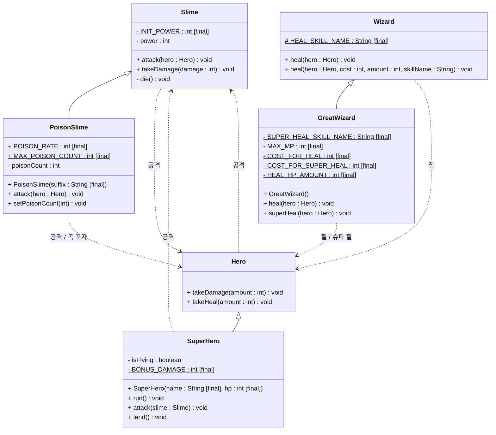

```mermaid
classDiagram

    class Slime {
        - INIT_POWER : int [final] $
        - power : int
        + attack(hero : Hero) void
        + takeDamage(damage : int) void
        - die() void
    }

    class PoisonSlime {
        + POISON_RATE : int [final] $
        + MAX_POISON_COUNT : int [final] $
        - poisonCount : int
        + PoisonSlime(suffix : String [final])
        + attack(hero : Hero) void
        + setPoisonCount(int) void
    }

    class Wizard {
        # HEAL_SKILL_NAME : String [final] $
        + heal(hero : Hero) void
        + heal(hero : Hero, cost : int, amount : int, skillName : String) void
    }
    
    class GreatWizard {
        - SUPER_HEAL_SKILL_NAME : String [final] $
        - MAX_MP : int [final] $
        - COST_FOR_HEAL : int [final] $
        - COST_FOR_SUPER_HEAL : int [final] $
        - HEAL_HP_AMOUNT : int [final] $
        + GreatWizard()
        + heal(hero : Hero) void
        + superHeal(hero : Hero) void
    }
    
    class Hero {
        + takeDamage(amount : int) void
        + takeHeal(amount : int) void
    }

    class SuperHero {
        - isFlying : boolean
        - BONUS_DAMAGE : int [final] $
        + SuperHero(name : String [final], hp : int [final])
        + run() void
        + attack(slime : Slime) void
        + land() void
    }

    Hero <|-- SuperHero
    Wizard <|-- GreatWizard
    Slime <|-- PoisonSlime
    Hero ..> Slime : 공격
    SuperHero ..> Slime : 공격
    Slime ..> Hero : 공격
    PoisonSlime ..> Hero : 공격 / 독 포자
    Wizard ..> Hero : 힐
    GreatWizard ..> Hero : 힐 / 슈퍼 힐

```

