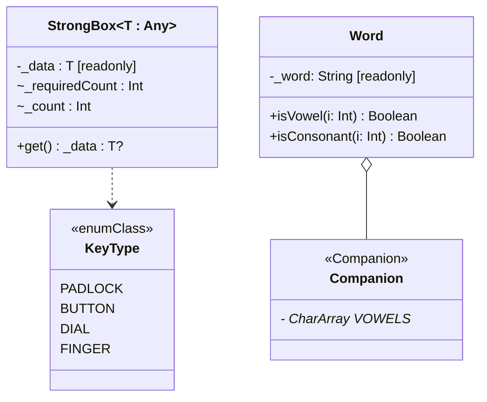

```mermaid
classDiagram
    class KeyType {
        <<enumClass>>
        PADLOCK
        BUTTON
        DIAL
        FINGER
    }

    class StrongBox~T : Any~ {
        -_data : T [readonly]
        ~_requiredCount : Int
        ~_count : Int
        +get() _data : T?
    }

    StrongBox ..> KeyType

    class Word {
        -_word: String [readonly]
        +isVowel(i: Int) Boolean
        +isConsonant(i: Int) Boolean
    }

    class Companion {
        <<Companion>> 
        - CharArray VOWELS*
    }

Word o-- Companion
```