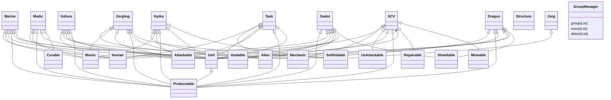

```mermaid
classDiagram
    
    class Marine
    class Medic
    class Tank
    class Vulture
    class SCV
     
    class Zergling
    class Hydra
     
    class Zealot
    class Dragun

    class Human
    class Alien
    class Bionic
    class Mechanic

    class Unit
    class Structure
 
    class Attackable
    class Curable
    class Healable
    class SelfAidable
    class Produceable
    class Mineable
    class Repairable
    class UnAttackable
    class Shieldable
    
    Marine <|-- Human 
    Marine <|-- Bionic 
    Marine <|-- Attackable 
    Marine <|-- Produceable 
    Marine <|-- Healable 
    Marine <|-- Unit
    
    Medic <|-- Human 
    Medic <|-- Bionic 
    Medic <|-- Produceable 
    Medic <|-- Unit
    
    Tank <|-- Human 
    Tank <|-- Mechanic 
    Tank  <|-- Unit
    Tank <|-- Attackable 
    Tank <|-- Produceable
    Tank <|-- Unit 
    
    Vulture <|-- Human 
    Vulture  <|-- Mechanic 
    Vulture <|-- Unit 
    Vulture <|-- Attackable 
    Vulture <|-- Produceable
    
    SCV <|-- Human 
    SCV  <|-- Mechanic 
    SCV  <|-- UnAttackable 
    SCV <|-- Healable 
    SCV <|-- Produceable 
    SCV <-- Unit
    SCV <|-- Repairable 
    SCV <|-- Mineable 
    
    Zergling <|-- Alien 
    Zergling <|-- Bionic 
    Zergling <|-- Attackable 
    Zergling <|-- Produceable 
    Zergling <|-- Unit 
    Zergling <|-- SelfAidable 
    
    Hydra <|-- Alien 
    Hydra <|-- Bionic 
    Hydra <|-- Attackable 
    Hydra <|-- Produceable 
    Hydra <|-- Unit 
    Hydra <|-- SelfAidable 
    
    Zealot <|-- Produceable 
    Zealot <|-- Bionic 
    Zealot <|-- Healable 
    Zealot <|-- Alien 
    Zealot <|-- Unit 
    Zealot <|-- Attackable 
    Zealot <|-- Shieldable 
    
    Dragun <|-- Mechanic 
    Dragun <|-- Produceable 
    Dragun <|-- Alien 
    Dragun <|-- Unit 
    Dragun <|-- Attackable 
    Dragun <|-- Shieldable
    
    Unit <|-- Produceable 
    
    Medic <|-- Curable
    Zerg <|-- SelfAidable
    

    class GroupManager {
        group(List<Unit>)
        move(List<Unit>)
        attack(List<Unit>)
    }

```