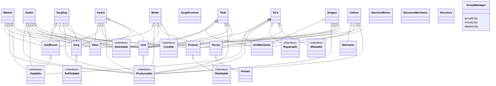

```mermaid
classDiagram
    
    class Terran
    
    %% 저그 건물만 불가능
    class Zerg
    
    class Protoss
    
    class Marine 
    class Medic
    class Tank
    class Vulture
    class SCV
     
    class ZergStructure
    class Zergling
    class Hydra
     
    class Zealot
    class Dragun

    class Human
    class Alien
    
    class UnitBionic
    class UnitMechanic
    class StuctureBionic
    class StructureMechanic
    
    class Unit
    class Structure
 
    class Attackable {
        <<Interface>>
    }
    
    class Curable {
        <<Interface>>
    }
    
    class Healable {
        <<Interface>>
    }
    
    class SelfAidable {
        <<Interface>>
    }
    
    class Produceable {
        <<Interface>>
    }
    
    class Mineable {
        <<Interface>>
    }
    
    class Repairable {
        <<Interface>>
    }
    
    class Shieldable {
        <<Interface>>
    }
    
    Terran <|-- Human 
    
    Protoss <|-- Shieldable
    
    Zerg <|-- SelfAidable

    Unit <|-- Produceable
    
    UnitBionic <|-- Healable
    
    UnitAttackable
    
    Marine <|-- UnitBionic 
    Marine <|-- Attackable
    Marine <|-- Produceable 
    Marine <|-- Healable 
    Marine <|-- Unit
    Marine <|-- Terran 
    
    Medic <|-- UnitBionic 
    Medic <|-- Produceable 
    Medic <|-- Unit
    Medic <|-- Terran
    Medic <|-- Curable
    
    Tank <|-- UnitMechanic 
    Tank  <|-- Unit
    Tank <|-- Attackable 
    Tank <|-- Produceable
    Tank <|-- Unit 
    Tank <|-- Terran 
    
    Vulture  <|-- Mechanic 
    Vulture <|-- UnitMechanic 
    Vulture <|-- Attackable
    Vulture <|-- Produceable
    Vulture <|-- Terran 
    
    SCV  <|-- UnitMechanic 
    SCV <|-- Healable 
    SCV <|-- Produceable 
    SCV <-- Unit
    SCV <|-- Repairable 
    SCV <|-- Mineable 
    SCV <|-- Terran 
    
    Zergling <|-- Alien 
    Zergling <|-- UnitBionic 
    Zergling <|-- Attackable 
    Zergling <|-- Produceable
    Zergling <|-- Unit 
    Zergling <|-- Zerg 
    
    Hydra <|-- Alien 
    Hydra <|-- UnitBionic 
    Hydra <|-- Attackable 
    Hydra <|-- Produceable 
    Hydra <|-- Unit 
    Hydra <|-- Zerg 
    
    Zealot <|-- Produceable 
    Zealot <|-- UnitBionic 
    Zealot <|-- Healable 
    Zealot <|-- Alien 
    Zealot <|-- Unit 
    Zealot <|-- Attackable 
    Zealot <|-- Protoss 
    
    Dragun <|-- UnitMechanic 
    Dragun <|-- Produceable 
    Dragun <|-- Alien 
    Dragun <|-- Unit 
    Dragun <|-- Attackable 
    Dragun <|-- Protoss

    class GroupManager {
        group(List<Unit>)
        move(List<Unit>)
        attack(List<Unit>)
    }

```